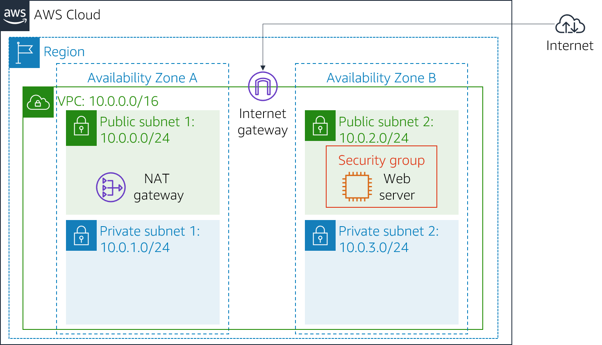
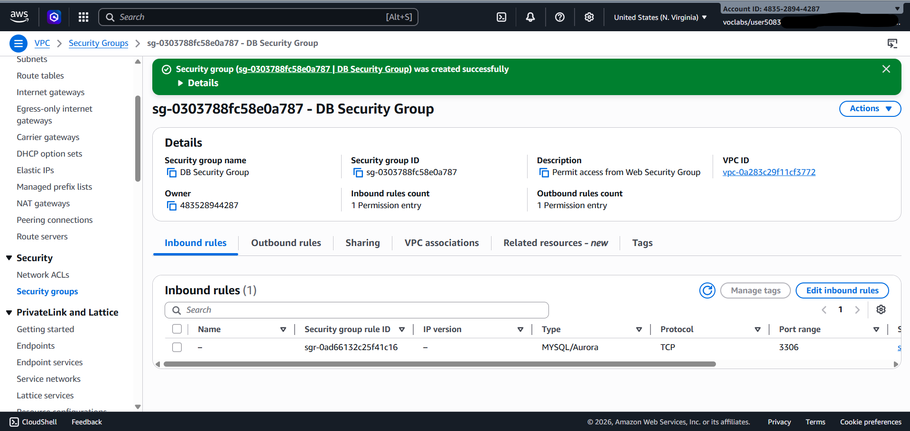
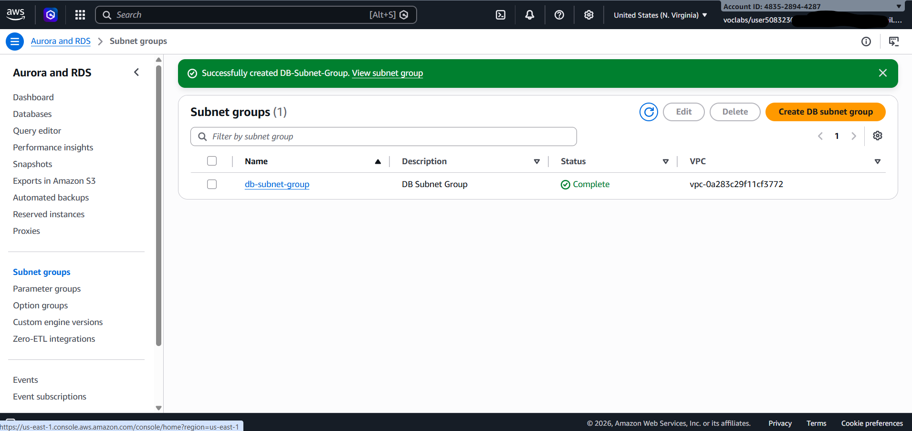
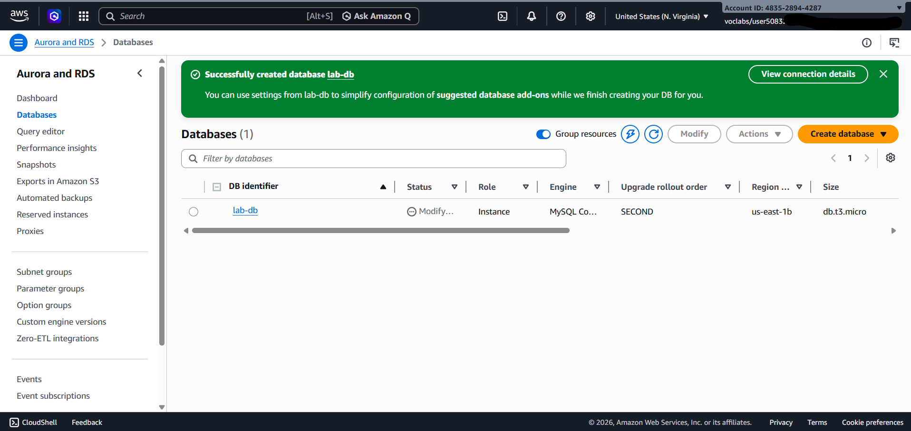
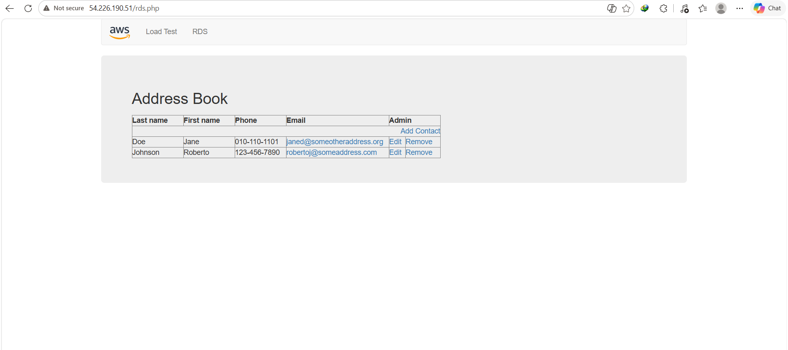

# Lab: Amazon RDS Deployment (High Availability Relational Database)

## 📌 Project Overview
This lab demonstrates how to leverage an AWS-managed database instance (**Amazon RDS**) to solve relational database needs. By deploying a Multi-AZ database, we ensure high availability and data durability across different Availability Zones, then securely connect it to an existing EC2 Web Server.

## 🎯 Objectives
- Launch an Amazon RDS DB instance with **High Availability (Multi-AZ)**.
- Configure the DB instance security group to permit secure connections only from the Web Server.
- Verify the connection by interacting with a live PHP web application backed by the RDS database.

---

## 🗺️ Lab Infrastructure & Scenarios

### 1. Initial Infrastructure Scenario
At the start of this lab, an existing custom **VPC** network is provided. It contains an active **EC2 Web Server** running inside a public subnet, alongside empty private subnets in two different Availability Zones waiting for the database tier deployment.

### 2. Final Target Architecture
By the end of this lab, the infrastructure will be expanded to include a highly available **Amazon RDS DB instance (Multi-AZ)** spanning across Private Subnets. The DB security group will restrict incoming database traffic to only allow requests originating from the Web Server security group.

---

## 🛠️ Implementation Steps

### 🛠️ Task 1: Create a Security Group for the RDS DB Instance
- Navigated to the **VPC Console > Security Groups** and clicked **Create security group**.
- Configured the basic security group details:
  - **Security group name:** `DB Security Group`
  - **Description:** `Permit access from Web Security Group`
  - **VPC:** Selected `Lab VPC` (removed the default selection).
- Configured the secure **Inbound Rules** to isolate database access:
  - **Type:** `MySQL/Aurora` (Port `3306`)
  - **Source:** Custom -> Selected **`Web Security Group`** (`sg-xxxxxx`) as the source.
  - **Description:** Allows inbound traffic on port 3006 exclusively from EC2 instances tied to the web firewall.
- Clicked **Create security group** to finalize the database tier firewall.

### 🛠️ Task 2: Create a DB Subnet Group
- Opened the **Amazon RDS Console**, navigated to **Subnet groups** from the left menu, and clicked **Create DB Subnet Group**.
- Configured the Subnet Group details:
  - **Name:** `DB-Subnet-Group`
  - **Description:** `DB Subnet Group`
  - **VPC:** Selected `Lab VPC`
- Defined the network topology for High Availability (Multi-AZ):
  - **Availability Zones:** Selected `us-east-1a` and `us-east-1b`.
  - **Subnets:** Selected the private subnets corresponding to CIDR blocks **`10.0.1.0/24`** and **`10.0.3.0/24`**.
- Clicked **Create** to successfully isolate the database cluster inside the private subnet layers.

### 🛠️ Task 3: Create an Amazon RDS DB Instance
- Navigated to **RDS > Databases** and clicked **Create database**.
- Configured the Database Engine and Architecture:
  - **Engine type:** `MySQL`
  - **Templates:** `Dev/Test`
  - **Availability & durability:** Selected **`Multi-AZ DB instance`** to provision a primary DB instance with synchronous replication to a standby instance in a different Availability Zone for High Availability.
- Settings & Credentials:
  - **DB instance identifier:** `lab-db`
  - **Master username:** `main`
  - **Master password:** `lab-password`
- Hardware & Storage Configuration:
  - **DB instance class:** `Burstable classes` -> **`db.t3.micro`**
  - **Storage type:** `General Purpose (SSD)` -> Allocated storage: **`20 GiB`**
- Connectivity & Security:
  - **Virtual Private Cloud (VPC):** `Lab VPC`
  - **Existing VPC security groups:** Selected **`DB Security Group`** (and deselected `default`).
- Optimization & Additional Configuration (Speed Optimization for Lab Environment):
  - **Monitoring:** Unchecked `Enable Enhanced monitoring`.
  - **Initial database name:** `lab`
  - **Backup:** Unchecked `Enable automatic backups`.
  - **Encryption:** Unchecked `Enable encryption`.
- Clicked **Create database** and waited approximately 4 minutes until the status changed to **`Available`**.
- Scrolled down to **Connectivity & security** and copied the generated **Database Endpoint** for later use in application integration.

### 🛠️ Task 4: Interact with Your Database & Connect the Web App
- Retrieved the public IP address of the **WebServer** from the AWS Details menu.
- Opened the IP address in a new browser tab to access the live PHP web application.
- Navigated to the **RDS** configuration section at the top of the web page.
- Integrated the application with the live database by providing the following deployment credentials:
  - **Endpoint:** `[Your copied RDS Endpoint URL]`
  - **Database:** `lab`
  - **Username:** `main`
  - **Password:** `lab-password`
- Clicked **Submit** to trigger the database migration and database initialization scripts.
- Verified successful integration via a functional **Address Book** application.
- Tested persistence and Multi-AZ replication by adding, editing, and deleting test contacts inside the address book.

---

## 🏆 Lab Submission & Verification
- Clicked the **Submit** button at the top of the lab workspace.
- Confirmed the submission by selecting **Yes** to record progress.
- Reviewed the **Grades** panel and the **Submission Report** to ensure all tasks passed with full points.

---

### 🎉 Lab Complete
Successfully terminated the lab resources by clicking **End Lab**.