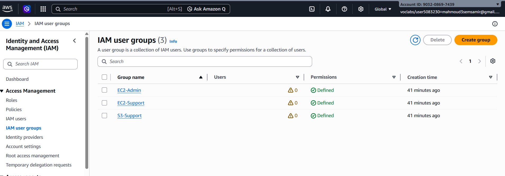
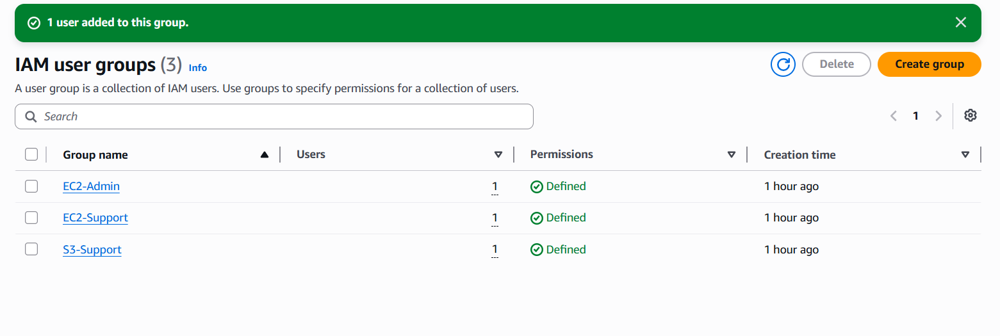
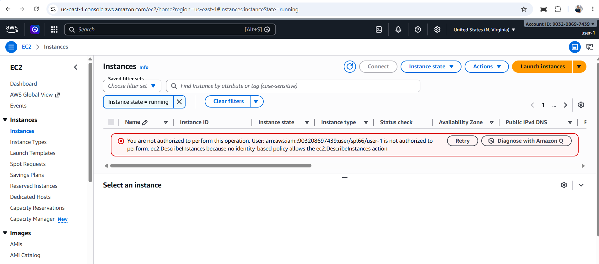
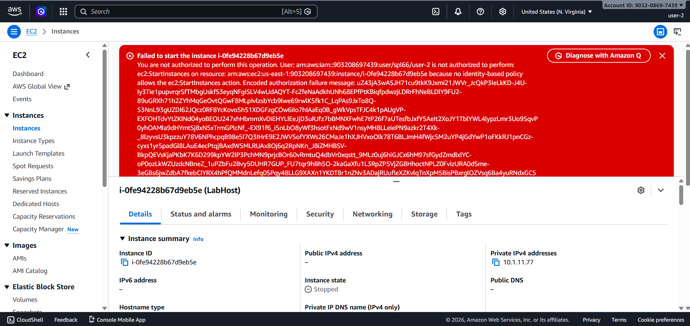
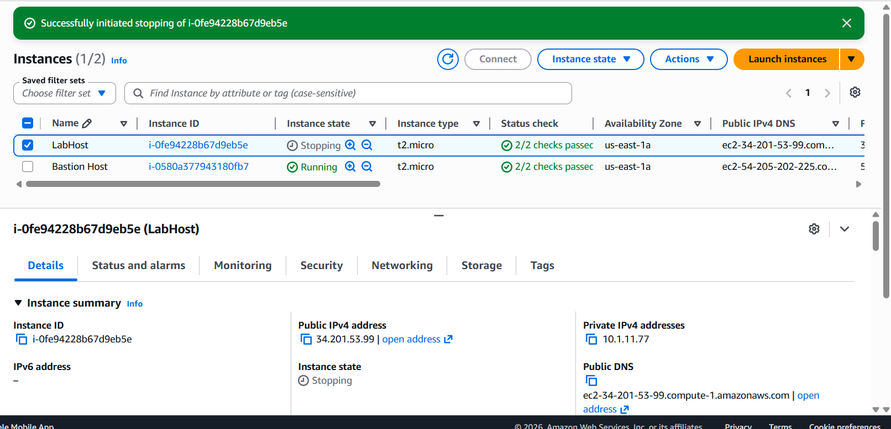

# IAM Architecture

## Tasks Completed

*  Task 1: Explore Users and Groups:
  - Explored pre-created IAM users (`user-1`, `user-2`, `user-3`)
  - Inspected three IAM groups: EC2-Admin, EC2-Support, S3-Support
  - Reviewed IAM policies attached to each group

  

*  Task 2: Add Users to Groups:
    - In this task, IAM users were assigned to different groups to inherit permissions through attached policies.

   - `user-1` was added to the S3-Support group and inherited the AmazonS3ReadOnlyAccess policy, which allows read-only access to Amazon S3 resources.
   -`user-2` was added to the EC2-Support group and inherited the AmazonEC2ReadOnlyAccess policy, which allows viewing Amazon EC2 resources without modifying them.
   - `user`-3` was added to the EC2-Admin group and inherited an inline policy that allows starting, stopping, and viewing EC2 instances.

   - After completing the configuration, each IAM group contained one user, confirming that permissions were successfully assigned through group membership.

   

- [ ] Task 3: Sign-In and Test Users
  - [ ] **Test `user-1` (S3 Support):**
    - Logged in via the IAM Sign-in URL.
    - Verified access to Amazon S3 console (Successfully listed buckets).
    - Tested access to Amazon EC2 (Received "You are not authorized" error as expected).
    
     

  - [ ] **Test `user-2` (EC2 Support):**
    - Logged in as `user-2`.
    - Verified Read-Only access to EC2 (Can see the `LabHost` instance).
    - Attempted to **Stop** the instance (Received "Not authorized" error as expected).
    - Tested access to S3 (Received "Don't have permissions to list buckets" error).

    

  - [ ] **Test `user-3` (EC2 Admin):**
    - Logged in as `user-3`.
    - Navigated to EC2 Instances and selected `LabHost`.
    - Successfully **Stopped** the instance (State changed to `stopping`).
   
     
     
     ## Lab complete.