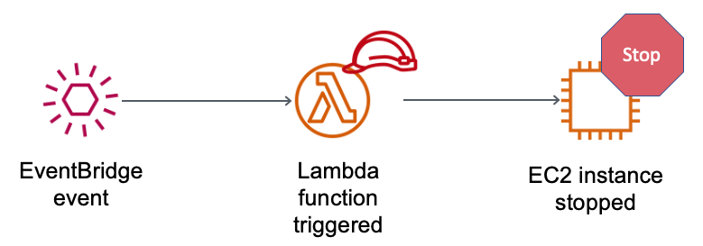
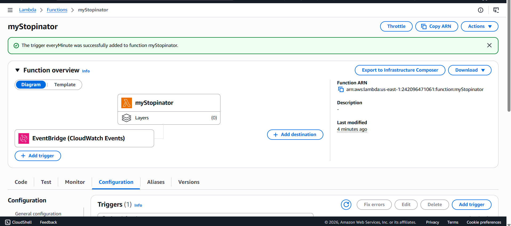
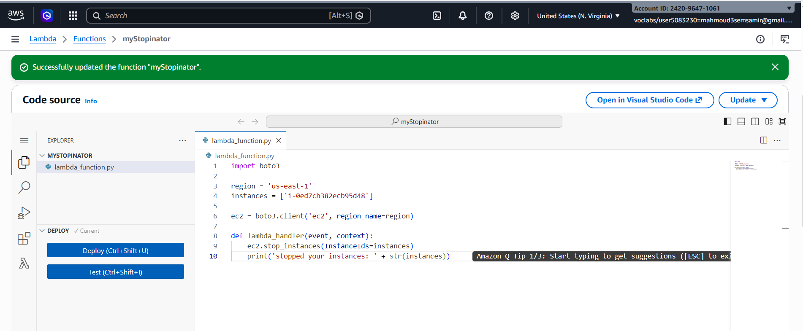

# ⚡ AWS Lab | Automated EC2 Management using AWS Lambda & EventBridge

This repository documents the hands-on implementation of a serverless automation workflow. The project demonstrates how to leverage **AWS Lambda** and **Amazon EventBridge** to automatically manage infrastructure states based on time schedules, enforced by strict **IAM** permissions.

---

## 📐 Architecture Overview

The automation workflow follows a modern event-driven serverless pattern:
1. **Amazon EventBridge** acts as a cron-job trigger, firing an event every 60 seconds (1 minute).
2. **AWS Lambda** receives the event and executes a Python script (Boto3) to scan for running EC2 instances.
3. An **IAM Role** grants the Lambda function the exact minimum permissions required (`ec2:StopInstances`) to safely shut down target instances.

---

## 🎯 Activity Objectives

* 🛠️ **Create an AWS Lambda Function:** Deploy serverless code configured to interact with the AWS ecosystem.
* ⏰ **Configure an Amazon EventBridge Rule:** Establish a time-based scheduled trigger (1-minute interval).
* 🔐 **Implement IAM Least Privilege:** Attach a specialized IAM role to the Lambda function to authorize secure API calls to Amazon EC2.
* 💻 **Automate EC2 State Management:** Automatically stop running Amazon EC2 instances to optimize costs and enforce environment boundaries.

## 🛠️ Step-by-Step Implementation Preview

### 1️⃣ Task 1: Create the Lambda Function
1. Navigate to the **AWS Lambda Console** and choose **Create a function**.
2. Select **Author from scratch** and apply the following setup:
   * **Function name:** `myStopinator`
   * **Runtime:** `Python 3.11`
3. Expand **Change default execution role** $\rightarrow$ Select **Use an existing role**.
4. From the dropdown list, select **`myStopinatorRole`**.
5. Choose **Create function**.

### 2️⃣ Task 2: Configure the EventBridge Trigger
1. In the **Function overview** pane, click **Add trigger**.
2. Select **EventBridge (CloudWatch Events)** from the dropdown.
3. Configure the trigger rule:
   * **Rule:** Select *Create a new rule*.
   * **Rule name:** `everyMinute`
   * **Rule type:** `Schedule expression`
   * **Schedule expression:** `rate(1 minute)`
4. Click **Add**.

### 3️⃣ Task 3: Deployment & Code Configuration

Navigate to the **Code** tab, open `lambda_function.py`, replace its contents with the optimized Python script below, and update your environmental parameters:

import boto3

 * * 🌐 Replace with your active AWS Region (e.g., 'us-east-1')
region = 'YOUR_AWS_REGION'

* * 🆔 Replace with your specific running EC2 Target Instance ID (e.g., 'i-0abcdef1234567890')
instances = ['YOUR_INSTANCE_ID']

ec2 = boto3.client('ec2', region_name=region)

def lambda_handler(event, context):
    # Execute API call to stop target infrastructure safely
    ec2.stop_instances(InstanceIds=instances)
    print('Successfully stopped target instances: ' + str(instances))

 #### 🚀 Deployment Steps
 

Follow these structured steps to save, deploy, and monitor your newly configured Lambda function:

* **🔍 Step 1: Code Verification**
  * Double-check **line 5** in your editor. Make sure no unwanted formatting periods (`.`) were accidentally introduced during the copy-paste process.
  
* **💾 Step 2: Save Changes**
  * From the top menu bar of the code editor, select **File** $\rightarrow$ **Save** to commit your script updates.

* **🌐 Step 3: Publish Live**
  * Click the blue **Deploy** button located in the *Code source* toolbar to push your changes to the active AWS execution environment.

* **📊 Step 4: Monitor Analytics**
  * Switch to the **Monitor** tab near the top of the function page to inspect real-time operational metrics via CloudWatch charts:
    * 📈 **Invocation Count:** Tracks how many times EventBridge triggers the function.
    * 🛑 **Error Count & Success Rate (%):** Monitors for any runtime failures or syntax bugs.

 ### 🧪 Task 4: Verification & Operational Infrastructure Testing

To ensure the automated serverless architecture functions correctly, perform the following validation workflow within your AWS sandbox:

### 🔎 Step 1: Verify Instance State Transition
1. Return to your open **Amazon EC2 Console** browser tab.
2. Locate your target instance (**`instance1`**).
3. Click the 🔄 **Refresh** icon in the top right of the EC2 console table.
4. **🎯 Expected Result:** You should observe the instance state transitioning from `Running` to `Stopping` or `Stopped`, confirming that the Lambda function was successfully invoked by EventBridge.

### 🔄 Step 2: The Resiliency Challenge (Manual Override Test)
* **Action:** Select `instance1`, click **Instance state**, and choose **Start instance** to manually boot it back up.
* **❓ Operational Question:** *What happens if you try starting the instance again?*
* **💡 System Response:** The instance will successfully start, but **within exactly 1 minute**, the background Amazon EventBridge schedule will trigger the Lambda function again, automatically forcing the instance back into a **`Stopped`** state. This proves the automation loop is highly resilient.

---

## 🏆 Submitting Your Work & Finalizing the Lab 