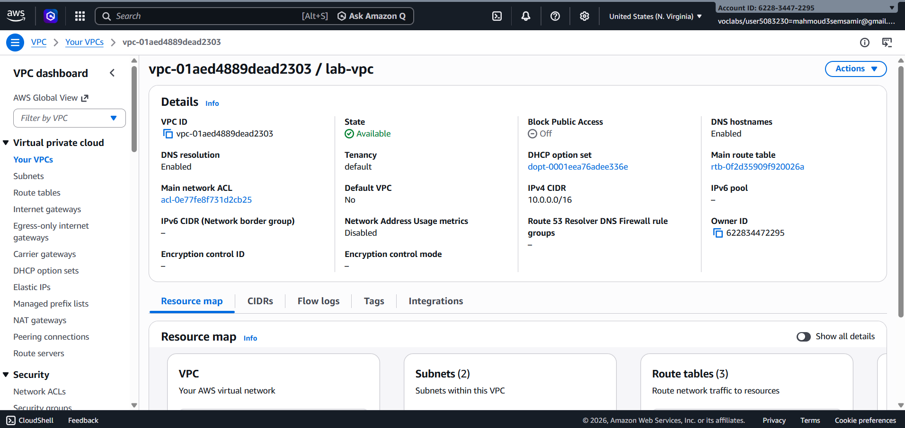
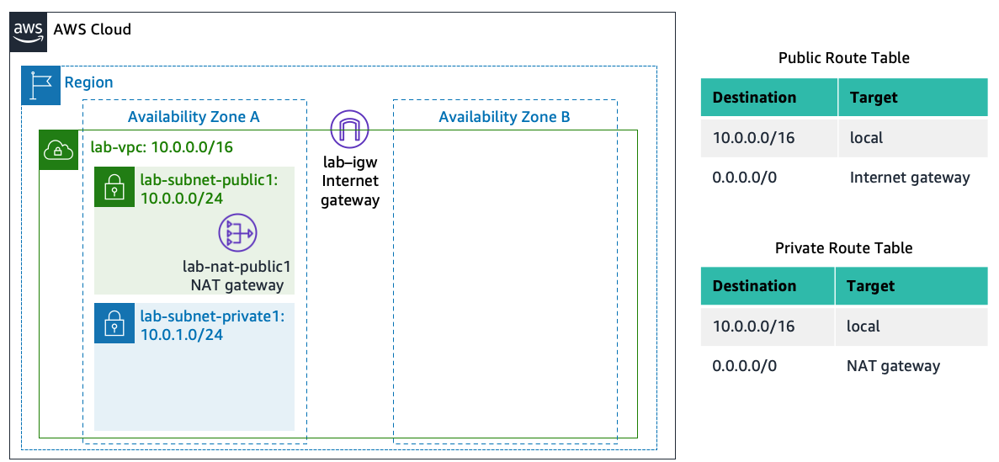
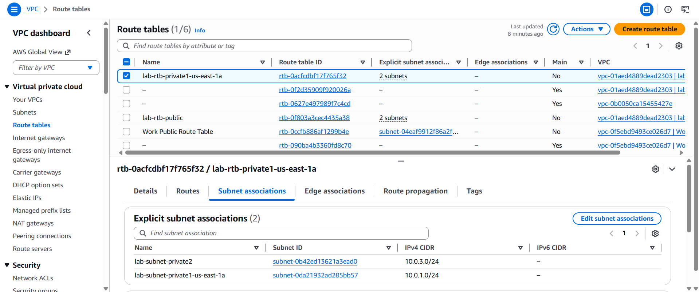
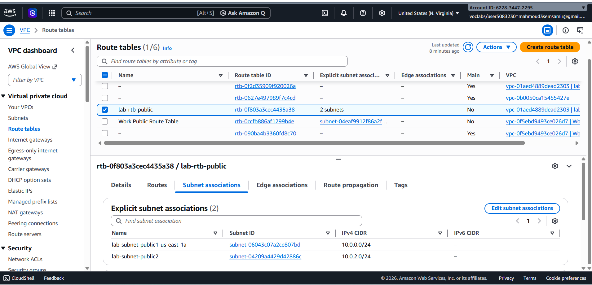
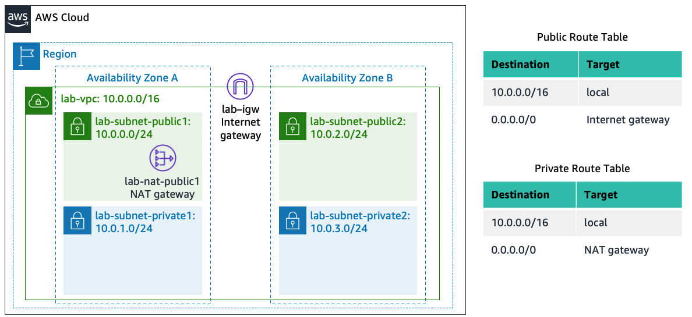
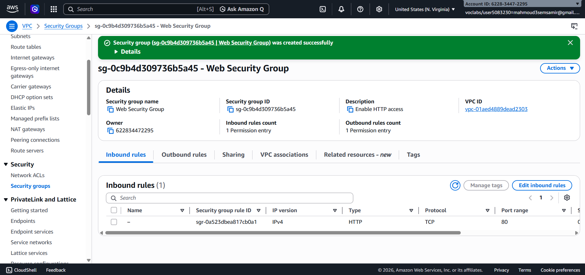
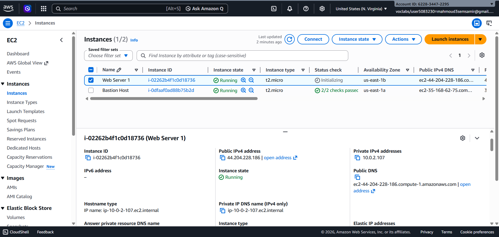

# Lab 2: Build your VPC and Launch a Web Server

# Tasks Completed

- [ ] Task 1: Create Your VPC
  - Navigated to the VPC Console and verified the region is **N. Virginia (us-east-1)**.
  - Used the **"VPC and more"** option to auto-generate and configure the network infrastructure:
    - **Name tag auto-generation:** Changed prefix to `lab` (resulting in `lab-vpc`).
    - **IPv4 CIDR block:** `10.0.0.0/16`
    - **Availability Zones (AZs):** 1 AZ (`us-east-1a`).
    - **Public Subnet:** 1 subnet with CIDR `10.0.0.0/24` (`lab-subnet-public1-us-east-1a`).
    - **Private Subnet:** 1 subnet with CIDR `10.0.1.0/24` (`lab-subnet-private1-us-east-1a`).
    - **NAT Gateway:** Configured **In 1 AZ** (`lab-nat-public1-us-east-1a`) to provide secure internet access for the private subnet.
    - **Internet Gateway (IGW):** Created and attached (`lab-igw`).
  - Successfully created all resources and clicked **View VPC**.

- **Network Architecture**
- This diagram summarizes the VPC resources created and how traffic is routed between the public and private subnets:
 

- [ ] Task 2: Create Additional Subnets (High Availability)
  - **Created a Second Public Subnet:**
    - **VPC:** `lab-vpc`
    - **Subnet name:** `lab-subnet-public2`
    - **Availability Zone:** `us-east-1b`
    - **IPv4 CIDR block:** `10.0.2.0/24`
  
  - **Created a Second Private Subnet:**
    - **VPC:** `lab-vpc`
    - **Subnet name:** `lab-subnet-private2`
    - **Availability Zone:** `us-east-1b`
    - **IPv4 CIDR block:** `10.0.3.0/24`

  - **Configured Route Table Associations:**
    - **Private Routing:** Associated `lab-subnet-private2` with the `lab-rtb-private1-us-east-1a` route table to direct internet-bound traffic (`0.0.0.0/0`) through the NAT Gateway.
    

    - **Public Routing:** Associated `lab-subnet-public2` with the `lab-rtb-public` route table to direct internet-bound traffic (`0.0.0.0/0`) directly through the Internet Gateway (IGW).
 

    ###  Updated VPC Architecture 
    - The diagram below displays the updated network layout across two Availability Zones:
    

 - [ ] Task 3: Create a VPC Security Group
  - Navigated to **VPC > Security Groups** and clicked **Create security group**.
  - Configured the Firewall basic settings:
    - **Security group name:** `Web Security Group`
    - **Description:** `Enable HTTP access`
    - **VPC:** Selected `lab-vpc` (removed the default VPC).
  - Configured **Inbound Rules** to allow web traffic:
    - **Type:** `HTTP` (Port `80`)
    - **Source:** `Anywhere-IPv4` (`0.0.0.0/0`)
    - **Description:** `Permit web requests`
  - Successfully created the security group to be associated with the EC2 instance later.

- [ ] Task 4: Launch a Web Server Instance
  - Navigated to the **EC2 Console** and clicked **Launch instance**.
  - **Instance Name:** Named the instance `Web Server 1` (creates a `Name` tag automatically).
  - **Application and OS Images (AMI):** Selected default **Amazon Linux 2023 AMI**.
  - **Instance Type:** Kept default `t2.micro` (determines hardware resources).
  - **Key Pair:** Selected the existing `vockey` for future SSH access.
  - **Network Settings Configuration:**
    - **Network:** `lab-vpc`
    - **Subnet:** `lab-subnet-public2` *(Ensuring it's public for external access)*.
    - **Auto-assign public IP:** `Enable` *(To get an accessible public IP address)*.
    - **Firewall (Security Groups):** Chose *Select existing security group* and attached **`Web Security Group`**.
  - **Advanced Details (User Data Script):**
    - Scrolled to the bottom and pasted the bootstrap shell script inside the **User data** field to automate the installation of Apache Web Server, PHP, MariaDB, and deploy the lab application.
  - Clicked **Launch instance** and proceeded to **View all instances**.

**Final Architecture Deployed**
The completed multi-AZ network architecture with our active web server inside the public subnet:
.png)

##  Summary of Skills Gained
- Building a custom VPC infrastructure with Public and Private subnets across multiple Availability Zones (High Availability).
- Configuring Internet Gateways and NAT Gateways for secure routing.
- Launching and bootstrapping EC2 instances automatically using Linux Shell Scripts (User Data).
- Setting up Security Groups as network firewalls to allow specific web traffic (HTTP)