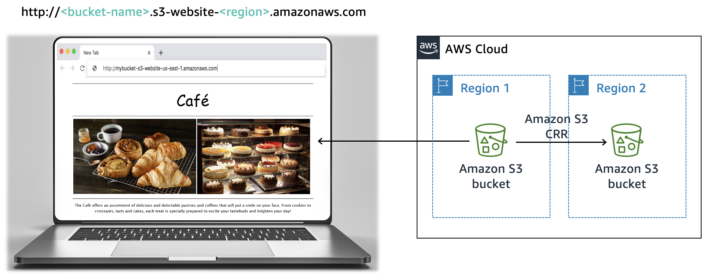
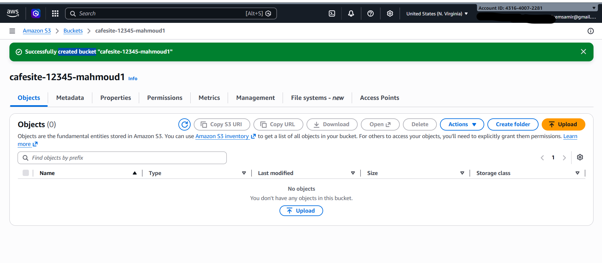
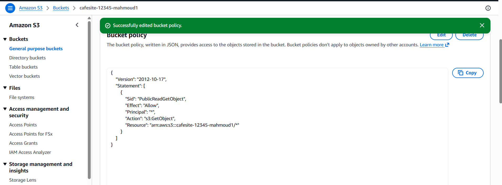
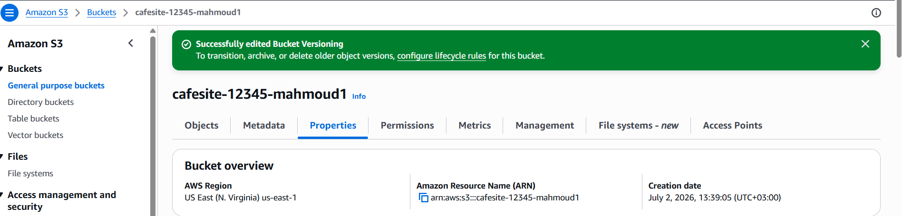

# ☕ AWS Challenge Lab: Static Website for the Café

A concise documentation of deploying a secure, scalable, and cost-effective static website for the café using **Amazon S3**.

---

## 🎯 Objectives
* 🌐 **Host a Static Website:** Deploy café web assets publicly on Amazon S3.
* 🔒 **Data Protection:** Enable S3 Versioning to prevent accidental deletions.
* ⏳ **Lifecycle Management:** Implement rules to optimize storage costs over time.
* 🌍 **Disaster Recovery (DR):** Setup Cross-Region Replication (CRR) for high availability.

---

## 🛠️ Implementation Steps

### 1️⃣ Launching the Website
* Created an S3 bucket and disabled **Block Public Access**.
* Attached a **Bucket Policy** to allow public read permissions (`s3:GetObject`).
* Enabled **Static Website Hosting** and uploaded `index.html` and assets.

### 2️⃣ Data Protection & Lifecycle
* Turned on **Bucket Versioning** to retain historical object states.
* Configured **Lifecycle Rules** to automatically transition old assets or logs to cost-effective storage classes.

### 3️⃣ Disaster Recovery
* Created a secondary backup bucket in a different AWS Region.
* Configured **Cross-Region Replication (CRR)** to mirror data automatically.

---

## 🧰 Tech Stack
* **Cloud Provider:** Amazon Web Services (AWS)
* **Core Service:** Amazon Simple Storage Service (Amazon S3)

### 📂 Task 1: Environment Setup
* Downloaded and extracted the local website source files (`index.html` and the `images/` directory).

### 🪣 Task 2: Infrastructure Creation
* Created an Amazon S3 bucket in the **US East (N. Virginia) us-east-1** region.
* **Permissions:** Enabled ACLs and completely disabled **Block Public Access**.
* **Hosting:** Configured **Static Website Hosting** using `index.html` as the index document.


---

### 🚀 Task 3: Uploading Content to S3 Bucket

This repository documents the process of deploying static web assets to an **Amazon S3 bucket** and verifying the deployment via the public static website endpoint.

---

## 📂 Task Overview: Uploading Static Files

The objective of this task is to host a static website by uploading the essential frontend components into the root of the configured S3 bucket.

### 🗂️ Project Structure to Upload
Ensure the following files and directories are uploaded exactly as shown:

| Asset Name | Type | Description |
| :--- | :--- | :--- |
| 📄 `index.html` | File | The main entry point of the static website. |
| 📁 `css/` | Folder | Contains the stylesheets for layout and design. |
| 📁 `images/` | Folder | Contains all graphic assets and images used in the site. |

  ---<p align="center">
  
</p>

---

## 🛠️ Step-by-Step Implementation

### 1️⃣ Step 1: Uploading Assets via AWS Console
1. Open the **Amazon S3 Console**.
2. Click on the name of your specific lab bucket.
3. Click the **Upload** button.
4. Drag and drop the `index.html` file, and the `css` and `images` folders into the upload area.
5. Scroll down and click the blue **Upload** button to confirm.

### 2️⃣ Step 2: Verifying the Static Website Endpoint
1. Navigate to the **Properties** tab of your S3 bucket.
2. Scroll to the very bottom to find the **Static website hosting** section.
3. Click on the **Bucket website endpoint** URL.
4. The link will open in a new browser tab to verify if the website is live.

  ---<p align="center">
  
</p>


---

## 📝 Lab Assessment & Questions


### 🌐 How to Access the Quiz:
1. Scroll to the top of the lab instructions page.
2. Click on the **AWS Details** button.
3. Choose the link labeled: **"Access the multiple choice questions"**.

### 📌 Current Milestone Question:
* **Question 1:** *When viewing the website after Task 3, do you see the page in the browser?*
* 💡 *Reminder:* Keep the questions webpage open in your browser tab. You will need to return to it later in this lab.

---
## 🔐 Task 4: Creating a Bucket Policy for Public Read Access

To avoid manually making every new dessert image public, we implement a **Bucket Policy** that automatically grants read-only permissions to anonymous public users.

### 📝 Step-by-Step Implementation:
1. Go to the **Amazon S3 Console** and click on your bucket name.
2. Select the **Permissions** tab.
3. Scroll down to **Bucket policy** and click **Edit**.
4. Paste a public read policy (similar to the one below, replacing `YOUR-BUCKET-NAME` with your actual bucket name):

```json
{
    "Version": "2012-10-17",
    "Statement": [
        "Sid": "PublicReadGetObject",
        "Effect": "Allow",
        "Principal": "*",
        "Action": "s3:GetObject",
        "Resource": "arn:aws:s3:::YOUR-BUCKET-NAME/*"
    ]
}
```
.

Click Save changes.🎯 
### 🛡️ Task 5: S3 Object Versioning & Data Protection

This section details the implementation of Amazon S3 Object Versioning to protect website data from accidental overwrite or deletion, aligned with the AWS Well-Architected Framework.

---

## 🔄 Task Overview: Enabling Versioning

As the café website expands, changes become frequent. To prevent accidental loss of previous website states, we enable **Object Versioning** on the S3 bucket.

> ⚠️ **Crucial Note:** Once you enable versioning on an S3 bucket, it **cannot** be disabled; it can only be suspended.

---

## 🛠️ Step-by-Step Implementation

### 1️⃣ Step 1: Enable Bucket Versioning
1. Open the **Amazon S3 Console** and click on your bucket name.
2. Navigate to the **Properties** tab.
3. Locate the **Bucket Versioning** section and click **Edit**.
4. Select **Enable** and click **Save changes**.


### 2️⃣ Step 2: Modifying `index.html` locally
Open your `index.html` file in your preferred text editor (e.g., VS Code, Notepad++) and perform the following updates:

| Original Code | Updated Code | Description |
| :--- | :--- | :--- |
| 🔴 `bgcolor="aquamarine"` *(First occurrence)* | `bgcolor="gainsboro"` | Updates background color |
| 🔴 `bgcolor="orange"` | `bgcolor="cornsilk"` | Updates accent color |
| 🔴 `bgcolor="aquamarine"` *(Second occurrence)* | `bgcolor="gainsboro"` | Updates secondary section background |

💾 **Save** the changes to the file.

### 3️⃣ Step 3: Uploading and Verifying Versions
1. **Upload** the newly saved `index.html` to your S3 bucket.
2. **Refresh** your static website browser tab to observe the color modifications.
3. Go back to the S3 bucket console and toggle the **Show versions** switch. 
4. 🕵️‍♂️ **Result:** You will now see both the original version and the newly modified version of `index.html` listed concurrently.

---

## 📝 Lab Assessment & Quiz

### 📌 Question 2:
* **Question:** *What is another way to ensure maximum protection and prevent the accidental deletion of a preserved version?*
* 🔑 **Answer/Hint:** **MFA Delete (Multi-Factor Authentication Delete)**. When enabled, it requires additional authentication from a hardware or virtual MFA device before any object version can be permanently deleted.

---

## 🏛️ Architecture Best Practice: Data Protection

According to the **AWS Well-Architected Framework**, data protection is a fundamental pillar of cloud security. 

* 📁 **Data Classification:** Categorizing organizational data based on its level of sensitivity.
* 🔒 **Encryption:** Rendering data unintelligible to unauthorized access (both at rest and in transit).
* 🔄 **Lifecycle & Versioning:** Combining versioning with lifecycle policies supports business continuity, prevents financial loss, and meets compliance obligations.

---

## 🎯 Next Challenge: Optimizing Costs
* **The Problem:** Enabling versioning causes the bucket size to accumulate indefinitely as older versions are preserved.

# 📉  Task 6: S3 Lifecycle Policies & Cost Optimization

This section covers the implementation of **S3 Lifecycle Policies** to automate data tiering, reduce storage costs for noncurrent object versions, and align with data retention best practices.

---

## 💰 Task Overview: Setting Lifecycle Policies

With versioning enabled, older versions accumulate and increase storage costs. To optimize expenses, we configure **two separate lifecycle rules** to automate the transition and expiration of noncurrent versions.

### ⚙️ Rule Configuration Requirements:
* **Rule 1 (Storage Tiering):** Move noncurrent versions to **S3 Standard-IA** after **30 days**.


* **Rule 2 (Data Destruction):** Permanently delete noncurrent versions after **365 days**.


---

## 🛠️ Step-by-Step Implementation

### 1️⃣ Step 1: Creating Rule 1 (Transition to Standard-IA)
1. Go to the **Amazon S3 Console** and click on your website bucket.
2. Navigate to the **Management** tab.
3. Under **Lifecycle rules**, click **Create lifecycle rule**.
4. Configure the following settings:
   * **Lifecycle rule name:** `Transition-Noncurrent-To-Standard-IA`
   * **Rule scope:** Choose **Apply to all objects in the bucket** (Acknowledge the warning).
   * **Lifecycle rule actions:** Check **Move noncurrent versions of objects between storage classes**.
5. Under **Transition noncurrent versions of objects**:
   * **Storage class transitions:** Choose **Standard-IA**.
   * **Days after objects become noncurrent:** Enter `30`.
6. Click **Create rule**.

### 2️⃣ Step 2: Creating Rule 2 (Permanent Deletion)
1. Click **Create lifecycle rule** again to create the second independent rule.
2. Configure the following settings:
   * **Lifecycle rule name:** `Expire-Noncurrent-Objects`
   * **Rule scope:** Choose **Apply to all objects in the bucket**.
   * **Lifecycle rule actions:** Check **Permanently delete noncurrent versions of objects**.
3. Under **Permanently delete noncurrent versions of objects**:
   * **Days after objects become noncurrent:** Enter `365`.
4. Click **Create rule**.

---

## 🏛️ Architecture Best Practice: Data Lifecycle Management

According to the **AWS Well-Architected Framework**, an effective lifecycle strategy must be tailored based on:
* 🎯 **Data Criticality & Sensitivity:** Determining which data needs high availability vs. lower-cost archive tiers.
* ⚖️ **Legal & Organizational Requirements:** Meeting compliance standards for data retention duration.
* 🗑️ **Data Destruction:** Securely and automatically removing data when it is no longer legally or operationally required.

---

## 🌐 New Business Requirement: Durability & Disaster Recovery (DR)

Now that data protection and cost optimization are handled, the next architecture milestone introduces **High Availability** and **Business Continuity**.

* **The Challenge:** Protecting the website against an entire AWS Region outage.
* **The Solution (Challenge 4 Preview):** Implementing **Cross-Region Replication (CRR)** to automatically back up and archive critical static assets to a geographically separated standby region.