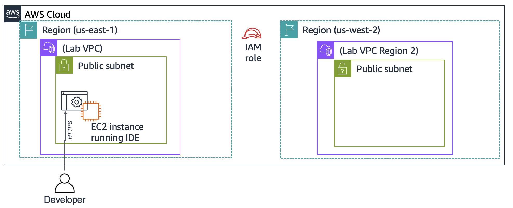
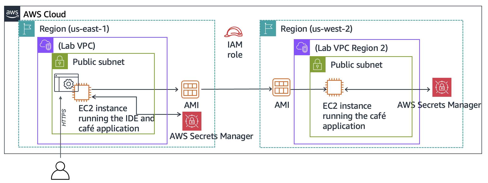

# Challenge Lab: Creating a Dynamic Website for the Café

## 📌 Scenario
After launching the first version of the café's website, customers praised its design but frequently asked if they could place online orders. 

To delight customers and improve their experience, Sofía, Nikhil, Frank, and Martha decided to upgrade the architecture. In this lab, you will deploy a dynamic web application that allows the café to accept online orders, create a golden image (**AMI**) from it, and deploy a production copy in a secondary AWS Region for high availability/localization.

---

## 🎯 Lab Objectives
By the end of this lab, you will be able to:
* [x] **Connect** to the VS Code Integrated Development Environment (VS Code IDE) on an existing EC2 instance.
* [x] **Configure** the EC2 instance environment and confirm web server accessibility.
* [x] **Install** a dynamic web application on an EC2 instance integrated with **AWS Secrets Manager**.
* [x] **Test** the web application functionalities (online ordering).
* [x] **Create** a custom Amazon Machine Image (AMI) from the configured instance.
* [x] **Deploy** a second copy of the web application to another AWS Region (Production Environment).
 * When you start the lab, some resources are already created for you in the AWS account:


<p align="center">
  
</p>


  * At the end of this lab, your architecture should look like the following example:

  <p align="center">
  
</p>


---

## 🏗️ Architecture Overview

The lab infrastructure transitions from a single development environment to a multi-region deployment:

1. **Development Environment (First AWS Region):** Contains the initial EC2 instance hosting the VS Code IDE and the dynamic application connected to Secrets Manager.
2. **Production Environment (Second AWS Region):** Created using a copied AMI to replicate the exact application state across geographical boundaries.

---

## 🛠️ Step-by-Step Implementation Guide

### Task 1: Analyzing the Existing EC2 Instance

In this task, you will analyze the pre-configured EC2 instance named **Lab IDE** to understand its networking, security, and IAM settings before deploying the dynamic application.

#### Step 1: Locate the Instance
1. Open the **AWS Management Console**, search for **EC2**, and open the console.
2. In the left navigation pane, click on **Instances**.
3. Identify the running instance named **Lab IDE** (This instance serves as your development environment and workspace).

---

#### 📝 Task 1.1: Verification & Architecture Questions
To answer the validation questions for this lab, click on **AWS Details** at the top of your lab instructions page, and select the **Access the multiple choice questions** link. Look up the **Lab IDE** details in your EC2 console to answer the first four questions:

##### **Question 1: Is the instance in a public subnet?**
* **How to check:** Look at the **Subnet ID** in the instance description and verify if it routes traffic to an Internet Gateway (IGW), or if it has a public IP attached.

##### **Question 2: Does the EC2 instance have an IPv4 Public IP address assigned to it?**
* **How to check:** Inspect the **Public IPv4 address** field in the instance summary tab.

##### **Question 3: What inbound TCP port numbers are open for this instance?**
* **How to check:** Click on the **Security** tab of the instance, click on the **Security Groups** link, and review the **Inbound rules** table (Look for allowed TCP ports like 22, 80, 443, or custom ports).

##### **Question 4: Does the EC2 instance have an AWS Identity and Access Management (IAM) role associated with it?**
* **How to check:** Check the **Security** tab under the instance details and locate the **IAM role** field to see if a role is attached.

> 💡 **Tip:** Keep the multiple-choice questions tab open in your browser; you will return to it to submit your answers later.

### Task 2: Connecting to the IDE on the EC2 Instance

In this task, you will connect to the cloud-based VS Code IDE running on your EC2 instance and familiarize yourself with the development workspace.

#### Step 1: Retrieve Access Credentials
1. At the top of your lab instructions page, click on the **AWS Details** button.
2. Locate the following environment variables from the credentials table and copy them to a secure text editor for later use:
   * **`LabIDEURL`** (The web address to access your workspace)
   * **`LabIDEPassword`** (The password required to authenticate)

---

#### Step 2: Authenticate and Launch the IDE
1. Open a new browser tab, paste the **`LabIDEURL`** value, and hit Enter.
2. When the **"Welcome to code-server"** login window prompts you, enter the **`LabIDEPassword`** you copied earlier.
3. Click **Submit** to launch the cloud-hosted VS Code IDE interface.

---

#### Step 3: Explore the Workspace Layout
Once loaded, your integrated development environment (IDE) will feature three key functional zones:
* 📂 **File Browser (Left Panel):** Displays the directory structure mapped directly to the `/home/ec2-user/environment` folder on your EC2 instance.
* 📝 **File Editor (Upper-Right Panel):** Allows you to click, view, and modify file contents directly from your browser.
* 💻 **Bash Terminal (Bottom-Right Panel):** Provides standard Linux command-line access to execute commands directly on the server host.

  <p align="center">
  
</p>

### Task 3: Configuring the LAMP Stack & Confirming Web Server Accessibility

In this task, you will configure the Apache web server to run on port 8000, install the MariaDB database engine, set up a symbolic link for easy file editing, and configure the network security rules to make the site accessible online.

#### Step 1: Analyze Environment & Configure Apache Web Server
1. In the VS Code IDE terminal, check the Linux kernel and OS version:
   ```bash
   cat /proc/version

```

2. Modify the Apache configuration file to listen on **port 8000** (since the IDE uses port 80), then start and enable the web server:
```bash
sudo sed -i 's/Listen 80/Listen 8000/g' /etc/httpd/conf/httpd.conf
sudo systemctl start httpd
sudo systemctl enable httpd
sudo service httpd status
php --version

```
  <p align="center">
  
</p>


---

#### Step 2: Install and Enable the MariaDB Database

Run the following commands to install the relational database system and ensure it auto-starts on system boots:

```bash
# Install MariaDB Server
sudo dnf install -y mariadb105-server
sudo systemctl start mariadb
sudo systemctl enable mariadb
sudo mariadb --version
sudo service mariadb status

```
  <p align="center">
  
</p>


> 💡 *Tip: If the service status output leaves the terminal without a prompt, press **`Q`** on your keyboard to exit.*

---

#### Step 3: Configure Permissions & Project Symlink

To allow the VS Code file browser to access and modify the web server's core directories, run:

```bash
# Create a symbolic link to the web server root directory
ln -s /var/www/ /home/ec2-user/environment

# Change ownership of the HTML directory to the current user
sudo chown ec2-user:ec2-user /var/www/html

```

* **What this did:** A new folder named `www` will appear in your left file browser pane. The ownership change allows the `ec2-user` to seamlessly create and edit files inside `/var/www/html`.

---

#### Step 4: Create a Test Webpage

1. In the IDE file browser, navigate to: `www` > `html`.
2. Right-click or use the top menu to select **File** > **New File**.
3. Name the file **`index.html`** and paste the following content:
```html
<html>Hello from the café web server!</html>

```


4. Save the file (**Ctrl + S** or **File** > **Save**).

---

#### 🛠️ Resolving Challenge #1: Making the Website Accessible

To test if your server is accessible over the internet, follow these steps:

1. **Locate Public IP:** Go to your Amazon EC2 Console, select the **Lab IDE** instance, and copy its **Public IPv4 address**.
2. **Test Access:** Open a new browser tab and navigate to `http://<YOUR_PUBLIC_IP>:8000`.
3. **Firewall Adjustment (Security Group Challenge):**
* If the page loads infinitely, the inbound security rules are blocking traffic.
* Go to the EC2 Console > **Security Groups** attached to the **Lab IDE** instance.
* Edit **Inbound Rules** and add a new rule:
* **Type:** `Custom TCP`
* **Port Range:** `8000`
* **Source:** `Any IPv4` (`0.0.0.0/0`)


* Save the rules and refresh your browser tab. You should now see: **"Hello from the café web server!"**


---

### 🚀 Moving to Challenge #2: Installing the Dynamic Application

With Apache running on port 8000, MariaDB active, and port 8000 successfully exposed to the internet, you have established the base platform. You are now ready to deploy the actual interactive cafe ordering codebase!


### Task 4: Installing the Café Application

In this task, you will download the application source code, configure core parameters via AWS Secrets Manager, set up the local MySQL/MariaDB database, and troubleshoot permissions to bring the dynamic website online.

#### Step 1: Download and Extract Application Components
Run the following commands in your IDE terminal to download and unpack the application, database setup, and the AWS SDK for PHP:
```bash
cd ~/environment
# Download setup, database configuration, and web assets
wget [https://aws-tc-largeobjects.s3.us-west-2.amazonaws.com/CUR-TF-200-ACACAD-3-113230/03-lab-mod5-challenge-EC2/s3/setup.zip](https://aws-tc-largeobjects.s3.us-west-2.amazonaws.com/CUR-TF-200-ACACAD-3-113230/03-lab-mod5-challenge-EC2/s3/setup.zip) && unzip setup.zip
wget [https://aws-tc-largeobjects.s3.us-west-2.amazonaws.com/CUR-TF-200-ACACAD-3-113230/03-lab-mod5-challenge-EC2/s3/db.zip](https://aws-tc-largeobjects.s3.us-west-2.amazonaws.com/CUR-TF-200-ACACAD-3-113230/03-lab-mod5-challenge-EC2/s3/db.zip) && unzip db.zip
wget [https://aws-tc-largeobjects.s3.us-west-2.amazonaws.com/CUR-TF-200-ACACAD-3-113230/03-lab-mod5-challenge-EC2/s3/cafe.zip](https://aws-tc-largeobjects.s3.us-west-2.amazonaws.com/CUR-TF-200-ACACAD-3-113230/03-lab-mod5-challenge-EC2/s3/cafe.zip) && unzip cafe.zip -d /var/www/html/

# Download and extract the AWS SDK for PHP inside the cafe directory
cd /var/www/html/cafe/
wget [https://docs.aws.amazon.com/aws-sdk-php/v3/download/aws.zip](https://docs.aws.amazon.com/aws-sdk-php/v3/download/aws.zip)
wget [https://docs.aws.amazon.com/aws-sdk-php/v3/download/aws.phar](https://docs.aws.amazon.com/aws-sdk-php/v3/download/aws.phar)
unzip aws -d /var/www/html/cafe/

# Apply proper permissions across the application folder
chmod -R +r /var/www/html/cafe/

```

---

#### Step 2: Inject Application Parameters into AWS Secrets Manager

The application relies on `getAppParameters.php` to securely source its relational database connection details from Secrets Manager. Run the deployment script to create these entries:

```bash
cd ~/environment/setup/
./set-app-parameters.sh

```

> 🔍 **Verification:** Open the **AWS Secrets Manager Console** > **Secrets**. You will find seven newly created parameters (e.g., `/cafe/dbPassword`). Select it, click **Retrieve secret value**, and copy the password.

---

#### Step 3: Initialize the Relational Database

1. Execute the database initialization scripts from the IDE terminal:
```bash
cd ../db/
./set-root-password.sh
./create-db.sh

```


2. Connect to the local database using the copied password to verify tables:
```bash
mysql -u admin -p

```


3. Inside the MariaDB interactive prompt, inspect the product listings:
```sql
SHOW DATABASES;
USE cafe_db;
SHOW TABLES;
SELECT * FROM product;
EXIT;

```


---

#### Step 4: Configure the PHP Environment Timezone

Set the operational timezone for PHP and cycle the Apache service:

```bash
sudo sed -i "2i date.timezone = \"America/New_York\" " /etc/php.ini
sudo service httpd restart

```

---

#### 🛠️ Resolving Challenge #2: Fixing the Café Permissions Error

If you navigate to `http://<YOUR_PUBLIC_IP>:8000/cafe`, the application will fail to load or connect properly.

* **The Cause:** The PHP application uses the AWS SDK to retrieve operational secrets from Secrets Manager, but the EC2 instance lacks the necessary IAM permissions to query the service.
* **The Solution:**
1. Open the **Amazon EC2 Console** and select the **Lab IDE** instance.
2. Click **Actions** > **Security** > **Modify IAM role**.
3. Choose the pre-created IAM role named **`CafeRole`** (which grants read access to Secrets Manager).
4. Click **Update IAM role**.
5. Refresh your browser at `http://<YOUR_PUBLIC_IP>:8000/cafe`. The full dynamic store page with menu items will now load perfectly!


---

### Task 5: Testing the Web Application

To ensure end-to-end functionality of the development environment:

1. Access the web interface, click **Menu**, and place an online order for a dessert item.
2. Return to the homepage and place an additional test order.
3. Click on the **Order History** tab to verify that the orders are being successfully committed to and read from the MariaDB backend database.

  ---<p align="center">
  
</p>

---

### Task 6: Replicating to Production via AMI (Challenge #3)

To meet the disaster recovery and staging environment business standards, you will capture a golden image (**AMI**) of the working environment and port it over to a completely different AWS Region.

#### Step 1: Generate a Local SSH Key Pair & Authorize Access

Prepare your local networking credentials inside the EC2 instance terminal to safeguard administrative migration access:

```bash
sudo hostname cafeserver
ssh-keygen -t rsa -f ~/.ssh/id_rsa
# (Press Enter twice when prompted for passphrases)

cat ~/.ssh/id_rsa.pub >> ~/.ssh/authorized_keys

```

#### Step 2: Create a Custom AMI

1. In the **EC2 Console** (`us-east-1`), select the **Lab IDE** instance.
2. Select **Actions** > **Images and templates** > **Create image**.
3. Name the image **`CafeServer`** and confirm creation.
4. Navigate to the **AMIs** pane under the *Images* section and wait for the status to transition to **`Available`**.

#### Step 3: Copy the AMI across Regions

1. Select your new `CafeServer` AMI in the N. Virginia region.
2. Click **Actions** > **Copy AMI**.
3. Select **Oregon (`us-west-2`)** as the destination region and execute the copy. *(This process takes roughly 3 to 5 minutes)*.

#### Step 4: Deploy the Production Instance in Oregon (`us-west-2`)

Switch your AWS Management Console region to **Oregon**, locate the copied AMI, and launch a new instance with these exact configurations:

* **Name Tag:** `ProdCafeServer`
* **Instance Type:** `t2.small`
* **Key Pair:** `Proceed without a key pair` (The key injected earlier into authorized keys will act as access control).
* **VPC:** `Lab VPC Region 2`
* **Subnet:** `Public Subnet`
* **Security Group (`cafeSG`):** Open **TCP Port 22** (SSH) and **TCP Port 8000** (Web traffic) to Anywhere (`0.0.0.0/0`).
* **IAM Instance Profile:** Select **`CafeRole`**.
* **Launch Instance** and copy the resulting **Public IPv4 DNS** address.

  ---<p align="center">
  
</p>


#### Step 5: Update App Parameters for the New Production Region

Switch back to your VS Code IDE workspace (`us-east-1`), open the file `CafeWebServer/setup/set-app-parameters.sh`, and update the region and endpoint addresses to target Oregon:

```bash
# Line 15 (approx.) - Change targeted AWS Region
region="us-west-2"

# Line 21 (approx.) - Paste the public DNS string of the production instance
publicDNS="<public-dns-of-ProdCafeServer-instance>"

```

Save the file, then run the parameter injection script inside the terminal to spawn the required configuration parameters inside Oregon's Secrets Manager store:

```bash
cd ~/environment/setup/
./set-app-parameters.sh

```

---

### Task 7: Verifying the Production Café Instance

1. Open a new web browser tab.
2. Verify the base connection by navigating to: `http://<PROD_PUBLIC_IP>:8000/` (Should display: *"Hello from the café web server!"*).
3. Test the full application deployment by loading: `http://<PROD_PUBLIC_IP>:8000/cafe/`.
4. Browse the **Menu** page, submit a test purchase, and check the **Order History** page to ensure the application stack is entirely modular, self-contained, and working independently in the production region.

---

## 🏆 Conclusion

You have successfully designed and built a highly resilient, two-tiered architecture:

1. **Development Environment (`us-east-1`):** Allows safe testing of application updates and structural code updates without endangering the live environment.
2. **Production Environment (`us-west-2`):** A geo-replicated deployment running on a custom AMI, utilizing IAM profiles and Secrets Manager parameters optimized for strict region isolation.

```

```
