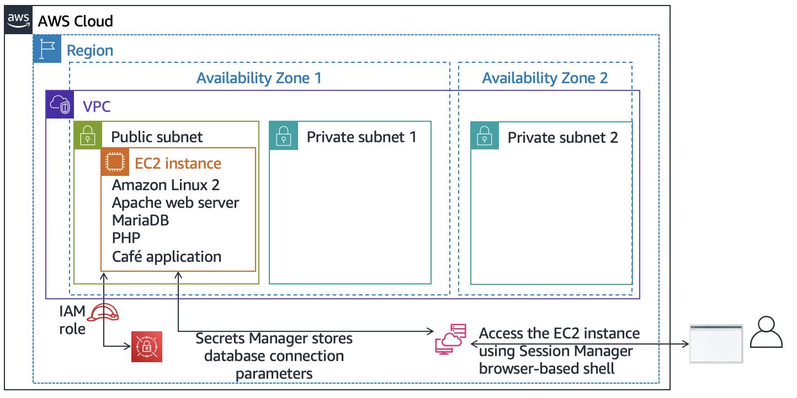
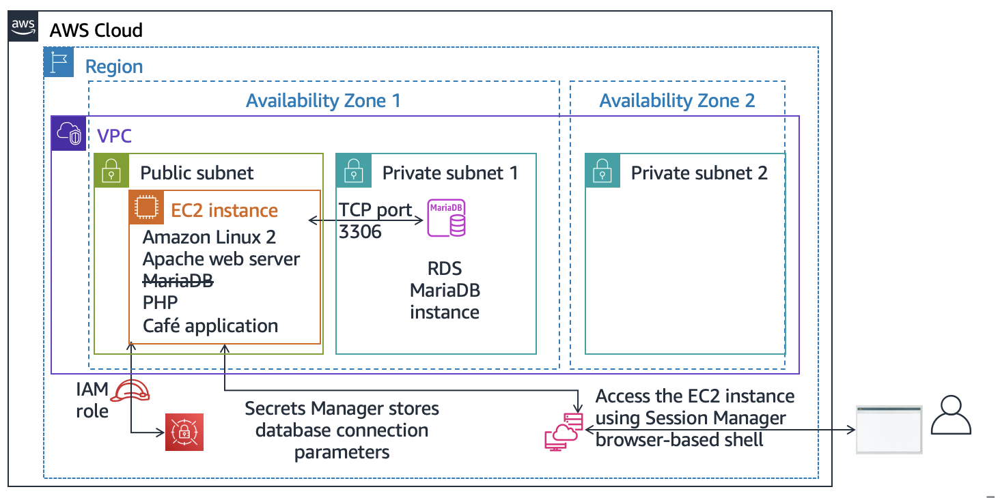
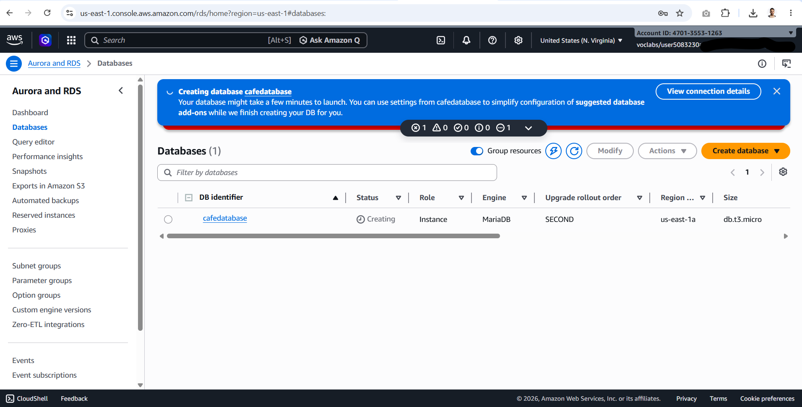
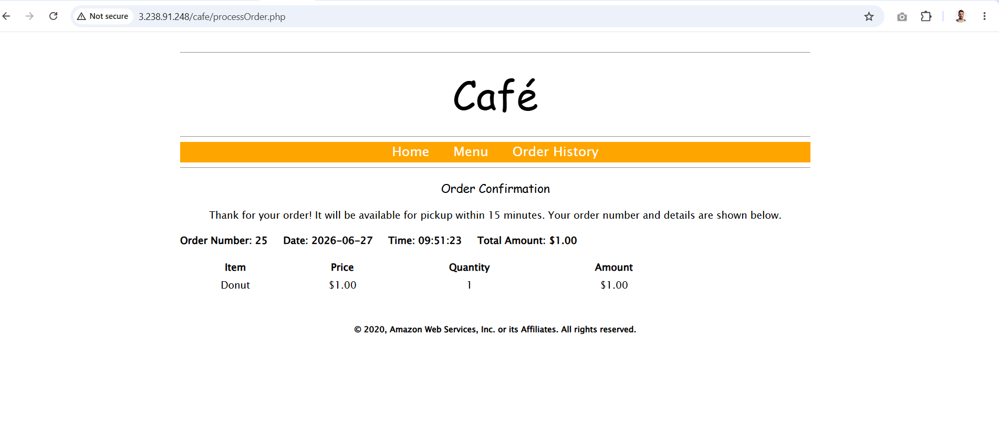
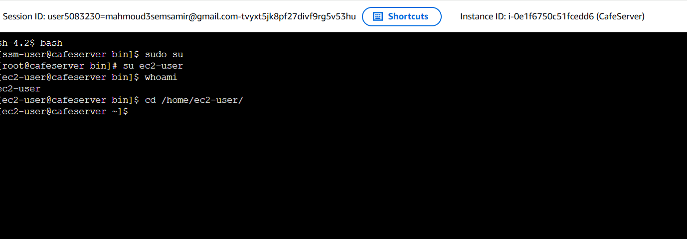
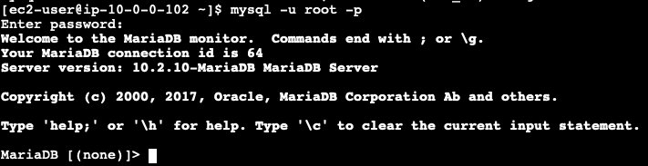

# Challenge Lab: Migrating a Database to Amazon RDS

> 💡 **Scenario Background**
> The café business has grown! Currently, a single Amazon EC2 instance hosts the web server, database, and application code. However, managing a local database introduces operational challenges:
> * 📊 **Data Value:** Order history is critical; Martha uses it for accounting, and Frank uses it to plan baking volumes.
> * 🔧 **Maintenance Overhead:** Sofía lacks the time for constant upgrades, patching, and complex database administration tasks.
> * 💾 **Backup Concerns:** Backups aren't performed as frequently as required.
> * 💰 **Cost & Learning Curve:** Martha wants to reduce labor costs and the technical learning investment needed to manage a standalone database.
> 
> **The Solution:** Migrate the local **MariaDB** database from the EC2 instance to a fully managed **Amazon Relational Database Service (Amazon RDS)** instance, and configure the application to inherit this cloud-native architecture.

---

## 🎯 Lab Overview & Objectives

In this advanced challenge lab, you will migrate an active production database into a managed environment and reconfigure the web application's endpoint logic.

After completing this lab, you should be able to:
* 🏗️ **Create** and configure a secure Amazon RDS database instance.
* 📦 **Export data** cleanly from a live MariaDB database using the `mysqldump` utility.
* 🔌 **Connect** a command-line SQL client directly to your new cloud RDS database.
* 🚀 **Migrate data** efficiently from the old MariaDB engine running on EC2 to the newly created RDS instance.
* ⚙️ **Configure** and update the parameters of the café web application to store all future orders in the managed RDS database instance.

---

## 🗺️ Lab Architecture Evolution

To better understand the migration pipeline, here is a visual overview of the infrastructure architecture at the start of the lab versus the target managed state:



At the end of this lab, your architecture will look like the following example:


---

## 🏗️ Pre-Created Resources in the Lab
When you start this lab, the following core environment assets are already provisioned for you in your AWS infrastructure account:
*(Note: You can inspect these in your console as soon as the lab environment is fully active)*


---

## 🔐 AWS Service Restrictions
> ⚠️ **Important Notice:** In this lab environment, access to AWS services and API actions is restricted to those strictly required to complete the instructions. Attempting to access unauthorized services or perform external actions may result in permission errors.

---

## 🚀 Accessing the AWS Management Console

1. At the top of the lab instructions page, click **Start Lab** to initialize your sandbox environment.
2. Monitor the environment countdown timer. 
   * *Tip:* You can refresh the session duration at any time by clicking **Start Lab** again before the timer reaches `0:00`.
3. Wait until the status circle icon to the right of the **AWS** link in the upper-left corner turns **green** 🟢. 
4. Once ready, click the **AWS** link to open the AWS Management Console in a new secure browser tab.
   * *Tip:* If the console fails to open, check your browser's top bar for pop-up blockers and select **Allow pop-ups**.
5. Arrange your browser tabs side-by-side so you can view both the instructions and the console seamlessly.

> 🚨 **Critical Rule:** **Do NOT change the AWS Region** unless explicitly instructed to do so by the lab guidelines.


---

## 💼 Challenge 1: Creating an RDS Instance for the Café Application

### 🗣️ Business Request
After consulting with Olivia (an AWS Solutions Architect and café regular), Sofía determined that the café needs a cloud-native database solution designed for:
* ✨ **High Durability & Availability**
* ⚡ **Performance & Scalability**
* 🔧 **Low Maintenance Overhead** (Automated patching & backups)

In this first challenge, you will step into Sofía's role to **provision a managed Amazon RDS instance** that will serve as the resilient storage layer for the café website. Following creation, you will connect to the existing EC2 instance to audit and analyze the current local web application configuration.

---
## 🛠️ Task 1: Creating an RDS Instance

In this task, you will provision a managed Amazon RDS instance running MariaDB inside the protected data subnet.

---

### 📝 Step-by-Step Configuration Guidelines

1. Navigate to the **Amazon RDS Console** and click **Create database**.
2. Configure the database using the **exact specifications** required below to ensure full credit during grading:

| Section | Parameter | Required Configuration Value |
| :--- | :--- | :--- |
| **Engine options** | Engine type | `MariaDB` |
| | Engine version | `10.6.25` *(⚠️ Do not use default or any other version)* |
| **Templates** | Template | `Dev/Test` |
| **Settings** | DB instance identifier | `CafeDatabase` |
| | Master username | `admin` |
| | Master password | `Caf3DbPassw0rd!` *(📋 Copy & paste to ensure accuracy)* |
| **Instance config** | DB instance class | `Burstable classes (includes t classes)` -> `db.t3.micro` |
| **Storage** | Storage type | `General Purpose SSD (gp2)` |
| | Allocated storage | `20 GiB` |
| **Availability & durability** | Deployment option | `Do not create a standby instance` |
| **Connectivity** | Virtual private cloud (VPC) | `Lab VPC` |
| | DB subnet group | `lab-db-subnet-group` |
| | Public access | `No` |
| | Existing VPC security group | Select `dbSG` and **clear / remove** the `default` security group |
| | Availability Zone | Select the first AZ ending in **a** (e.g., `us-east-1a`) |
| | Database port | `3306` *(Keep default TCP port)* |
| **Monitoring** | Enhanced Monitoring | **Clear / Uncheck** `Enable Enhanced Monitoring` |

3. Review all entered values carefully, scroll to the bottom, and click **Create database**.

> ⏱️ **Note:** Database provisioning takes a few minutes. You **do not** have to wait for the creation status to turn completely active; as soon as the creation process successfully initiates, you can immediately proceed to the next step.

---

### 🔍 Verification Capture

>   * 


## 🔍 Task 2: Analyzing the Existing Café Application Deployment

In this task, you will audit the live café web application, generate test traffic, and connect securely to the backend via AWS Systems Manager Session Manager.

---

### 💻 2. Connecting via AWS Systems Manager Session Manager
Connect securely to your EC2 instance's operating system directly from your web browser without exposing SSH ports.

1. In the **Amazon EC2 console**, select the **CafeServer** EC2 instance.
2. Click **Connect** from the top menu.
3. Choose the **Session Manager** tab, then click **Connect**.
4. A new browser tab will open with an interactive terminal session.

   * 
---

### 🛠️ 3. Environment Analysis & Access Setup

At the terminal prompt, execute the following commands sequentially to configure your environment privileges and navigate to the application workspace:

* Step 1: Start a Standard Bash Shell Session**
```bash
  bash
```
* Step 2: Switch Session to the Root Superuser Account

```bash
sudo su
```
* Step 3: Switch Context to the Standard EC2 User Account

```bash
su ec2-user
```
* Step 4: Verify Successful Connection Status

```Bash
whoami
```
* Step 5: Change Current Working Directory to Home Workspace

```Bash
cd /home/ec2-user/
```
  * 


## 🔍 Task 3: Working with the Database on the EC2 Instance

In this task, you will inspect the local database running on the EC2 instance and export its data to prepare for the migration.

### 📊 Stage 1: Check MariaDB Status and Version

Run the following commands in your Systems Manager terminal:

* **Check Service Status:**
```bash
  service mariadb status
```

> **Expected Output:** Look for `active (running)` highlighted in green.

* **Check Database Version:**
```bash
mysql --version

```


---

### 🔑 Stage 2: Retrieve the Database Password

1. Navigate to the **AWS Secrets Manager** console.
2. Click on **Secrets** from the left sidebar.
3. Select the secret named: `/cafe/dbPassword`.
4. Scroll down to the **Secret value** section and click **Retrieve secret value**.
5. Copy the revealed password to your clipboard.

---

### 🗄️ Stage 3: Connect and Inspect the Local Database

Execute the following commands in sequence inside your terminal to explore the current cafe data:

| Step | Command (SQL/Bash) | Expected Result / Purpose |
| --- | --- | --- |
| **1. Connect** | `mysql -u root -p` | Paste the password copied from Secrets Manager when prompted. |
| **2. Show DBs** | `show databases;` | Lists all databases available on the local server. |
| **3. Switch DB** | `use cafe_db;` | Selects the cafe database. Output: `Database changed`. |
| **4. Show Tables** | `show tables;` | Displays the tables inside the database (e.g., order, order_item). |
| **5. View Orders** | `select * from \`order`;` | Displays past customer orders, including your test order. |
| **6. View Items** | `select * from \`order_item`;` | Displays itemized details (quantities and prices) for each order. |
| **7. Exit** | `exit;` | Closes the SQL client and returns you to the Linux Bash prompt. |

---


 *  

### 💾 Stage 4: Export the Database (Backup)

Now, create a backup file (`.sql`) of the existing database to migrate it over to your new RDS instance.

1. **Run the export command:**
```bash
mysqldump --databases cafe_db -u root -p > CafeDbDump.sql

```


*When prompted for the password, paste the same local database password from Stage 2.*
2. **Verify the backup file creation:**
```bash
ls

```

> **Expected Output:** You should see `CafeDbDump.sql` listed in the directory.


3. **Preview the dump file (Optional):**
```bash
head CafeDbDump.sql

```

## 🔍 Task 4: Working with the RDS Database

## 🎯 Objective

In this task, you will:
- ✅ Confirm the availability of the new Amazon RDS instance.
- ✅ Analyze and answer key architectural questions about the RDS deployment.
- ✅ Update Security Group inbound rules to allow secure database traffic.
- ✅ Test network connectivity from the EC2 instance to RDS using `nmap`.
- ✅ Connect to the remote RDS instance and verify its initial database state.

---

# 🌐 Step 1: Verify RDS Instance Status

1. Return to the **Amazon RDS console** and choose **Databases**.
2. Confirm that the **`cafedatabase`** RDS instance status has changed from *Creating* to **Available**.
3. Click on **`cafedatabase`** and copy the **Endpoint** string under the *Connectivity & security* tab. (You will use this endpoint as `<rds-endpoint>` in the following steps).

---

# ❓ Step 2: Answer Lab Multiple Choice Questions

To record your answers for the lab grading:
1. At the top of the lab instructions page, choose **AWS Details**.
2. Click the **Access the multiple choice questions** link.
3. Review your infrastructure deployment to answer the following:
   * **Question 1:** Where is the RDS instance running? *(Check the Availability Zone of the RDS instance)*.
   * **Question 2:** Does the RDS instance have an IPv4 public IP address assigned to it? *(Check Public accessibility status)*.
   * **Question 3:** What is the Name tag applied to the subnet in which the RDS instance is running? *(Cross-reference RDS subnets with VPC Subnets)*.
   * **Question 4:** How many security group rules are defined for the RDS instance?

---

# 🛡️ Step 3: Configure RDS Security Group Inbound Rules

By default, the RDS instance will block direct traffic from the EC2 server. You must authorize inbound database traffic securely.

1. In the RDS instance details, under **Connectivity & security**, click on the security group link listed under **VPC security groups**.
2. Select the Security Group, and choose the **Inbound rules** tab, then click **Edit inbound rules**.
3. Add a new rule with the following parameters:
   * **Type:** `MySQL/Aurora` (Port `3306`)
   * **Source:** Custom -> Type **`sg-`** and select the **Security Group ID used by the CafeServer EC2 instance**.
4. Click **Save rules**.

> ⚠️ **Security Best Practice:** Never open port `3306` to `0.0.0.0/0` (all traffic). Always restrict access to the specific security group of the web application instances.

---

# 📡 Step 4: Verify Port Connectivity via `nmap`

Go back to your active **Systems Manager Session Manager terminal** tab and verify if port `3306` is open on the RDS endpoint.

Run the following command (replace `<rds-endpoint>` with your actual Amazon RDS endpoint):


nmap -Pn <rds-endpoint>

## 📥 Task 5: Importing Data into the RDS Database Instance

In this task, you import the café application data from the local backup file into your newly created Amazon RDS database instance and verify the migration.

### 🔄 Stage 1: Import the Database Dump
Run the following command to stream your backup file directly into the RDS database:
```bash
mysql -u admin -p --host cafedatabase.cqkcw7z5zjfr.us-east-1.rds.amazonaws.com < CafeDbDump.sql

```

> *When prompted, enter the master database password:* `Caf3DbPassw0rd!`

---

### 🔍 Stage 2: Verify the Migrated Data

1. Log into your interactive RDS SQL prompt:
```bash
mysql -u admin -p --host cafedatabase.cqkcw7z5zjfr.us-east-1.rds.amazonaws.com

```


2. Run the following queries to verify that `cafe_db` and its records are now successfully hosted on Amazon RDS:
```sql
show databases;
use cafe_db;
show tables;
select * from `order`;

```


> **Expected Output Verification:**
> The `select` statement should return a populated table showing at least 24 customer orders.

---

### 🚪 Stage 3: Exit the SQL Client

To return to your regular Linux terminal prompt, run:

```sql
exit;

```
## 🌐 Task 6: Connecting the Café Application to the New Database

In this final task, the café web application is reconfigured to source its data directly from the newly migrated Amazon RDS database instance instead of the local EC2 database.

---

### 🔐 Stage 1: Update Parameters in AWS Secrets Manager

To update the application’s backend database configuration, the following values were adjusted inside the AWS Secrets Manager console:

* **Database URL (`/cafe/dbUrl`):** 
  `cafedatabase.cqkcw7z5zjfr.us-east-1.rds.amazonaws.com`
  *(Updated from the local IP to the actual Amazon RDS endpoint)*

* **Database Master User (`/cafe/dbUser`):** 
  `admin`
  *(Updated to use the new master username)*

* **Database Password (`/cafe/dbPassword`):** 
  `Caf3DbPassw0rd!`
  *(Updated to reflect the secure master password set during the RDS creation)*

---

### 🛑 Stage 2: Stop the Local Database Service

To ensure that the application fully depends on the remote Amazon RDS instance and no longer utilizes local resources, the local MariaDB service on the EC2 instance was permanently shut down.

 Run the shutdown command in your Linux terminal:
```bash
sudo service mariadb stop

```

Stage 3: Final Application Testing and Verification
Navigate to the App Page:

Open the café application deployment page:

[http://18.207.184.157/cafe/menu.php](http://18.207.184.157/cafe/menu.php)

Submit a Test Order:

Place a new test order to verify database write capabilities.

Verify Order History:

Check the Order History tab to confirm that all 24+ migrated historic orders, along with the newly placed order, successfully load from the RDS database instance.
  * 
🎯 Result
The database migration is complete!

The application is now highly available and fully decoupled from the web server.