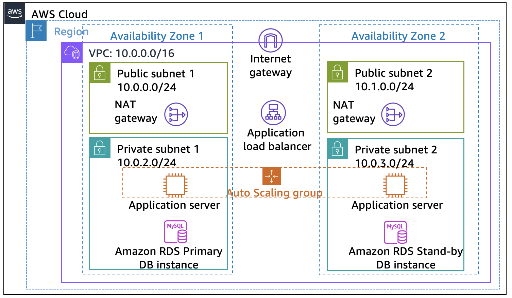
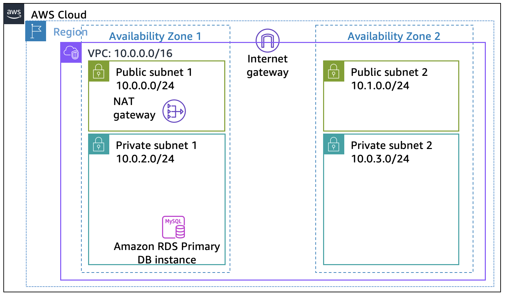
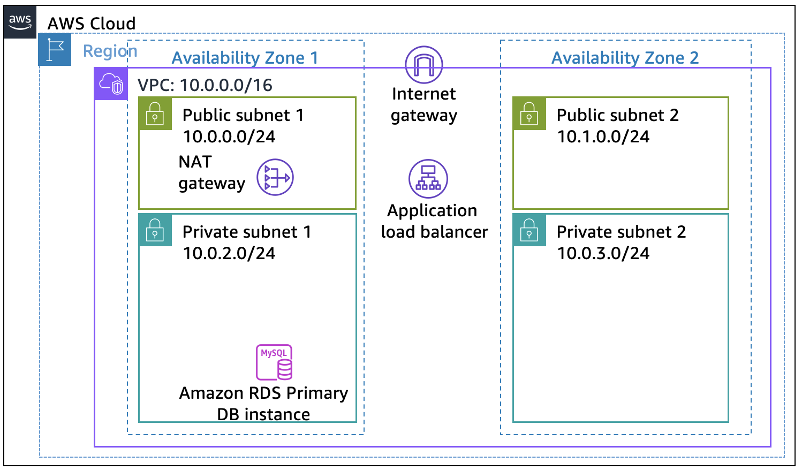
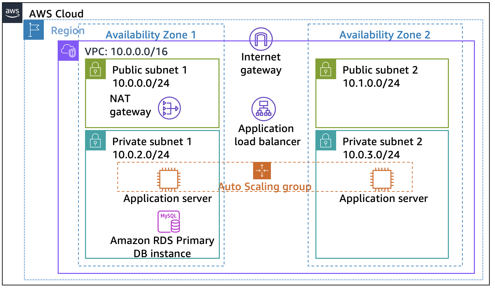
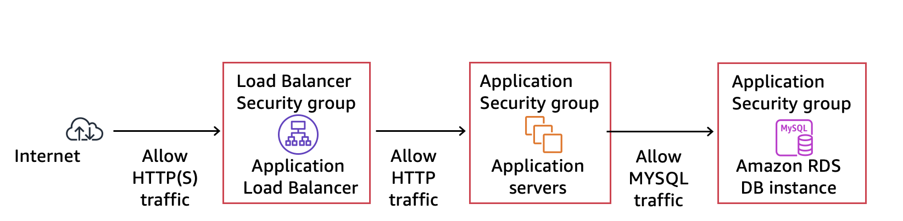
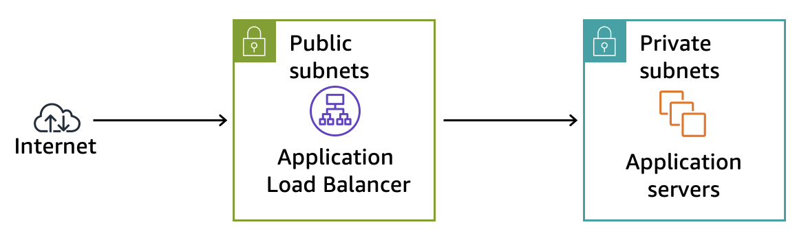
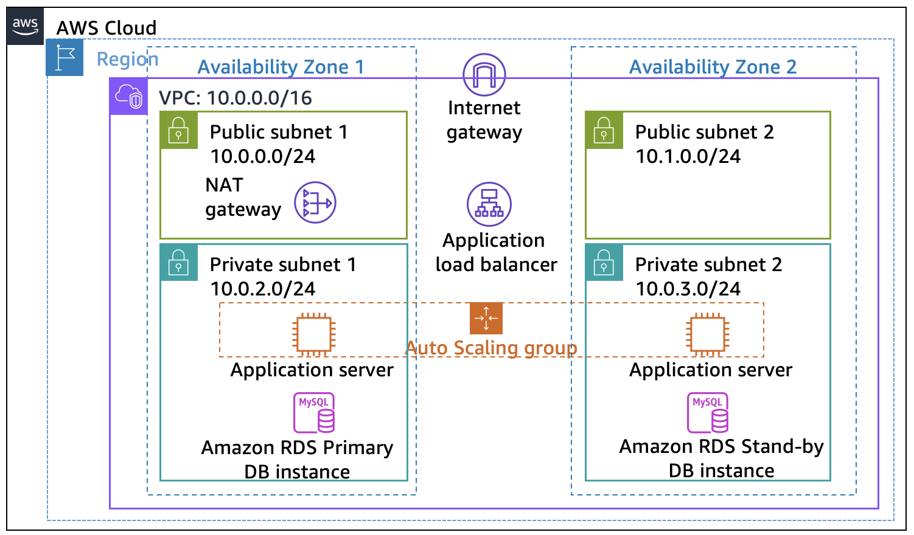

# Guided Lab: Creating a Highly Available Environment

## Lab Overview & Objectives

Critical business systems require continuous deployment as highly available applications—ensuring business operations continue seamlessly even if individual underlying components fail. On Amazon Web Services (AWS), high availability is achieved by distributing workloads across multiple **Availability Zones (AZs)** within an **Amazon VPC**.

In this lab, you begin with an application running on a single EC2 instance and progressively re-architect it into a scalable, fault-tolerant, and highly available infrastructure.

By the end of this lab, you will be able to:
* Inspect a multi-AZ Virtual Private Cloud (VPC) architecture.
* Provision and configure an **Application Load Balancer (ALB)** to distribute incoming web traffic.
* Create and configure an **Auto Scaling group (ASG)** to automatically manage instance health and elasticity.
* Perform fault-tolerance and high-availability testing by simulating instance failures.


---

## Target Architecture

At the end of this lab, your infrastructure will consist of a resilient multi-AZ web architecture:

---<p align="center">
  
</p>

## Task 1: Inspecting your VPC

This lab begins with an environment that is already deployed through AWS CloudFormation. This environment includes the following:
* A VPC
* Public and private subnets in two Availability Zones
* An internet gateway that is associated with the public subnets
* A NAT gateway in one of the public subnets
* An Amazon Relational Database Service (Amazon RDS) instance in one of the private subnets

---<p align="center">
  
</p>

In this task, you review the configuration of the VPC that was created for this lab.

1. On the **AWS Management Console**, in the search box, enter and choose **VPC** to open the Amazon VPC console.
2. In the left navigation pane, from the **Filter by VPC** dropdown list, choose **Lab VPC**.
   * *This setting limits the console to show only resources that are associated with the Lab VPC.*
3. In the left navigation pane, choose **Your VPCs**.
   * *Here, you can access information about the Lab VPC that was created for you.*
4. Select **Lab VPC**.
   * In the **Details** tab, notice that the **IPv4 CIDR** field has a value of `10.0.0.0/16`, which means that this VPC includes all IP addresses that start with `10.0.x.x`.

5. In the left navigation pane, choose **Subnets**.
   * Here, you can access information about **Public Subnet 1**. In the list of subnets, notice the following:
     * The **VPC** column for Public Subnet 1 shows that this subnet exists inside the **Lab VPC**.
     * The **IPv4 CIDR** column has a value of `10.0.0.0/24`, which means that this subnet includes the 256 IP addresses between `10.0.0.0` and `10.0.0.255` (5 of these addresses are reserved and unusable).
     * The **Availability Zone** column lists the Availability Zone where this subnet resides.
6. To reveal more details, select **Public Subnet 1**.
   * In the lower half of the page, choose the **Route table** tab:
     * The first entry specifies that traffic destined within the CIDR range for the VPC (`10.0.0.0/16`) is routed within the VPC (`local`).
     * The second entry specifies that any traffic destined for the internet (`0.0.0.0/0`) is routed to the internet gateway (`igw-`) that exists in Lab VPC. This setting makes the subnet a public subnet.
   * Choose the **Network ACL** tab:
     * This tab has information about the network access control list (network ACL) that is associated with the subnet. The rules permit all traffic to flow in and out of the subnet, but you can further restrict rules using security groups.
---<p align="center">
  
</p>

7. In the left navigation pane, choose **Internet gateways**.
   * Notice that an internet gateway with the name **Lab IG** is already attached to the Lab VPC.
8. In the left navigation pane, choose **Security groups**.
9. Select **Inventory-DB**.
   * *This security group controls incoming traffic to the database.*
10. In the lower half of the page, choose the **Inbound rules** tab.
    * The rule defined in this security group permits inbound MySQL or Aurora traffic (port 3306) from anywhere in the VPC (`10.0.0.0/16`). You later modify this setting so that it accepts traffic from only the application servers.
11. Choose the **Outbound rules** tab.
    * By default, security groups allow all outbound traffic. However, you can modify these settings as needed.
    .
    ## Task 2: Creating an Application Load Balancer

To build a highly available application, it is a best practice to launch resources in multiple Availability Zones. Availability Zones are physically separate data centers (or groups of data centers) in the same Region. If you run your applications across multiple Availability Zones, you can provide greater availability if a data center experiences a failure.

Because the application runs on multiple application servers, you need a way to distribute traffic among those servers. You can accomplish this goal by using a load balancer. This load balancer also performs health checks on instances and sends requests to only healthy instances.
---<p align="center">
  
</p>

1. On the **AWS Management Console**, in the search box, enter and choose **EC2** to open the Amazon EC2 console.
2. In the left navigation pane, choose **Load Balancers** *(you might need to scroll down to find it)*.
3. Choose **Create load balancer**.
4. Several types of load balancers are displayed. For **Application Load Balancer**, choose **Create**.
5. In the **Basic configuration** section, for **Load balancer name**, enter `Inventory-LB`.
6. In the **Network mapping** section, configure the following options:
   * For **VPC**, select **Lab VPC**. *(Important: Be sure to choose Lab VPC. It is likely not the default selection).*
   * For **Mappings**, choose the first Availability Zone, and then choose the **Public Subnet** that displays (`Public Subnet 1`).
   * For **Mappings**, also choose the second Availability Zone, and then choose the **Public Subnet** that displays (`Public Subnet 2`).
   * *You should now have selected two subnets: Public Subnet 1 and Public Subnet 2.*
---<p align="center">
  
</p>

7. In the **Security groups** section, select the **create a new security group** hyperlink *(opens a new browser tab)*.
8. On the **Create security group** page, in the **Basic details** section, configure the following:
   * **Security group name:** `Inventory-LB`
   * **Description:** `Enable web access to load balancer`
   * **VPC:** From the dropdown list, select **Lab VPC**.
9. In the **Inbound rules** section, choose **Add rule**, and configure:
   * **Type:** `HTTP`
   * **Source:** `Anywhere-IPv4` (`0.0.0.0/0`)
10. Choose **Add rule** again, and configure:
    * **Type:** `HTTPS`
    * **Source:** `Anywhere-IPv4` (`0.0.0.0/0`)
11. Choose **Create security group**.


12. Return to the browser tab where you are still configuring the load balancer:
    * In the **Security groups** section, choose the **refresh icon**.
    * From the **Security groups** dropdown list, select the **Inventory-LB** security group.
    * Choose the **X** for the default security group so that **Inventory-LB** is now the only security group chosen.

13. In the **Listeners and routing** section, choose the **Create target group** link *(opens a new browser tab)*.
    > 💡 **Analysis:** Target groups define where to send traffic that comes into the load balancer. The Application Load Balancer can send traffic to multiple target groups based on the URL of the incoming request.
14. For **Step 1: Specify group details**, configure the following options:
    * **Choose a target type:** Select **Instances**.
    * **Target group name:** Enter `Inventory-App`.
    * **VPC:** Ensure that **Lab VPC** is chosen.
15. In the **Health checks** section, expand **Advanced health check settings**, and configure:
    * **Healthy threshold:** Enter `2`.
    * **Interval:** Enter `10` (seconds).
    * *Health checks will occur every 10 seconds. If the instance responds correctly twice in a row, it is considered healthy.*
16. Choose **Next**.
17. On the **Step 2: Register targets** screen, skip adding targets *(you do not have application instances yet)* and choose **Create target group**.

---<p align="center">
  
</p>

18. Return to the browser tab where you started defining the load balancer.
19. In the **Listeners and routing** section, choose the **refresh icon**.
20. From the **Default action** dropdown list, choose the **Inventory-App** target group that you just created.
21. Scroll to the bottom of the page, and choose **Create load balancer**.
22. Once created, choose **View load balancer**.

---<p align="center">
  
</p>


## Task 3: Creating an Auto Scaling group

Amazon EC2 Auto Scaling is a service designed to launch or terminate EC2 instances automatically based on user-defined policies, schedules, and health checks. It also automatically distributes instances across multiple Availability Zones to make applications highly available.

In this task, you create an Auto Scaling group that deploys EC2 instances across your private subnets, which is a security best practice for application deployment. Instances in a private subnet cannot be accessed from the internet. Instead, users send requests to the load balancer, which forwards the requests to EC2 instances in the private subnets.

---<p align="center">
  
</p>

---

### Task 3.1: Creating an AMI for Auto Scaling

You create an Amazon Machine Image (AMI) from the existing Web Server 1. This saves the contents of the root volume of the web server so that new instances can be launched with an identically configured guest operating system.

1. On the **AWS Management Console**, in the search box, enter and choose **EC2** to open the Amazon EC2 console.
2. In the left navigation pane, choose **Instances**.
3. First, confirm that the **Web Server 1** instance created for you in this lab is running.
   * Wait until the **Status check** for Web Server 1 displays `2/2 checks passed` *(choose the refresh icon to update)*.
4. Select **Web Server 1**.
5. From the **Actions** dropdown list, choose **Image and templates > Create image**.
6. On the **Create image** page, configure the following options:
   * **Image name:** Enter `Web Server AMI`.
   * **Image description:** Enter `Lab AMI for Web Server`.
7. Choose **Create image**.
   * *A banner at the top of the screen displays the AMI ID for your new AMI. You use this AMI ID when creating the launch template later.*

---<p align="center">
  
</p>

---

### Task 3.2: Creating a launch template and an Auto Scaling group

You first create a launch template. A launch template is a template that an Auto Scaling group uses to launch EC2 instances. When you create a launch template, you specify information for the instances such as the AMI, the instance type, a key pair, and security group.

1. In the left navigation pane, choose **Launch Templates**.
2. Choose **Create launch template**.
3. In the **Launch template name and description** section, configure the following options:
   * **Launch template name:** Enter `Inventory-LT`.
   * **Auto Scaling guidance:** Select **Provide guidance to help me set up a template that I can use with EC2 Auto Scaling**.
4. In the **Application and OS Images (Amazon Machine Image)** section:
   * Choose **My AMIs**.
   * For **Amazon Machine Image (AMI)**, choose **Web Server AMI**.
5. In the **Instance type** section, choose `t2.micro`.
6. In the **Key pair (login)** section, for **Key pair name**, choose `vockey`.
7. In the **Network settings** section:
   * For **Firewall (security groups)**, choose **Select existing security group**.
   * For **Security groups**, choose **Inventory-App**.
8. Expand the **Advanced details** section, and configure the following options:
   * **IAM instance profile:** Choose `Inventory-App-Role`.
   * **Detailed CloudWatch monitoring:** Choose **Enable**. *(Allows Auto Scaling to react quickly to changing utilization)*.
   * In the **User data** box, enter the following script:

```bash
#!/bin/bash
# Install Apache Web Server and PHP
yum install -y httpd mysql
amazon-linux-extras install -y php7.2
# Download Lab files
wget [https://aws-tc-largeobjects.s3.us-west-2.amazonaws.com/CUR-TF-200-ACACAD-3-113230/12-lab-mod10-guided-Scaling/s3/scripts/inventory-app.zip](https://aws-tc-largeobjects.s3.us-west-2.amazonaws.com/CUR-TF-200-ACACAD-3-113230/12-lab-mod10-guided-Scaling/s3/scripts/inventory-app.zip)
unzip inventory-app.zip -d /var/www/html/
# Download and install the AWS SDK for PHP
wget [https://github.com/aws/aws-sdk-php/releases/download/3.62.3/aws.zip](https://github.com/aws/aws-sdk-php/releases/download/3.62.3/aws.zip)
unzip aws -d /var/www/html
# Turn on web server
chkconfig httpd on
service httpd start
```
---<p align="center">
  
</p>


## Task 4: Updating Security Groups

The application you deployed is a three-tier architecture. You now configure the security groups to enforce these tiers:
---<p align="center">
  
</p>

---

### Task 4.1: Configuring the Load Balancer Security Group
You already configured the load balancer security group (`Inventory-LB`) when you created the load balancer. It accepts all incoming HTTP and HTTPS traffic from the internet (`0.0.0.0/0`).

---

### Task 4.2: Configuring the Application Security Group
The application security group was provided as part of the lab setup. You now configure it to accept only incoming traffic from the load balancer.

1. In the left navigation pane, choose **Security Groups**.
2. Select **Inventory-App**.
3. Choose the **Inbound rules** tab *(the security group is currently empty)*.
4. Choose **Edit inbound rules**.
5. On the **Edit inbound rules** page, choose **Add rule**, and configure:
   * **Type:** `HTTP`
   * **Port:** `80`
   * **Source:** Select **Custom**, enter `sg`, and select **`Inventory-LB`** from the list.
   * **Description:** `Traffic from load balancer`
6. Choose **Save rules**.

---<p align="center">
  
</p>


---

### Task 4.3: Configuring the Database Security Group
You now configure the database security group to accept only incoming traffic from the application servers.

1. In the **Security groups** list, select **Inventory-DB** *(ensure no other security groups are selected)*.
2. In the **Inbound rules** tab, choose **Edit inbound rules**.
3. For the existing rule *(which allows traffic from `10.0.0.0/16`)*, choose **Delete**.
4. Choose **Add rule**, and configure:
   * **Type:** `MYSQL/Aurora`
   * **Port:** `3306`
   * **Source:** Select **Custom**, enter `sg`, and select **`Inventory-App`** from the list.
   * **Description:** `Traffic from application servers`
5. Choose **Save rules**.

---<p align="center">
  
</p>


> 🔒 **Security Architectural Note:** You have now enforced strict 3-tier isolation. Each tier permits inbound connections solely from the security group of the tier directly above it, combined with private subnet placement for network defense in depth.

---

## Task 5: Testing the Application

In this task, you confirm that your web application is running properly and verify its high availability and load balancing capabilities.

### Step 1: Verify Target Group Health
1. In the left navigation pane, choose **Target Groups**.
2. Select **Inventory-App**.
3. Choose the **Targets** tab.
4. Observe the two registered EC2 target instances.
5. Choose the **refresh icon** until the **Health status** for both instances displays as **Healthy**.


---

### Step 2: Access the Application via Load Balancer DNS
1. In the left navigation pane, choose **Load Balancers**, and select **Inventory-LB**.
2. In the **Details** tab in the lower pane, copy the **DNS name** to your clipboard *(e.g., `Inventory-LB-xxxx.elb.amazonaws.com`)*.
3. Open a new web browser tab, paste the DNS name, and press **Enter**.


4. Scroll to the bottom of the webpage to observe the **Instance ID** and **Availability Zone** handling your request.
5. Refresh the page multiple times in your browser. Notice that the request alternates between instances deployed across Availability Zone A and Availability Zone B.
---<p align="center">
  
</p>

---

### Traffic Flow Summary:
1. Client sends an HTTP/HTTPS request to the **Application Load Balancer** sitting in the public subnets.
2. The load balancer selects an active healthy EC2 instance running in one of the private subnets and forwards the request.
3. The private EC2 application instance processes the request, communicates with the MySQL RDS database, and returns the response back through the load balancer to your browser.

## Task 6: Testing High Availability

Your application is configured to be highly available. You can prove the application's high availability by terminating one of the EC2 instances.

### Step 1: Simulate Instance Failure
1. Return to the Amazon EC2 Console tab in your web browser *(do not close the web application tab)*.
2. In the left navigation pane, choose **Instances**.
3. Select one of the **Inventory-App** instances *(it does not matter which one you select)*.
4. Choose **Instance state > Terminate instance**.
5. In the **Terminate instance?** confirmation dialog, choose **Terminate**.


---

### Step 2: Verify Continuous Application Availability
1. Return to the web application tab in your web browser and reload the page several times.
2. Observe that the application remains fully accessible without interruption.
3. Check the **Availability Zone** and **Instance ID** displayed at the bottom of the page:
   * The Availability Zone stays constant because the Application Load Balancer automatically detected the failed instance via health checks and shifted 100% of incoming traffic to the remaining healthy instance.


---

### Step 3: Verify Auto Scaling Self-Healing Recovery
1. Return to the Amazon EC2 Console tab showing the instances list.
2. In the upper-right area, choose the **refresh icon** every 30 seconds.
3. After a few minutes, observe that **Amazon EC2 Auto Scaling** detects the health check failure and automatically launches a new replacement **Inventory-App** instance to restore the desired capacity of 2.
4. Once the new instance passes its health checks, the load balancer resumes distributing incoming web requests across both Availability Zones.
5. Reload the web application tab to confirm that traffic is once again toggling between two distinct Availability Zones.


---

> 💡 **Key Takeaway:** This test proves that your infrastructure is both **fault-tolerant** and **self-healing**. Individual component failures do not result in application downtime, and capacity is automatically restored to maintain SLAs.

## Optional Task 1: Making the Database Highly Available

The application architecture is now highly available. However, the Amazon RDS database currently operates from only one database instance. In this optional task, you make the database highly available by configuring it to run across multiple Availability Zones (a Multi-AZ deployment).

---<p align="center">
  
</p>

1. On the **AWS Management Console**, in the search box, enter and choose **RDS** to open the Amazon RDS console.
2. In the left navigation pane, choose **Databases**.
3. Choose the link for the name of the **inventory-db** instance.
4. Choose **Modify**.
5. In the **Availability & durability** section, for **Multi-AZ deployment**, choose **Create a standby instance**.

> 💡 **Architectural Note:** Converting to Multi-AZ creates a synchronous standby instance in a second Availability Zone. The application continues using the same database endpoint, but AWS automatically fails over to the standby instance if the primary instance fails.

6. In the **Instance configuration** section, for **DB instance class**, choose `db.t3.small` *(this doubles the compute capacity of the instance)*.
7. In the **Storage** section, for **Allocated storage**, enter `20`.
8. At the bottom of the page, choose **Continue**.


9. In the **Schedule modifications** section, choose **Apply immediately**.
10. Choose **Modify DB instance**.
    * *The status of the database changes to **Modifying** while the changes are applied.*


---

## Optional Task 2: Configuring a Highly Available NAT Gateway

Application servers run in private subnets and require a NAT gateway in a public subnet to access the internet. Currently, only Public Subnet 1 contains a NAT gateway. To eliminate a single point of failure if Availability Zone 1 goes down, you launch a second NAT gateway in Availability Zone 2.

---<p align="center">
  
</p>

### Step 1: Create a Second NAT Gateway
1. On the **AWS Management Console**, in the search box, enter and choose **VPC** to open the Amazon VPC console.
2. In the left navigation pane, choose **NAT gateways**.
3. Choose **Create NAT gateway**.
4. On the **Create NAT gateway** page, configure:
   * **Name:** Enter `NatGateway2`.
   * **Subnet:** Choose **Public Subnet 2**.
   * Choose **Allocate Elastic IP**.
5. Choose **Create NAT gateway**.


---

### Step 2: Create and Associate Route Table for Private Subnet 2
1. In the left navigation pane, choose **Route tables**.
2. Choose **Create route table**, and configure:
   * **Name:** `Private Route Table 2`
   * **VPC:** Select `Lab VPC`
3. Choose **Create route table**.
4. Choose the **Routes** tab, and then choose **Edit routes**.
5. Choose **Add route**, and configure:
   * **Destination:** `0.0.0.0/0`
   * **Target:** Select **NAT Gateway**, and then choose **`NatGateway2`**.
6. Choose **Save changes**.


7. Choose the **Subnet associations** tab, and choose **Edit subnet associations**.
8. Select **Private Subnet 2**.
9. Choose **Save associations**.

![Subnet Association Private Subnet 2]

---

> 🔒 **High Availability Summary:** Internet-bound traffic from Private Subnet 2 now routes directly through `NatGateway2` in Availability Zone 2. Network egress traffic is fully resilient across both Availability Zones.