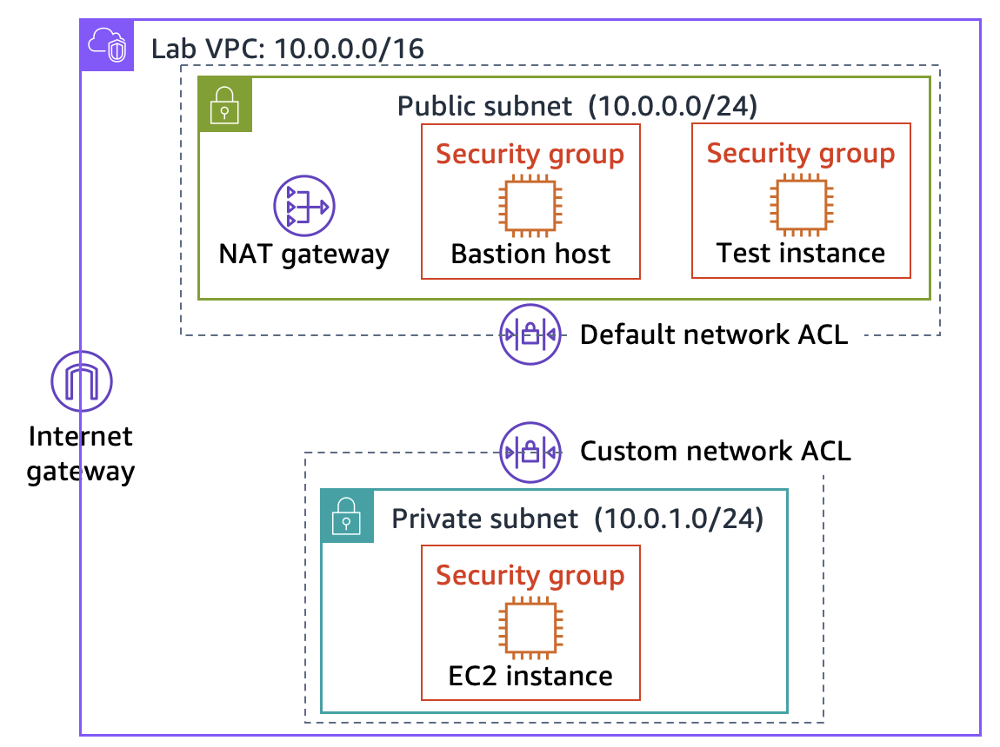
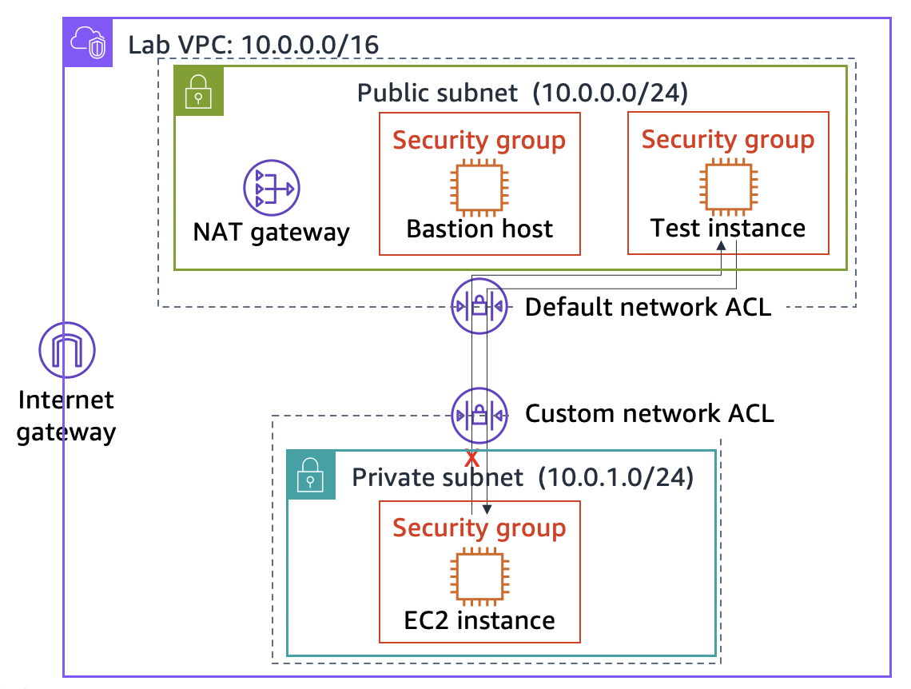

# Challenge Lab: Creating a VPC Networking Environment for the Café

## 📌 Scenario
Following a successful database migration from a local EC2 instance to an Amazon RDS instance inside a private subnet, Sofía and Nikhil want to further elevate the café's security posture. 

Based on professional recommendations from Mateo (an AWS Systems Administrator), the café aims to transition into a robust, secure architecture. The new design isolates the web application server into its own **Private Subnet** (separate from both the public internet and the database layer). To maintain administrative access without exposing the instances, a **Bastion Host (Jump Box)** will be deployed in a public subnet, while a **NAT Gateway** will be configured to allow private resources to securely fetch software patches without exposing them to inbound internet threats.

This non-production VPC environment acts as a safe testing ground to experiment with multi-tier isolation layers before updating the live café site.

---

## 🎯 Lab Objectives
By the end of this lab, you will be able to:
* [x] **Design & Deploy** a multi-tier Virtual Private Cloud (VPC) environment to isolate distinct application layers.
* [x] **Configure Secure Routing** to safely connect administrative tools to private network segments.
* [x] **Provision a NAT Gateway** to enable one-way outbound internet connectivity for private instances (patching/updates).
* [x] **Implement Network Access Control** and Security Layers using Bastion hosts and customized security groups.

---

## ⚙️ Details & Constraints
* **Core Services:** Amazon VPC (Subnets, Route Tables, IGW, NAT Gateway), Amazon EC2 (Bastion Host, App Server).
* **Architecture Style:** Highly secure multi-tier setup (Public Subnet for edge routing, Private Subnets for computing and storage layers).
* **Self-Guided Challenge:** Unlike standard guided labs, this challenge lab requires you to map out and implement configuration choices independently based on architectural requirements.

---

## 🏗️ Targeted Architecture Design

The final state of this network deployment will comprise:
1. **Public Subnet:** Hosts the Internet Gateway (IGW), a public NAT Gateway, and a Bastion Host for secure SSH bridging.
2. **Application Private Subnet:** Hosts the core Café Web Application Server, completely shielded from direct inbound internet traffic, routing outbound requests through the NAT Gateway.
3. **Database Private Subnet:** Contains isolated database assets accessible exclusively by the application layer.

---
### 🗺️ Network Topology Diagram
At the end of this lab, your architecture should look like the following example:

  ---<p align="center">
  
</p>

## 🛠️ Implementation Guide: Infrastructure Setup

### Task 1: Creating a Public Subnet & Internet Gateway

In this task, you will provision a public network segment within the pre-existing **Lab VPC** to handle edge routing, deploy an Internet Gateway (IGW) to connect the VPC to the outside world, and update the routing tables to allow internet traffic flow.

#### Step 1: Create the Public Subnet
1. Open the **Amazon VPC Console**.
2. In the left navigation pane, choose **Subnets**, then click **Create subnet**.
3. Configure the following subnet parameters:
   * **VPC ID:** Select `Lab VPC`.
   * **Subnet name:** `Public Subnet`
   * **Availability Zone:** Select the first zone (`a`) of your assigned region (e.g., `us-east-1a`).
   * **IPv4 subnet CIDR block:** `10.0.0.0/24`
4. Click **Create subnet**.
  ---<p align="center">
  
</p>

#### Step 2: Provision and Attach the Internet Gateway (IGW)
1. In the left navigation pane, choose **Internet gateways**, then click **Create internet gateway**.
2. Name it `Cafe-IGW` and click **Create internet gateway**.
3. Once created, click **Actions** > **Attach to VPC**.
4. Select `Lab VPC` from the dropdown list and click **Attach internet gateway**.

  ---<p align="center">
  
</p>

#### Step 3: Configure Edge Routing (Route Table Update)
1. In the left navigation pane, choose **Route tables**.
2. Locate and select the main route table associated with your `Lab VPC`.
3. Click on the **Routes** tab at the bottom, then click **Edit routes**.
4. Click **Add route** and define the internet-bound route:
   * **Destination:** `0.0.0.0/0` (Anywhere)
   * **Target:** Select **Internet Gateway** and click on your newly created `Cafe-IGW`.
5. Click **Save changes**.
  ---<p align="center">
  
</p>
---

### Task 2: Creating a Bastion Host (Jump Box)

To securely administer backend assets residing in private subnets later on without exposing them to raw internet threats, you will deploy a hardened **Bastion Host** inside your new Public Subnet.

#### Step 1: Launch the Instance
1. Navigate to the **Amazon EC2 Console** and click **Launch instance**.
2. Configure the launch wizard with the following metrics:
   * **Name:** `Bastion Host`
   * **Application and OS Images (AMI):** `Amazon Linux 2023 AMI`
   * **Instance Type:** `t2.micro`
   * **Key Pair:** `vockey`

#### Step 2: Configure Network Settings & Security Perimeter
1. In the **Network settings** section, click **Edit**:
   * **VPC:** `Lab VPC`
   * **Subnet:** `Public Subnet`
   * **Auto-assign public IP:** `Enable` *(Crucial for remote entry)*
   
2. Under **Firewall (security groups)**, select *Create security group* and configure:
   * **Security group name:** `Bastion Host SG`
   * **Description:** `Allow SSH access to administrative Bastion Host`
   * **Inbound Security Group Rules:**
     * **Type:** `SSH`
     * **Port:** `22`
     * **Source Type:** `My IP` *(Restricts access strictly to your local workspace for production hardening simulation)*

3. Leave storage settings at default and click **Launch instance**.
  ---<p align="center">
  
</p>

> 🔒 **Security Architectural Note:** In production enterprise environments, hardening a bastion host extends beyond IP whitelisting. Typically, jump boxes reside inside heavily audited, isolated edge zones, backed by Multi-Factor Authentication (MFA), and strictly integrated with system logging tools to maintain immutable access trails.


### Task 3: Testing the Connection to the Bastion Host

In this task, you will retrieve your lab credential key and verify that your public endpoint is reachable via SSH.

#### Step 1: Download the Private Key
1. Click on **AWS Details** at the top right of your lab interface.
2. Download the appropriate key format based on your operating system:
   * **Windows (PuTTY users):** Click **Download PPK**.
   * **macOS / Linux / OpenSSH users:** Click **Download PEM**.
3. Save the file (it will be named `labuser.*`).

---

#### Step 2: Establish SSH Connection

##### **Option A: For macOS & Linux Users (Terminal / Git Bash)**
1. Open your terminal and change permissions on the downloaded `.pem` file to secure it:
   ```bash
   chmod 400 labuser.pem

```

2. Run the following command to connect to your Bastion Host:
```bash
ssh -i "labuser.pem" ec2-user@<BASTION_PUBLIC_IP>

```


##### **Option B: For Windows Users (PuTTY)**

1. Launch **PuTTY**.
2. In the left Category pane, navigate to **Connection** > **SSH** > **Auth** > **Credentials**.
3. Click **Browse** and load your downloaded `labuser.ppk` file.
4. To prevent your session from timing out, go to **Connection** and enter `30` in the field for **Seconds between keepalives**.
5. Return to the **Session** category, enter your Bastion Host's **Public IPv4 address**, and click **Open**.

---

#### Step 3: Close the Session

Once you have successfully logged into the bastion host interface and confirmed that your public subnet routing is operational, you can close the terminal or PuTTY window.

  ---<p align="center">
  
</p>


### Task 4: Creating a Private Subnet

In this task, you will create an isolated network segment inside the VPC to safely host backend resources away from direct public internet exposure.

1. Open the **Amazon VPC Console** and navigate to **Subnets** in the left sidebar.
2. Click **Create subnet** and configure the options exactly as follows:
   * **VPC ID:** Select `Lab VPC`.
   * **Subnet name:** `Private Subnet`
   * **Availability Zone:** Select the **exact same Availability Zone** you chose for the Public Subnet in the previous task (e.g., `us-east-1a`).
   * **IPv4 subnet CIDR block:** `10.0.1.0/24`
3. Click **Create subnet**.

  ---<p align="center">
  
</p>

---

### Task 5: Creating a NAT Gateway & Private Routing

In this task, you will deploy a NAT Gateway to allow instances in the Private Subnet to securely connect out to the internet (for software updates or patches) while blocking unauthorized inbound connections from initiating contact.

#### Step 1: Provision the NAT Gateway
1. In the left navigation pane of the VPC console, choose **NAT gateways**, then click **Create NAT gateway**.
2. Configure the following parameters:
   * **Name:** `Lab NAT Gateway`
   * **Subnet:** Select your **`Public Subnet`** *(Crucial: A NAT Gateway must reside in a public subnet to reach the internet)*.
   * **Elastic IP allocation ID:** Click **Allocate Elastic IP** to assign a static public IP address to the gateway.
3. Click **Create NAT gateway** and wait for its status to become `Available`.

  ---<p align="center">
  
</p>


#### Step 2: Establish the Private Route Table
1. In the left navigation pane, choose **Route tables**, then click **Create route table**.
2. Configure the following options:
   * **Name:** `Private Route Table`
   * **VPC:** Select `Lab VPC`.
3. Click **Create route table**.

  ---<p align="center">
  
</p>


#### Step 3: Configure Outbound Routes and Associations
1. Select your newly created **`Private Route Table`** from the list.
2. Click on the **Routes** tab at the bottom, and choose **Edit routes**.
3. Click **Add route** and define the outbound destination:
   * **Destination:** `0.0.0.0/0`
   * **Target:** Select **NAT Gateway**, and choose the `Lab NAT Gateway` you provisioned earlier.
4. Click **Save changes**.

  ---<p align="center">
  
</p>

5. Switch to the **Subnet associations** tab, click **Edit subnet associations**, select the checkbox next to your **`Private Subnet`**, and click **Save associations**.

### Task 6: Creating an EC2 Instance in the Private Subnet

In this task, you will spin up the protected application instance within your private subnet. To secure the instance, you will configure its security group to restrict administrative access so that it only accepts SSH traffic originating directly from the Bastion Host's security group.

#### Step 1: Generate a Secondary Administrative Key
1. Navigate to the **Amazon EC2 Console**.
2. In the left navigation pane under **Network & Security**, choose **Key Pairs**.
3. Click **Create key pair** and configure the settings:
   * **Name:** `vockey2`
   * **Key pair type:** `RSA`
   * **Private key file format:** Choose `.pem` (for macOS/Linux) or `.ppk` (for Windows PuTTY).
4. Click **Create key pair** and save the downloaded file securely to your local machine.

  ---<p align="center">
  
</p>

---

#### Step 2: Launch the Private Instance
1. In the left navigation pane, choose **Instances**, then click **Launch instance**.
2. Configure the launch wizard with the following metrics:
   * **Name:** `Private Instance`
   * **Application and OS Images (AMI):** `Amazon Linux 2023 AMI`
   * **Instance Type:** `t2.micro`
   * **Key pair name:** Select the **`vockey2`** key pair you created in the previous step.

---

#### Step 3: Configure Network & Security Perimeter
1. In the **Network settings** section, click **Edit**:
   * **VPC:** `Lab VPC`
   * **Subnet:** `Private Subnet`
   * **Auto-assign public IP:** `Disable` *(Crucial: This keeps the instance hidden from the public internet)*.

2. Under **Firewall (security groups)**, select **Create security group** and configure the inbound rules to whitelist the Bastion Host:
   * **Security group name:** `Private Instance SG`
   * **Description:** `Allow SSH traffic exclusively from the Bastion Host`
   * **Inbound Security Group Rules:**
     * **Type:** `SSH`
     * **Port:** `22`
     * **Source Type:** `Custom`
     * **Source:** Select or type the Security Group ID belonging to the **`Bastion Host SG`** *(This nests the security groups so that only resources wrapped in the Bastion SG can attempt an SSH handshake)*.

3. Leave storage settings at their default values and click **Launch instance**.

  ---<p align="center">
  
</p>


### Task 7: Configuring Your SSH Client for SSH Agent Forwarding

Because the **Private Instance** utilizes a different key pair (`vockey2`) than the **Bastion Host** (`vockey`), you must configure **SSH Agent Forwarding** (passthrough). This secure practice allows your local machine's SSH agent to respond to authentication challenges when bridging from the bastion host to the private backend, eliminating the high security risk of uploading private keys directly onto the public jump box.

Choose the appropriate setup workflow below based on your operating system:

---

#### 💻 Option A: For Microsoft Windows Users (PuTTY & Pageant)

1. **Launch Pageant:** Download, install, and open **Pageant** (available via the official PuTTY package). It will run quietly inside your Windows system tray.
2. **Import the Private Keys:**
   * Right-click the Pageant icon in the system tray and select **Add Key**.
   * Select and load your primary credential key file: **`labsuser.ppk`**.
   * Click **Add Key** again, then select and load your secondary deployment key file: **`vockey2.ppk`**.
   * Close the Pageant overview window.
3. **Configure PuTTY Session Agent Forwarding:**
   * Open **PuTTY** and navigate to the left menu: **Connection** > **SSH** > **Auth**.
   * Check the box for **Allow agent forwarding**.
4. **Define the Inbound Credentials:**
   * Expand **Auth** and select **Credentials**.
   * Click **Browse** under the *Private key file for authentication* field.
   * Select your **`labsuser.ppk`** file, click **Open**, and then **Accept** the host signature.
5. **Establish the Multi-Tier Connection:**
   * Connect to your Bastion Host using its **Public IP** normally (without manually declaring a `.ppk` inside the session window now that the agent manages it).
   * Once logged into the Bastion shell, securely hop directly onto the internal server by execution:
     ```bash
     ssh ec2-user@<PRIVATE_INSTANCE_INTERNAL_IP>
     ```

---

#### 🍎 Option B: For macOS & Linux Users (Native Terminal)

1. **Add Keys to the Local Agent:**
   Open your native shell environment and add both cryptographic credentials to the internal `ssh-agent` vault:
   ```bash
   ssh-add -K labsuser.pem
   ssh-add -K vockey2.pem

```

2. **Verify Loaded Identities:**
Ensure both private strings are successfully integrated and recognized by the authentication broker:
```bash
ssh-add -L

```


3. **Connect to the Edge Zone with Agent Passthrough:**
Initiate an SSH handshake targeting the Bastion using the `-A` flag to safely forward your local credentials down the tunnel:
```bash
ssh -A ec2-user@<BASTION_PUBLIC_IP_OR_DNS>

```


4. **Bridge to the Isolated Subnet Backend:**
Once authenticated inside the Bastion interface, pivot directly to the application server using its private internal network coordinates:
```bash
ssh ec2-user@<PRIVATE_INSTANCE_INTERNAL_IP>

```


> ⚠️ **Architectural Key Management Warning:** The local `ssh-agent` resolves authorization challenges by testing keys sequentially until a match is found. Because typical Amazon Linux server security policies drop connections instantly after **5 failed attempts**, ensure your active authentication agent holds **5 or fewer total keys** simultaneously to prevent sudden authentication lockouts.

```

```

### Task 8: Testing the SSH Connection from the Bastion Host

In this task, you will execute the final end-to-end handshake by hopping from your local environment, passing through the public edge router, and executing an internal connectivity verification test from within the private zone.

#### Step 1: Execute the Multi-Hop Login
1. Establish your initial SSH session into the **Bastion Host** utilizing the SSH agent forwarding configuration validated in the previous task.
2. From the Bastion shell prompt, run the following command to securely tunnel into your protected node (replace the placeholder with your actual internal IP address):
```bash
   ssh ec2-user@<PRIVATE_INSTANCE_INTERNAL_IP>

```

3. Your terminal command prompt should update, indicating that you are now successfully logged directly into the `Private Instance` architecture.

---

#### Step 2: Validate Outbound Internet Connectivity (NAT Gateway Verification)

Since this backend instance has no public IP address, all external web hooks flow exclusively through your public NAT Gateway route rules. To ensure this configuration is working perfectly:

1. Run a test ping against a public DNS resolver target:
```bash
ping 8.8.8.8

```
  ---<p align="center">
  
</p>


2. Observe the terminal output to ensure packet transmission and receipt confirmation replies are streaming in successfully.
3. Press **`Ctrl + C`** on your keyboard to terminate the verification loop.

  ---<p align="center">
  
</p>

---

### 🏛️ Architecture Best Practice: Defense in Depth

By routing administration through a multi-tier jump structure, you implemented an foundational security principle: **giving teams the ability to perform necessary operational actions at a distance** without exposing the direct compute infrastructure.

> 💡 **AWS Well-Architected Framework Insight:**
> According to cloud infrastructure security standards, compute footprints require distinct, overlapping layers of defense against internal and external threat profiles. In mature production systems, interactive host access should ideally be removed completely to eliminate risks of human configuration drift and manual errors.
> Modern cloud operations recommend deploying EC2 platforms utilizing **Infrastructure as Code (IaC)** change pipelines, and shifting administrative tasks over to specialized automated management tools like **AWS Systems Manager (SSM) Session Manager** rather than maintaining public Bastion architecture configurations permanently.

---

---

## 🚀 Moving to Challenge #2: Enhancing the Security Layer for Private Resources

### Scenario & Business Goal

Sofía and Nikhil have successfully proven their staging architecture isolates computational processing while preserving vital patching avenues. Upon presenting this design milestone to Mateo, he highlights an opportunity to incorporate **Defense in Depth**: adding a secondary firewall boundary layer using **Network Access Control Lists (Network ACLs)**.

While Security Groups act as stateful firewalls evaluated at the individual *instance interface* layer, Network ACLs act as stateless traffic control boundaries applied at the entire *subnet boundary*.

In this next phase of the architecture build, your goal is to build and tie a custom Network ACL wrapper to the **Private Subnet** to explicitly control incoming and outgoing network parameters, locking down the internal architecture to maximum enterprise baseline configurations.

```

```
### Task 9: Creating a Network ACL

In this task, you will provision a custom Network Access Control List (Network ACL) to add an extra stateless firewall boundary at the subnet level, providing a secondary layer of protection alongside your stateful Security Groups.

#### Step 1: Inspect the Default Network ACL
1. Open the **Amazon VPC Console** and navigate to **Network ACLs** in the left sidebar.
2. Select the default Network ACL associated with your **Lab VPC**.
3. Review the configurations and note the following behaviors:
   * **Subnet Associations:** Any newly created subnets are automatically attached to this default Network ACL.
   * **Traffic Rules:** The default inbound and outbound rules are configured to allow all traffic (`0.0.0.0/0`) by default.

---

#### Step 2: Provision the Custom Network ACL
1. Click the **Create network ACL** button in the top right.
2. Configure the creation parameters:
   * **Name:** `Lab Network ACL`
   * **VPC:** Select `Lab VPC`.
3. Click **Create network ACL**.
> ⚠️ **Important Note:** Unlike the default Network ACL, all custom Network ACLs are initialized with default inbound and outbound rules that **deny all traffic** until explicitly updated.

---

#### Step 3: Associate the Custom Network ACL with the Private Subnet
1. Select your newly created **`Lab Network ACL`** from the list.
2. Click on the **Subnet associations** tab, and choose **Edit subnet associations**.
3. Select the checkbox next to your **`Private Subnet`**.
4. Click **Save changes** to isolate the private network segment within this new boundary.

---

#### Step 4: Configure Baseline "Allow All" Rules
To ensure your infrastructure doesn't experience a total blackout while you prepare to selectively block traffic, you must first add baseline rules to permit standard traffic into and out of the Private Subnet.

1. Select **`Lab Network ACL`** and open the **Inbound rules** tab, then click **Edit inbound rules**:
   * **Rule Number:** `100`
   * **Type:** `All traffic`
   * **Source:** `0.0.0.0/0`
   * **Allow / Deny:** `ALLOW`
   * Click **Save changes**.

2. Open the **Outbound rules** tab, and click **Edit outbound rules**:
   * **Rule Number:** `100`
   * **Type:** `All traffic`
   * **Destination:** `0.0.0.0/0`
   * **Allow / Deny:** `ALLOW`
   * Click **Save changes**.

     ---<p align="center">
  
</p>


### Task 10: Testing Your Custom Network ACL

In this task, you will launch a temporary test instance in the Public Subnet to validate that your custom stateless Network ACL explicitly intercepts, evaluates, and drops targeted traffic before it even reaches the instance security group.

#### Step 1: Launch the Public Test Instance
1. Open the **Amazon EC2 Console** and click **Launch instance**.
2. Configure the deployment metrics as follows:
   * **Name:** `Test Instance`
   * **AMI:** `Amazon Linux 2023 AMI`
   * **Instance Type:** `t2.micro`
   * **Key Pair:** `vockey`
3. In the **Network settings** section, click **Edit**:
   * **VPC:** `Lab VPC`
   * **Subnet:** `Public Subnet`
   * **Auto-assign public IP:** `Enable`
4. Under **Firewall (security groups)**, select *Create security group*:
   * **Security group name:** `Test SG`
   * **Inbound Security Group Rules:**
     * **Type:** `All ICMP – IPv4` *(Allows ping requests to pass through the instance firewall)*
5. Click **Launch instance** and copy the **Private IP address** of this new `Test Instance`.
  ---<p align="center">
  
</p>


---

#### Step 2: Establish the Initial Connectivity Baseline
1. Return to your active SSH session terminal inside the **Private Instance**.
2. Initiate a continuous ping utility sequence targeting the test node (replace the placeholder with the copied address):

```bash
   ping <PRIVATE_IP_OF_TEST_INSTANCE>

```

3. Verify that the terminal shows active, successful ICMP reply streams. **Leave this utility running.**

---

#### Step 3: Enforce Stateless Network ACL Blocks

1. Open the **Amazon VPC Console** and navigate to **Network ACLs** in the left sidebar.
2. Select the **Custom Network ACL** associated with your **Private Subnet**.
3. Select the **Outbound Rules** tab (or Inbound, depending on where you choose to drop the request), and click **Edit outbound rules**.
4. Add a new rule with a lower rule number than your allow rule (e.g., Rule `#50` or `#90`) so that it is evaluated **first**:
* **Rule Number:** `90` (Must be lower than your catch-all rule)
* **Type:** `All ICMP - IPv4`
* **Source/Destination:** Enter `<PRIVATE_IP_OF_TEST_INSTANCE>/32` *(The `/32` denotes a host-specific address routing constraint)*.
* **Allow / Deny:** Select **DENY**.


5. Click **Save changes**.
  ---<p align="center">
  
</p>

---

#### Step 4: Verify Traffic Interception

Return immediately to your **Private Instance** terminal tab. The active ping stream should instantly freeze and stop responding, confirming that your stateless Network ACL wrapper successfully intercepted and dropped the traffic at the subnet boundary line.

> 💡 **Tip:** Press **`Ctrl + C`** to close the halted ping operation.
as shown in the following diagram:

  ---<p align="center">
  
</p>


---

### 🏛️ Architecture Best Practice: Controlling Traffic at All Layers

By nesting instance-level stateful Security Groups within subnet-level stateless Network ACL envelopes, you successfully designed a **Defense-in-Depth** network boundary layout.

* **Security Groups:** Evaluate stateful connection patterns at the elastic network interface (ENI) layer.
* **Network ACLs:** Act as stateless perimeter gates checking packet streams at the entire subnet threshold boundary.

---

## 📝 Lab Review & Verification Questions

Before clicking the blue submit link, choose **AWS Details** > **Access the multiple choice questions** link to log your answers:

* **Question 1: What is the purpose of the internet gateway in the public subnet?**
* *Answer:* It provides a target in your VPC route tables for internet-bound traffic and enables communication between instances in your VPC and the internet.


* **Question 2: What allows the instance in the private subnet to connect to the internet so that it can download updates?**
* *Answer:* The NAT Gateway located inside the Public Subnet.


* **Question 3: Can the instance in the private subnet be accessed directly from the internet?**
* *Answer:* No, because it lacks a public IP address, and the private subnet route table does not point directly to an Internet Gateway.


* **Question 4: Why do you use two different key pairs to access the private instance and the bastion host?**
* *Answer:* To enforce strong administrative access isolation (Defense in Depth) so that compromising the bastion host key does not grant automatic entry to backend infrastructure.


* **Question 5: Can the bastion host use ping and get a reply from the instance in the private subnet?**
* *Answer:* Only if the Private Instance's Security Group and Network ACL explicitly allow inbound ICMP echo requests from the Bastion's IP range.


* **Question 6: Which security group rules allow the private EC2 instance to receive the return traffic when it pings the test instance?**
* *Answer:* Security groups are stateful. The default outbound rule allows all traffic out, and the return traffic is automatically allowed back in regardless of inbound rules.


---

## Submitting Your Progress

1. Click the blue **Submit** button at the top of the lab workspace panel.
2. Select **Yes** when prompted to close out documentation recording.
3. Access detailed point allocation feedback under **Grades** > **Submission Report**.
4. Once completed, select **End Lab** to safely tear down the provisioned sandbox assets.


### 🏁 Lab Complete!