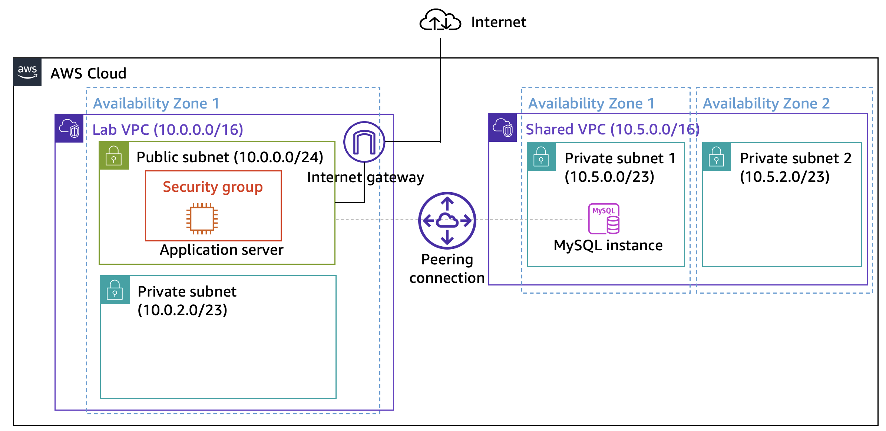
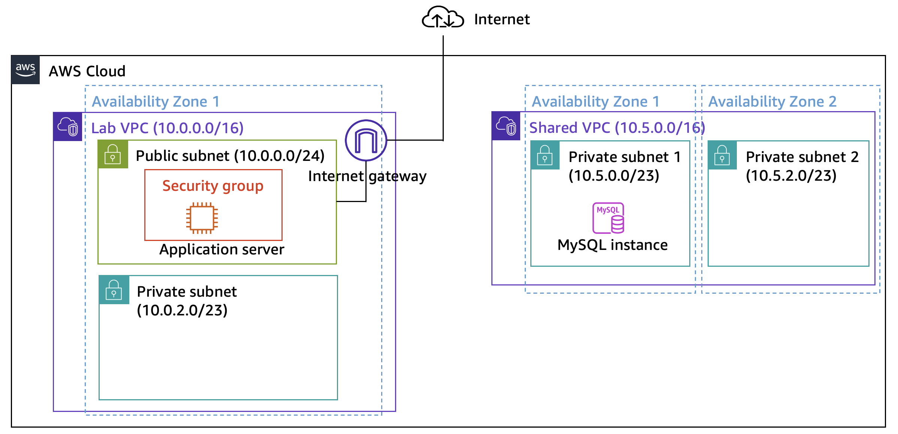
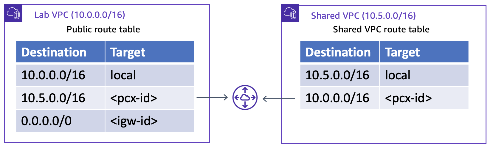

# Guided Lab: Creating a VPC Peering Connection

## 📌 Lab Overview & Objectives
You need to connect your virtual private clouds (VPCs) when you must transfer data between them. This lab shows you how to create a private VPC peering connection between two VPCs.

After completing this lab, you should be able to:
- [x] Create a VPC peering connection.
- [x] Configure route tables to use the VPC peering connection.
- [x] Enable VPC Flow Logs to provide insight on the data moving across the network.
- [x] Test a peering connection.
- [x] Analyze the VPC flow logs.

---

## 🎯 Final Architecture Design
At the end of this lab, your architecture will look like the following example:

---

  

### Task 1: Creating a VPC Peering Connection

#### 🎯 Objective
Establish a private, one-to-one network bridge between **Lab VPC** (hosting the web application) and **Shared VPC** (hosting the database) to allow secure inter-VPC traffic without routing over the public internet.

---

  

---

#### 🛠️ Implementation Steps

1. Navigate to the **VPC Dashboard** in the AWS Management Console.
2. In the left navigation pane, select **Peering Connections**.
3. Click **Create peering connection** and enter the following settings:
   * **Name**: `Lab-Peer`
   * **VPC ID (Requester)**: Select `Lab VPC`
   * **VPC ID (Accepter)**: Select `Shared VPC`
4. Click **Create peering connection**.
5. Select the newly created `Lab-Peer` connection, open the **Actions** dropdown menu at the top, and click **Accept request** to finalize the peering state.

---

  

---

> **Note:** A VPC Peering connection requires explicit acceptance from the accepter VPC (even when created within the same AWS account) before traffic can be routed across it. Once accepted, the status changes from `Pending Acceptance` to `Active`.

### Task 2: Configuring Route Tables

#### 🎯 Objective
Enable two-way network communication between **Lab VPC** and **Shared VPC** by updating their respective route tables to direct cross-VPC traffic through the newly established `Lab-Peer` peering connection.

---

  

---

#### 🛠️ Implementation Steps

##### Step 2.1: Configure Lab VPC Route Table
1. In the left navigation pane of the VPC Console, select **Route Tables**.
2. Select **Lab Public Route Table** (associated with Lab VPC).
3. Navigate to the **Routes** tab and click **Edit routes**.
4. Click **Add route** and enter the following settings:
   * **Destination**: `10.5.0.0/16` *(CIDR block range for Shared VPC)*
   * **Target**: Select **Peering Connection** $\rightarrow$ Choose **`Lab-Peer`**
5. Click **Save changes**.

---

  

---

##### Step 2.2: Configure Shared VPC Route Table (Reverse Path)
1. Return to **Route Tables** and select **Shared-VPC Route Table** (clear any previous selections).
2. Navigate to the **Routes** tab and click **Edit routes**.
3. Click **Add route** and enter the following settings:
   * **Destination**: `10.0.0.0/16` *(CIDR block range for Lab VPC)*
   * **Target**: Select **Peering Connection** $\rightarrow$ Choose **`Lab-Peer`**
4. Click **Save changes**.

---

  

---

> **Key Takeaway:** Establishing a VPC Peering Connection only creates the physical/logical connection between VPCs. Traffic will **not** flow until explicit routes pointing to the target VPC's CIDR block via the Peering Connection target (`pcx-xxxxxx`) are added to the active route tables of **both** VPCs.

---

### Task 3: Enabling VPC Flow Logs

#### 🎯 Objective
Enable AWS VPC Flow Logs on **Shared VPC** to capture IP traffic flows passing through network interfaces, outputting telemetry data to AWS CloudWatch for operational analysis and security auditing.

---

#### 🛠️ Implementation Steps

1. In the VPC Console, navigate to **Your VPCs** and select **Shared VPC**.
2. Open the **Flow logs** tab in the bottom panel and click **Create flow log**.
3. Configure the following parameter settings:
   * **Name**: `SharedVPCLogs`
   * **Maximum aggregation interval**: `1 minute`
   * **Destination**: Select **Send to CloudWatch Logs**
   * **Destination log group**: Enter `ShareVPCFlowLogs`
   * **IAM Role**: Choose `vpc-flow-logs-Role`
4. Click **Create flow log**.
5. Once created, click the **ShareVPCFlowLogs** hyperlink to navigate directly to the target CloudWatch Log Group.

---

  

---

### Task 4: Testing the VPC Peering Connection

#### 🎯 Objective
Verify inter-VPC network reachability by connecting the Café Inventory Application running in **Lab VPC** to the isolated MySQL database in **Shared VPC** across the private peering route.

---

#### 🛠️ Implementation Steps

1. Retrieve the `EC2PublicIP` and the Database `Endpoint` credentials.
2. Access the Inventory Web Application in your browser using `http://<EC2PublicIP>`.
3. Select **Settings** and provide the database access parameters:
   * **Endpoint**: `<RDS Database Endpoint>`
   * **Database**: `inventory`
   * **Username**: `admin`
   * **Password**: `lab-password`
4. Click **Save**.

#### 💡 Validation Result
The application successfully queries and displays database records. Because **Shared VPC** has no Internet Gateway attached, data communication functions strictly over the **VPC Peering Connection**.

---

  

---
---

### Task 5: Analyzing the VPC Flow Logs

#### 🎯 Objective
Inspect and parse captured network flow telemetry to confirm bidirectional application-to-database communication on MySQL Port `3306`.

---

#### 🛠️ Implementation Steps & Log Parsing

1. Navigate to the **ShareVPCFlowLogs** Log Group in CloudWatch.
2. Open the active Elastic Network Interface log stream (`eni-*`).
3. Filter/analyze log entries targeting MySQL port `3306`:

| Log Field | Example Value | Description |
| :--- | :--- | :--- |
| **Interface ID** | `eni-xxxxxxxx` | The Elastic Network Interface of the database. |
| **From IP** | `10.5.1.185` | Private IP of the Database Instance inside Shared VPC. |
| **To IP** | `10.0.0.02` | Private IP of the Application Instance inside Lab VPC. |
| **Port** | `3306` | Native MySQL Database Port. |
| **Action** | `ACCEPT` | Network traffic granted pass-through by Security Groups/NACLs. |
| **Status** | `OK` | Flow log collection and ingestion state. |

---

  

---

## 🏆 Lab Conclusion & Summary

Through this lab deployment, the following architecture milestones were successfully implemented:
* [x] **VPC Peering Connection**: Provisioned `Lab-Peer` bridging `Lab VPC` and `Shared VPC`.
* [x] **Custom Route Tables**: Added explicit target routes for CIDR ranges `10.5.0.0/16` and `10.0.0.0/16`.
* [x] **Network Observability**: Configured CloudWatch Flow Log aggregation at a 1-minute interval.
* [x] **Cross-VPC Verification**: Confirmed zero-internet private database bridging and analyzed TCP/3306 connection traces.