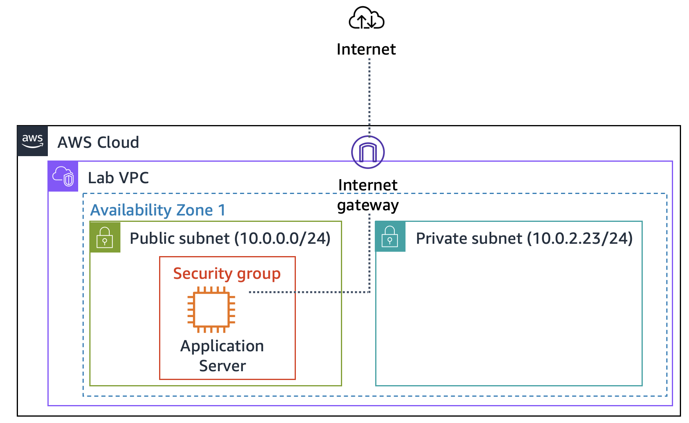

# AWS Guided Lab: Creating a Virtual Private Cloud (VPC)

## 📋 Overview
Traditional networking is complex, requiring specialized physical hardware, intricate cabling, and manual configurations. **Amazon Virtual Private Cloud (Amazon VPC)** simplifies this process by allowing you to provision a logically isolated section of the AWS Cloud where you can launch AWS resources in a virtual network that you define.

In this hands-on lab, you will build a custom VPC from scratch, configure public and private subnets, establish internet connectivity using an Internet Gateway, and deploy an application server to test the environment.

---

## 🎯 Objectives
By the end of this lab, you will be able to:
- Deploy a custom **Amazon VPC** with a dedicated IPv4 CIDR block.
- Configure a **Public Subnet** for internet-facing resources.
- Configure a **Private Subnet** for isolated backend resources.
- Attach an **Internet Gateway (IGW)** to the VPC and configure route tables.
- Provision an **EC2 Application Server** to test network topology and connectivity.

---

## ⏱️ Duration & Restrictions
- **Estimated Duration:** 30 minutes
- **AWS Service Restrictions:** Access is limited strictly to the resources and actions required for this lab.

---

## 🏗️ Architecture Diagram

<p align="center">
  
</p>

### Task 1: Creating a VPC

In this task, you create a custom Virtual Private Cloud (VPC) with a Classless Inter-Domain Routing (CIDR) block of `10.0.0.0/16`, providing over 65,000 private IPv4 addresses.

1. **Access the VPC Console:**
   - In the **AWS Management Console** search box, enter `VPC`.
   - Select **VPC** from the results to open the Amazon VPC console.

2. **Create the Custom VPC:**
   - In the left navigation pane, choose **Your VPCs**.
   - Click **Create VPC**.
   - Configure the following settings:
     - **Resources to create:** `VPC only`
     - **Name tag:** `Lab VPC`
     - **IPv4 CIDR block:** `10.0.0.0/16`
   - Choose **Create VPC**.

     ---<p align="center">
  
</p>


3. **Enable DNS Hostnames:**
   - Select **Lab VPC** from the VPC list (if not already selected).
   - Choose **Actions** dropdown at the top right, then select **Edit VPC settings**.
   - Under **DNS settings**, check **Enable DNS hostnames**.
   - Click **Save changes**.

        ---<p align="center">
  
</p>

> 💡 *Note: Enabling DNS hostnames ensures that EC2 instances launched within this VPC receive public DNS hostnames automatically.*

---
### Task 2: Creating Subnets

A subnet is a range of IP addresses in your VPC. Public subnets are designed for internet-facing resources, while private subnets isolate backend resources from direct internet access.

* In this task, you create a public subnet and a private subnet:


---

#### Task 2.1: Creating a Public Subnet

1. In the left navigation pane, choose **Subnets**.
2. Click **Create subnet** and configure the following parameters:
   - **VPC ID:** Choose `Lab VPC`.
   - **Subnet name:** Enter `Public Subnet`.
   - **Availability Zone:** Select the **first Availability Zone** in the list (do not leave as *No preference*).
   - **IPv4 subnet CIDR block:** Enter `10.0.0.0/24` (provides addresses `10.0.0.0` through `10.0.0.255`).
3. Click **Create subnet**.
  ---<p align="center">
  
</p>

4. **Enable Auto-Assign Public IPv4 Address:**
   - Select **Public Subnet** from the subnets list.
   - Click **Actions** -> **Edit subnet settings**.
   - Under **Auto-assign IP settings**, check **Enable auto-assign public IPv4 address**.
   - Click **Save**.
     ---<p align="center">
  
</p>


> 📌 *Note: Although named "Public Subnet", it remains isolated from the internet until an Internet Gateway is attached and configured in the route table.*

---

#### Task 2.2: Creating a Private Subnet

1. Click **Create subnet** and configure the following parameters:
   - **VPC ID:** Choose `Lab VPC`.
   - **Subnet name:** Enter `Private Subnet`.
   - **Availability Zone:** Select the **same Availability Zone** chosen for the Public Subnet.
   - **IPv4 subnet CIDR block:** Enter `10.0.2.0/23` (covers addresses `10.0.2.x` and `10.0.3.x`).
2. Click **Create subnet**.
  ---<p align="center">
  
</p>


> 💡 *Note: The `/23` block provides double the IP range of a `/24` block, accommodating a larger number of isolated backend resources (such as databases and private compute instances).*

### Task 3: Creating an Internet Gateway

An **Internet Gateway (IGW)** is a redundant, highly available VPC component that enables communication between instances in your VPC and the internet. It acts as a route target and performs Network Address Translation (NAT) for public IPv4 addresses.

1. In the left navigation pane, choose **Internet gateways**.
2. Click **Create internet gateway**.
3. For **Name tag**, enter `Lab IGW`.
4. Click **Create internet gateway**.
  ---<p align="center">
  
</p>

5. **Attach the Gateway to the VPC:**
   - Click **Actions** -> **Attach to VPC**.
   - Under **Available VPCs**, select `Lab VPC`.
   - Click **Attach internet gateway**.

---<p align="center">
  
</p>
---

### Task 4: Configuring Route Tables

A **route table** contains rules (routes) determining where network traffic is directed. Every subnet must be associated with a route table. In this task, you configure a public route table to route internet-bound traffic (`0.0.0.0/0`) through the Internet Gateway.

#### Task 4.1: Identify and Name the Private Route Table
1. In the left navigation pane, choose **Route tables**.
2. Locate the default route table associated with **Lab VPC**.
3. Hover over the **Name** field, click the pencil/edit icon, enter `Private Route Table`, and click **Save**.
   > *Note: By default, this table routes `10.0.0.0/16` traffic locally, enabling internal communication across all subnets.*

#### Task 4.2: Create and Configure the Public Route Table
1. Click **Create route table** and configure:
   - **Name:** Enter `Public Route Table`.
   - **VPC:** Select `Lab VPC`.
2. Click **Create route table**.

---<p align="center">
  
</p>
3. **Add Internet Route:**
   - Go to the **Routes** tab and click **Edit routes**.
   - Click **Add route**.
   - Set **Destination** to `0.0.0.0/0` (all internet traffic).
   - Set **Target** to `Internet Gateway` and select `Lab IGW`.
   - Click **Save changes**.
   ---<p align="center">
  
</p>

#### Task 4.3: Associate the Public Route Table with Public Subnet
1. Select the **Subnet associations** tab.
2. Click **Edit subnet associations**.
3. Check the box for **Public Subnet**.
4. Click **Save associations**.
---<p align="center">
  
</p>

> 💡 *Summary for making a subnet public: Create an IGW -> Attach it to the VPC -> Add a `0.0.0.0/0` route to a route table targeting the IGW -> Associate that route table with the subnet.*
---

### Task 5: Creating a Security Group for the Application Server

A **security group** acts as a virtual firewall for your EC2 instances to control inbound and outbound traffic. It operates at the network interface level rather than the subnet level, allowing granular access control per instance.

In this task, you create a custom security group that allows external web traffic (HTTP) to reach the application server.

1. In the left navigation pane, choose **Security groups**.
2. Click **Create security group** and configure the following:
   - **Security group name:** Enter `App-SG`.
   - **Description:** Enter `Allow HTTP traffic`.
   - **VPC:** Choose `Lab VPC`.

3. **Configure Inbound Rules:**
   - Under the **Inbound rules** section, click **Add rule**.
   - **Type:** Select `HTTP`.
   - **Source:** Select `Anywhere-IPv4` (`0.0.0.0/0`).
   - **Description:** Enter `Allow web access`.

4. Click **Create security group**.
---<p align="center">
  
</p>


> 🔒 *Security Note: Permitting `0.0.0.0/0` on port 80 allows any IPv4 address on the internet to send HTTP requests to instances associated with this security group.*

---

### Task 6: Launching an Application Server in the Public Subnet

In this final task, you will launch an Amazon EC2 instance into your newly configured Public Subnet to validate your VPC network architecture and test public internet routing.

#### Step 1: Configure and Launch the EC2 Instance
1. Open the **Amazon EC2 Console** and click **Launch instance**.
2. Configure the instance setup exactly as follows:
   * **Name:** `App Server`
   * **Application and OS Images (AMI):** Keep the default **Amazon Linux 2023 AMI**.
   * **Instance Type:** Keep the default **t2.micro**.
   * **Key Pair:** Select **`vockey`**.

3. In the **Network settings** section, click **Edit** and set:
   * **VPC:** `Lab VPC`
   * **Subnet:** `Public Subnet`
   * **Firewall (security groups):** Choose *Select existing security group*.
   * **Common Security Groups:** Select **`App-SG`**.

4. Expand the **Advanced details** panel:
   * **IAM instance profile:** Select **`Inventory-App-Role`** *(This gives the instance permission to securely fetch database credentials from AWS Secrets Manager)*.

5. Scroll down to the **User data** field, and paste the following bash script to automate the deployment of Apache, MariaDB, PHP, and the application files:

  ---<p align="center">
  
</p>


6. In the Summary panel, click **Launch instance**.

---<p align="center">
  
</p>


#### Step 2: Validate Network Routing & Application Setup

1. Click the link to the newly created instance or navigate to the **Instances** page.
2. Monitor the instance state and wait until the **Status check** column displays **`2/2 checks passed`** *(Feel free to hit the refresh icon every 30 seconds)*.

3. Select the **App Server** instance, and from the **Details** tab, copy the **Public IPv4 DNS** value.
4. Open a new tab in your web browser, paste the Public DNS string, and press Enter.

> 🎉 **Expected Success Output:** The Inventory application interface should load completely, showing the following status message:
> `Please configure Settings to connect to database.`
> * **What this proves:** The successful loading of this screen confirms that your Internet Gateway, Route Tables, Public Subnet routing, and Security Groups are all successfully configured and communicating with the public internet!
> 
---<p align="center">
  
</p>

---

## 🏁 Submitting Your Work

1. Go back to the top of your lab instructions panel and click the blue **Submit** button to record your progress.
2. Select **Yes** when prompted to confirm your submission.
3. To view granular technical feedback, wait a minute, click on **Grades**, and choose **Submission Report**.

---

## 🏆 Conclusion

Congratulations! You have successfully designed, built, and validated a custom AWS network topology. Throughout this lab, you achieved the following production-grade benchmarks:

* [x] **Deployed a custom VPC** from scratch.
* [x] **Created a Public Subnet** intended for front-facing web assets.
* [x] **Created a Private Subnet** isolated from direct internet access to safeguard sensitive backends.
* [x] **Provisioned an Internet Gateway (IGW)** and attached it to route external traffic.
* [x] **Launched an Automated Application Server** via user-data script execution to stress-test and validate infrastructure reliability.

```