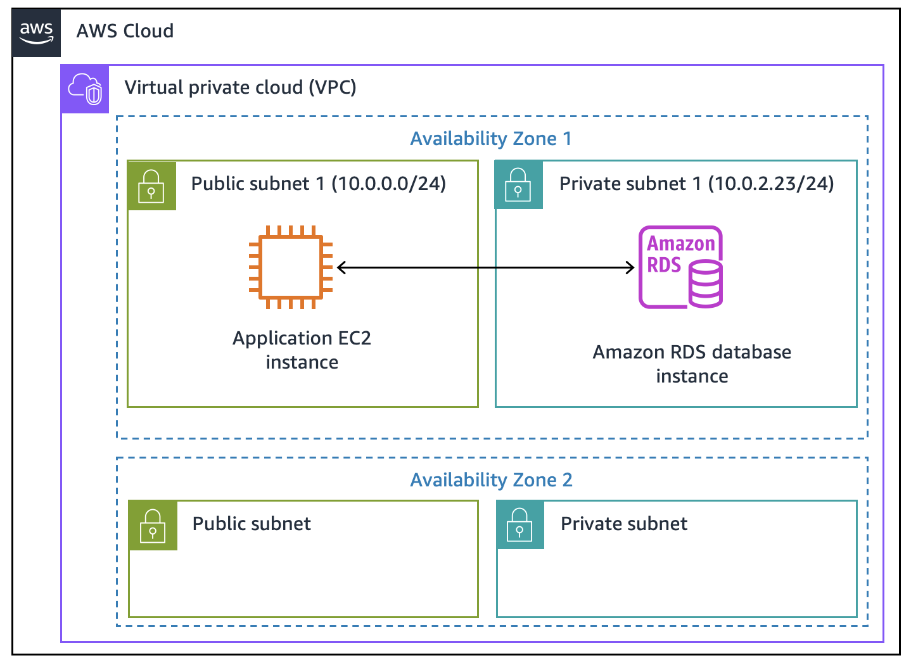

# Guided Lab: Creating an Amazon RDS Database

## Lab Overview & Objectives

Traditionally, provisioning and configuring a database can be a complex process requiring specialized database or systems administration. Using **Amazon Relational Database Service (Amazon RDS)** in the AWS Cloud streamlines database creation, scaling, and infrastructure management.

By the end of this lab, you will be able to:
* Create and configure an **Amazon RDS DB instance**.
* Configure a multi-tier web application running on Amazon EC2 to connect seamlessly to the RDS database.

---

## Lab Information

* **Estimated Duration:** 30–45 minutes
* **AWS Services Used:** Amazon RDS, Amazon EC2, Amazon VPC (Subnet Groups & Security Groups).

---

## Target Architecture

At the end of this lab, your infrastructure will consist of a resilient two-tier architecture:
     ---

  

### Task 1: Creating an Amazon RDS MySQL Database

In this task, you provision a managed MySQL database instance within a private subnet group of your VPC using Amazon RDS.

#### Step 1: Configure Engine & Template
1. In the **AWS Management Console**, search for and select **RDS**.
2. Click **Create database**.
3. Under **Engine options**, choose **MySQL**.
4. Under **Templates**, select **Free tier** *(automatically selects a Single-AZ deployment)*.

---

#### Step 2: Configure Credentials & Instance Specifications
1. Under **Settings**:
   * **DB instance identifier:** `inventory-db`
   * **Master username:** `admin`
   * **Credentials management:** Choose **Self managed**
   * **Master password:** `lab-password`
   * **Confirm master password:** `lab-password`
2. Under **Instance configuration**:
   * Select **Burstable classes (includes t classes)**
   * Select **`db.t3.micro`**
3. Under **Storage**:
   * **Storage type:** `General Purpose SSD (gp2)`
   * **Allocated storage:** `20` GiB
   * Expand **Storage autoscaling** and **clear/deselect** *Enable storage autoscaling*.

---

#### Step 3: Network & Security Configuration
1. Under **Connectivity**:
   * **Virtual Private Cloud (VPC):** `Lab VPC`
   * **DB subnet group:** Keep default *(spans across two private subnets for Multi-AZ readiness)*.
   * **VPC security group (firewall):** Choose **Choose existing**.
   * Under **Existing VPC security groups**, select **`DB-SG`** and **remove** the `default` security group.
2. Expand **Additional configuration**:
   * **Initial database name:** `inventory`
3. Click **Create database** at the bottom of the page.

> ⏳ **Validation:** Wait until `inventory-db` transitions to the **Available** status before proceeding (this usually takes 5–10 minutes). If prompted with *Suggested add-ons*, click **Close**.

     ---

  

---

### Task 2: Connecting the Web Application to the RDS Instance

In this task, you retrieve the RDS endpoint and configure the EC2 web application to securely authenticate and store relational data.

#### Step 1: Access the Application Frontend
1. Copy the **`AppServerPublicIP`** provided in your lab credentials/AWS Details panel.
2. Open a new browser tab, paste the IP address into the address bar, and press **Enter**.
3. Click **Settings** in the application menu.

---

#### Step 2: Retrieve the RDS Endpoint & Establish Connection
1. Return to the **Amazon RDS Console > Databases**.
2. Click **`inventory-db`**.
3. Under the **Connectivity & security** tab, copy the **Endpoint** address (e.g., `inventory-db.xxxxxx.rds.amazonaws.com`).
4. Return to the web application **Settings** tab and enter the following details:

| Field | Value |
| :--- | :--- |
| **Endpoint** | *[Pasted RDS Endpoint]* |
| **Database** | `inventory` |
| **Username** | `admin` |
| **Password** | `lab-password` |

5. Click **Save**.

> 🔒 **Security Mechanism:** The web app transfers these parameters into **AWS Secrets Manager**, storing credentials as an encrypted secret. The application retrieves these credentials dynamically at runtime rather than storing plain-text strings in source code.

---

#### Step 3: Verify Data Persistence
1. Navigate to the main inventory table in the web application.
2. Insert, edit, or delete items until you have **at least 5 inventory records** saved in the database.

> **Architecture Benefit:** Data is now persisted safely inside the Amazon RDS MySQL layer. Any failure or restart of the EC2 web application server will not result in data loss.

---

## 🏁 Lab Completion 

