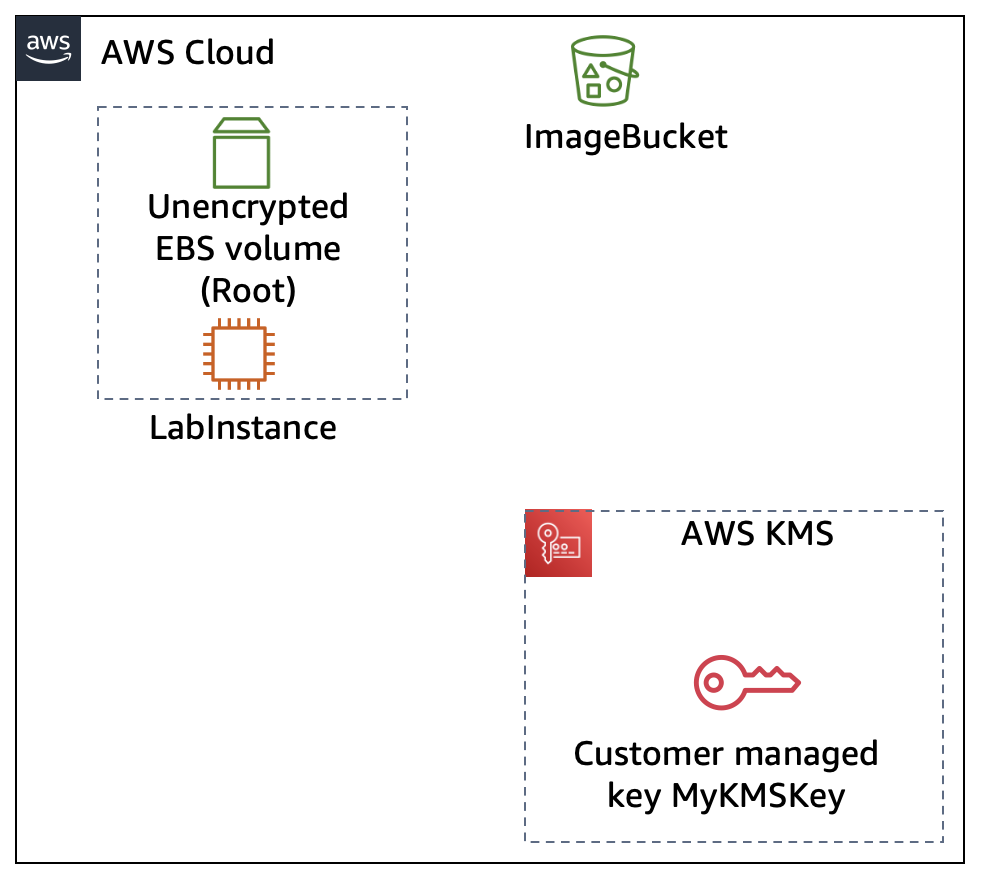
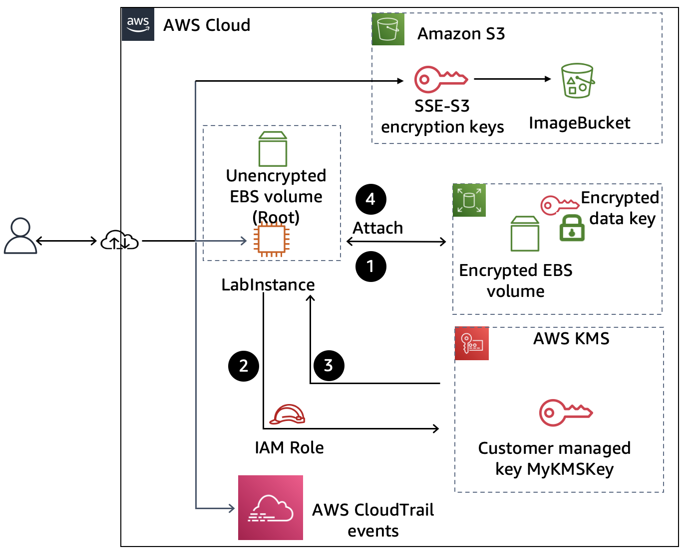

# Guided Lab: Encrypting Data at Rest by Using AWS Encryption Options

## Lab Overview & Objectives

In this lab, you review default data encryption and **AWS Key Management Service (AWS KMS)** mechanisms used to secure data at rest. You will inspect default server-side encryption for objects stored in **Amazon S3**, generate an AWS KMS Customer Managed Key (CMK) to encrypt **Amazon EBS** volumes, observe the audit capabilities of **AWS CloudTrail**, and evaluate the impact of disabling cryptographic keys on data availability.

By the end of this lab, you will be able to:
* Review default encryption configurations provided by **Amazon S3 (SSE-S3)**.
* Access and verify encrypted Amazon S3 objects.
* Create and configure an **AWS KMS Customer Managed Key (CMK)** for data encryption/decryption at rest.
* Create and attach an encrypted **Amazon EBS** data volume to an existing EC2 instance.
* Disable and re-enable an AWS KMS key to analyze access disruption and key lifecycle controls.
* Audit and monitor KMS key usage using **AWS CloudTrail Event History**.
* Understand and review automated AWS KMS key rotation options.

---

## Lab Information

* **Estimated Duration:** 30 minutes
* **AWS Service Restrictions:** Access is restricted strictly to services specified within the lab scope (S3, EC2, EBS, KMS, CloudTrail). Attempting unauthorized service actions may trigger access denied errors.

---

## Scenario & Architecture

### **Initial State**
The lab environment provisions the following baseline resources:
1. An **Amazon S3 Bucket** (`ImageBucket`) configured for object storage.
2. An **Amazon EC2 Instance** (`LabInstance`) serving as the primary compute node.
3. Access to **AWS KMS** to establish key management operations.

   ---

  

### **Target Architecture**
By completing the tasks, you will connect these components into an integrated, encrypted architecture:
* **Amazon S3:** Stores objects protected by Server-Side Encryption with Amazon S3-Managed Keys (`SSE-S3`).
* **Amazon EBS & EC2:** An encrypted EBS volume is created using `MyKMSKey` and attached to `LabInstance`.
* **AWS KMS:** Manages `MyKMSKey` (Customer Managed Key) and processes data key decryption requests.
* **AWS CloudTrail:** Captures and logs all KMS API calls (`GenerateDataKey`, `Decrypt`, etc.) for security auditing.

   ---

  

---

### Key Workflow & Decryption Sequence

| Step | Action & Explanation |
| :--- | :--- |
| **1. Volume Attachment** | The user attaches the encrypted EBS volume to the `LabInstance`. The EC2 host retrieves the volume's **encrypted data key**. |
| **2. KMS Decryption Request** | The EC2 host sends an API request to **AWS KMS** to decrypt the volume's encrypted data key using `MyKMSKey`. |
| **3. Authorization & Key Return** | AWS KMS validates IAM role/user permissions and returns the **plaintext data key** back to the EC2 host. |
| **4. In-Memory Encryption** | The EC2 host stores the plaintext data key in hypervisor memory to execute transparent I/O encryption and decryption operations for the EBS volume. |

### Task 1: Reviewing Default Encryption for Objects in an S3 Bucket

In this task, you inspect the default Amazon S3 Server-Side Encryption (SSE-S3) configuration, upload an object with public permissions, and verify transparent decryption behavior.

#### Step 1: Download Target Object
1. Download the [`clock.png`](https://aws-tc-largeobjects.s3-us-west-2.amazonaws.com/AWS-100-DEV/v2.2/course-file/clock.png) asset to your local workspace.

#### Step 2: Inspect S3 Bucket Encryption Settings
1. Open the **Amazon S3 Console**.
2. Navigate to **Buckets** and select the bucket containing **`imagebucket`** in its name.
3. Select the **Properties** tab.
4. Scroll to the **Default encryption** section:
   > ℹ️ **Observation:** Amazon S3 automatically applies **Server-side encryption with Amazon S3 managed keys (SSE-S3)** as the baseline security standard for all newly created objects.
      ---

  

---

#### Step 3: Upload Object and Validate Transparent Decryption
1. Switch to the **Objects** tab and click **Upload**.
2. Click **Add files** and select `clock.png`.
3. Expand **Permissions** and select **Grant public-read access**.
4. Check the warning acknowledgment: *"I understand the risk of granting public-read access..."*
5. Click **Upload**, then click **Close** upon completion.
6. Select `clock.png` from the object registry:
   * **Server-side encryption status:** *Enabled*
   * **Encryption type:** *Server-side encryption with Amazon S3 managed keys (SSE-S3)*
7. Under **Object overview**, click the **Object URL** link.

> **Validation Outcome:** The image opens seamlessly in the browser. Although the data is encrypted at rest using AES-256 via SSE-S3, Amazon S3 handles decryption transparently on-the-fly when serving authorized HTTP GET requests.

---

### Task 2: Creating an AWS KMS Customer Managed Key (CMK)

In this task, you generate a symmetric Customer Managed Key (CMK) within AWS KMS. This key will manage data encryption keys for EBS storage volumes.

1. Open the **AWS Key Management Service (AWS KMS) Console**.
2. Select **Customer managed keys** from the left navigation panel.
3. Click **Create key**.
4. Configure key specifications:
   * **Key type:** `Symmetric` *(AES-256 secret key that never leaves AWS KMS unencrypted)*
   * Click **Next**.
5. Set key aliases:
   * **Alias:** `MyKMSKey`
   * Click **Next**.
6. **Define key administrative permissions:**
   * Search for and select the **`voclabs`** IAM role.
   * Click **Next**.
7. **Define key usage permissions:**
   * Search for and select the **`voclabs`** IAM role again.
   * Click **Next**.
8. Review configuration details and click **Finish**.

> **Note:** The key status will now report as **Enabled** under your Customer Managed Keys list.

---

### Task 3: Creating and Attaching an Encrypted EBS Volume

In this task, you provision a new Amazon EBS volume encrypted with `MyKMSKey` and attach it to an active EC2 compute node.

#### Step 1: Verify EC2 Root Volume State
1. Open the **Amazon EC2 Console**.
2. Navigate to **Instances** and click **LabInstance**.
3. Record the **Availability Zone** (e.g., `us-east-1a`).
4. Select the **Storage** tab:
   * Observe the default `/dev/xvda` root volume — note that it is listed as **Not Encrypted**.

---

#### Step 2: Provision & Encrypt the EBS Volume
1. Select **Volumes** under the *Elastic Block Store* menu.
2. Click **Create volume**.
3. Configure volume parameters:
   * **Volume type:** `gp2` or `gp3` (Default)
   * **Size (GiB):** `1`
   * **Availability Zone:** Must match `LabInstance`'s Availability Zone recorded above.
   * **Encryption:** Select **Encrypt this volume**.
   * **KMS key:** Select `MyKMSKey`.
4. Click **Create volume**.

---

#### Step 3: Attach Volume to the EC2 Instance
1. Select the newly created 1 GiB volume and click **Actions > Attach volume**.
2. Select **`LabInstance`** from the *Instance* dropdown list.
3. Accept the default device path (e.g., `/dev/sdf`) and click **Attach volume**.
4. Return to **Instances > LabInstance > Storage** tab to confirm attachment state:

| Volume Device | Size | Encryption Status | KMS Key ID |
| :--- | :--- | :--- | :--- |
| **Root (`/dev/xvda`)** | 8 GiB | Not Encrypted | `-` |
| **Data (`/dev/sdf`)** | 1 GiB | **Encrypted** | `MyKMSKey` |

> **Under the Hood:** When attached, EC2 requests AWS KMS to decrypt the volume's encrypted data key using `MyKMSKey`. KMS returns a plaintext data key, which EC2 stores securely in hypervisor memory to handle I/O encryption transparently.

### Task 4: Disabling the Encryption Key and Observing Access Disruption

In this task, you temporarily disable `MyKMSKey` in AWS KMS and observe how KMS access restrictions impact storage attachment operations. You will also inspect **AWS CloudTrail** audit logs to analyze the resulting failure events.

#### Step 1: Disable the Customer Managed Key
1. Open the **AWS Key Management Service (AWS KMS) Console**.
2. Navigate to **Customer managed keys**.
3. Select **`MyKMSKey`**, then click **Key actions > Disable**.
4. Check the confirmation checkbox: *"Confirm that you want to disable this key"*.
5. Click **Disable key**.

---

#### Step 2: Detach and Attempt Re-attachment of the EBS Volume
> ℹ️ **Why Detach?** When an encrypted volume is already attached, EC2 caches the decrypted data key in host hypervisor memory. Detaching forces EC2 to discard the cached key and re-query AWS KMS upon the next attachment attempt.

1. Open the **Amazon EC2 Console** and navigate to **Volumes**.
2. Select your 1 GiB encrypted volume.
3. Click **Actions > Detach volume**, then confirm by clicking **Detach**.
4. Click the **Refresh** icon until the volume status transitions to `Available`.
5. Click **Actions > Attach volume**.
6. Select **`LabInstance`** from the *Instance* dropdown and click **Attach volume**.

> ⚠️ **Expected Error Output:**
> `Volume vol-xxxxxxxxxxxxxxxxx cannot be attached. The encrypted volume was unable to access the KMS key.`
> 
> **Analysis:** The attachment handshake fails because AWS KMS rejects EC2's API request to decrypt the volume's stored data key while `MyKMSKey` remains in a disabled state.

---

#### Step 3: Inspect Audit Logs in AWS CloudTrail
1. Search for and open the **AWS CloudTrail Console**.
2. From the left navigation menu, select **Event history**.
3. Locate and click the **`DisableKey`** event link to review its details:
   * **Event Time:** Matches the timestamp when the key state changed.
   * **Event Source:** `kms.amazonaws.com`
4. Return to **Event history** and select the subsequent **`AttachVolume`** event link:
   * **Event Source:** `ec2.amazonaws.com`
   * **Error Code / Status:** Indicates an authorization failure or failure to decrypt the underlying volume data key due to KMS key state restriction.

---

#### Step 4: Re-enable Key & Restore Volume Attachment
1. Return to the **AWS KMS Console > Customer managed keys**.
2. Select **`MyKMSKey`**, then click **Key actions > Enable**.
3. Return to the **Amazon EC2 Console > Volumes**.
4. Select your 1 GiB encrypted volume, click **Actions > Attach volume**, select **`LabInstance`**, and click **Attach volume**.

 ---

  

> **Validation Outcome:** The volume attaches successfully, as AWS KMS can once again process data key decryption requests.
### Task 5: Analyzing AWS KMS Activity Using AWS CloudTrail

In this task, you will audit cryptographic operations using **AWS CloudTrail Event History** to examine how AWS KMS grants and data key decryption events are logged during storage operations.

#### Step 1: Filter Logs by KMS Event Source
1. Open the **AWS CloudTrail Console**.
2. From the left navigation pane, select **Event history**.
3. In the **Lookup attributes** dropdown (default: *Read-only*), select **Event source**.
4. In the search box, enter `kms` and select **`kms.amazonaws.com`**.

---

#### Step 2: Audit Key Cryptographic Events

Select and inspect the following specific API calls in the event registry:

* **`CreateGrant`**:
  * **Analysis:** Triggered when Amazon EC2 requests permission delegation to perform cryptographic operations. It permits the EC2 service principal to decrypt the volume's data key on behalf of `LabInstance`.
* **`Decrypt`**:
  * **Analysis:** Executes after a successful `CreateGrant` authorization. AWS KMS uses `MyKMSKey` to decrypt the volume's encrypted data key, returning the plaintext key to EC2 for in-memory I/O encryption.
* **`GenerateDataKeyWithoutPlaintext`**:
  * **Analysis:** Logs the initial request sent to AWS KMS to generate an encrypted data key specifically allocated for the new EBS volume during creation.
* **`RetireGrant`**:
  * **Analysis:** Logs the cleanup operation when temporary grant permissions assigned to the EC2 host are revoked (e.g., during volume detachment).

> 💡 **CloudTrail Retention Tip:** Event history retains account management events for **90 days**. To store audit logs beyond 90 days for compliance, configure a dedicated **CloudTrail Trail** targeting an Amazon S3 bucket.

---

### Task 6: Reviewing & Enabling Key Rotation

In this task, you will configure automatic cryptographic key rotation to meet regulatory and security compliance baselines.

1. Open the **AWS Key Management Service (AWS KMS) Console**.
2. Select **Customer managed keys** and click **`MyKMSKey`**.
3. Select the **Key rotation** tab.
4. Check **Automatically rotate this KMS key every year**.
5. Click **Save**.

     ---

  

> ℹ️ **Key Rotation Mechanics:** When enabled, AWS KMS automatically generates new cryptographic key material every 365 days. KMS retains older key material indefinitely to seamlessly decrypt historical data previously encrypted with older key versions.

---

## 🏁 Lab Conclusion

You have successfully implemented comprehensive data-at-rest encryption controls on AWS:

* [x] **Amazon S3 Encryption:** Validated baseline Server-Side Encryption (`SSE-S3`) and verified transparent HTTP GET decryption workflows.
* [x] **AWS KMS Key Provisioning:** Created a symmetric Customer Managed Key (`MyKMSKey`) with specific administrative and usage policy boundaries.
* [x] **Amazon EBS Integration:** Provisioned and attached a 1 GiB EBS data volume protected with custom KMS envelope encryption.
* [x] **Disabling & Key Lifecycle Impact:** Demonstrated that disabling a KMS key instantly revokes EC2's ability to decrypt volume keys and mount storage.
* [x] **CloudTrail Auditing:** Analyzed `CreateGrant` and `Decrypt` API events within CloudTrail to track key utilization.
* [x] **Key Rotation:** Enabled automated yearly KMS key material rotation for compliance management.

---

## 📤 Submitting Your Lab

