# Guided Lab: Exploring AWS Identity and Access Management (IAM)
> ⏱️ **Lab Overview & Objectives**

In this practical lab, you explore the core concepts of AWS IAM by working with users, groups, and permissions. You will inspect how IAM policies are structured, how permissions are inherited, and test service access based on real-world scenarios.

---

## 🎯 Lab Objectives

After completing this lab, you should be able to:
* 🔍 **Explore** pre-created IAM users and groups within the AWS environment.
* 📜 **Inspect** IAM JSON policies and understand how they are applied to specific groups.
* 💼 **Follow a real-world scenario** by adding users to groups to grant them specific operational capabilities.
* 🔗 **Locate and use** the unique IAM sign-in URL.
* 🧪 **Test the effects** of IAM policies on actual AWS service access to verify restrictions and permissions.

---

## 🛠️ Core Concepts Covered

### 👥 Users & Groups
* **IAM User:** An entity that you create in AWS to represent the person or application that uses it to interact with AWS.
* **IAM Group:** A collection of IAM users. Groups let you specify permissions for multiple users, making it easier to manage the permissions for those users.

### 📄 IAM Policies
* Documents written in **JSON** that define permissions. 
* Permissions can be explicitly allowed or denied for specific AWS actions and resources.
* When a user is added to a group, they **inherit** all the permissions defined in that group's policies.

## 📝 Task 1: Explore IAM Users, Groups, and Inspect Policies

In this task, you will explore the pre-created IAM users and groups, and analyze the differences between Managed and Inline JSON policies.

> 🌐 **Note:** Before starting, check the upper-right corner of the AWS Management Console and note your current **AWS Region** (e.g., N. Virginia). You may need this information later.

---

### 👤 1. Inspecting Pre-Created IAM Users
1. Go to the **Services** menu, locate **Security, Identity, & Compliance**, and choose **IAM**.
2. In the left navigation pane, click on **Users**. You will see three pre-created users:
   * `user-1`
   * `user-2`
   * `user-3`
3. Click on **user-1** to open its summary page:
   * 🛑 **Permissions Tab:** Notice that `user-1` has **no permissions** explicitly attached.
   * 👥 **Groups Tab:** Notice that `user-1` is **not a member** of any groups yet.
   * 🔑 **Security Credentials Tab:** Notice that `user-1` has a **Console password** assigned, allowing them to log into the AWS Management Console.

---

### 👥 2. Inspecting User Groups & Policies

Navigate to **User groups** in the left pane. You will see three groups created to map different job roles:

#### 🔹 A. The `EC2-Support` Group (Managed Policy)
* **Policy Type:** **AWS Managed Policy** (`AmazonEC2ReadOnlyAccess`). 
* *What is a Managed Policy?:* Prebuilt policies by AWS that apply updates automatically to all attached users/groups.
* **JSON Analysis:** 
  * **Effect:** `Allow`
  * **Action:** Grants permissions to `List` and `Describe` (view) resources for **Amazon EC2, Elastic Load Balancing, Amazon CloudWatch, and Auto Scaling**.
  * **Resource:** `*` (applies to all entities under these services). It allows viewing resources but prevents any modifications.

   * 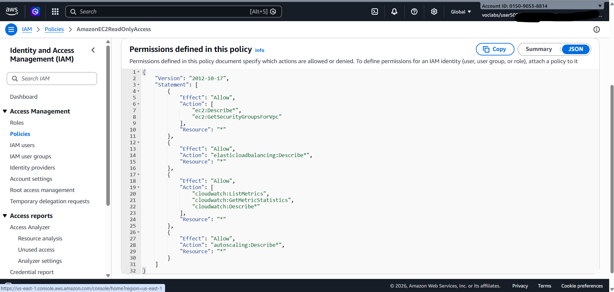

#### 🔹 B. The `S3-Support` Group (Managed Policy)
* **Policy Type:** **AWS Managed Policy** (`AmazonS3ReadOnlyAccess`).
* **JSON Analysis:** Grants `Get` and `List` permissions for all resources in **Amazon S3** (`"Resource": "*"`).

     * 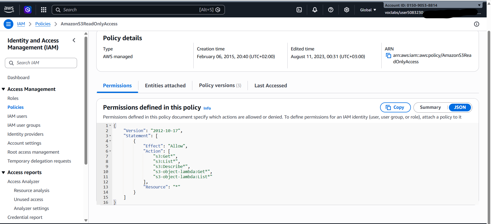

#### 🔹 C. The `EC2-Admin` Group (Inline Policy)
* **Policy Type:** **Inline Policy** (`EC2-Admin-Policy`).
* *What is an Inline Policy?:* A custom policy embedded directly into a single specific user or group.
* **JSON Analysis:** Grants permission to `Describe` (view) EC2 instances, and specifically allows the operational capabilities to **`StartInstances`** and **`StopInstances`**.

   * 

---

## 🏛️ IAM Policy Basic Structure Reminder
Every statement in an IAM JSON policy follows this foundational block:
* 🟢 **Effect:** Specifies whether the rule will `Allow` or `Deny` the traffic/action.
* 🛠️ **Action:** Specifies the exact API calls allowed against the AWS service (e.g., `cloudwatch:ListMetrics`).
* 📦 **Resource:** Defines the scope of covered entities (e.g., a specific S3 bucket ARN; an asterisk `*` means *any* resource).

---

## 💼 Business Scenario

Your company is expanding its AWS footprint. To maintain the principle of least privilege, you will assign the new staff members to their respective groups based on their job functions as mapped below:

| User | Assigned Group | Operational Permissions Inherited |
| :--- | :--- | :--- |
| 🧑‍💻 **user-1** | `S3-Support` | Read-only access to Amazon S3 buckets and objects. |
| 🧑‍💻 **user-2** | `EC2-Support` | Read-only access to view Amazon EC2 infrastructure. |
| 🧑‍💻 **user-3** | `EC2-Admin` | Capabilities to **View, Start, and Stop** Amazon EC2 instances. |

---

## 👥 Task 2: Add Users to Groups

In this task, you will assign each user to their designated user group to implement the required access control based on their job descriptions.

> ⚠️ **Note:** If you encounter any "Not Authorized" errors during this task, please ignore them. They are due to lab account restrictions and will not impact your ability to successfully complete the lab.

---

### 📥 Task 2.1: Add `user-1` to the `S3-Support` Group
1. In the left navigation pane of the IAM console, choose **User groups**.
2. Click on the **S3-Support** group name.
3. On the **Users** tab, click **Add users**.
4. Select **user-1** from the list, and click **Add users**.
5. Verify that `user-1` is now listed under the group's members.

    * 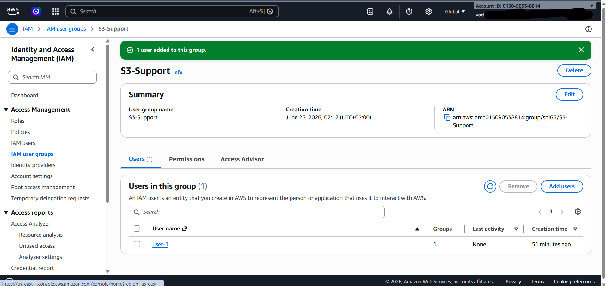
---

### 🖥️ Task 2.2: Add `user-2` to the `EC2-Support` Group
1. Navigate back to **User groups** and click on the **EC2-Support** group.
2. Under the **Users** tab, click **Add users**.
3. Select **user-2** from the list, and click **Add users**.
4. Verify that `user-2` has successfully joined the group to inherit the `AmazonEC2ReadOnlyAccess` policy.

     * 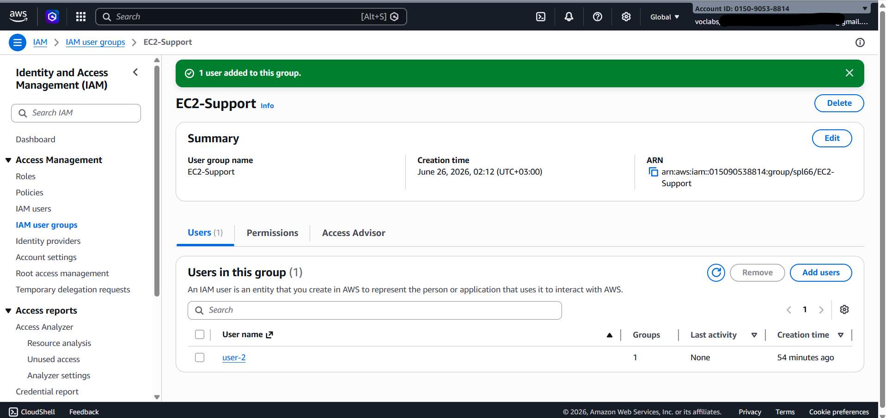
---

### 🛠️ Task 2.3: Add `user-3` to the `EC2-Admin` Group
1. Navigate to **User groups** and click on the **EC2-Admin** group.
2. Under the **Users** tab, click **Add users**.
3. Select **user-3** from the list, and click **Add users**.
4. Verify that `user-3` is now part of the group to inherit the custom `EC2-Admin-Policy`.

   * 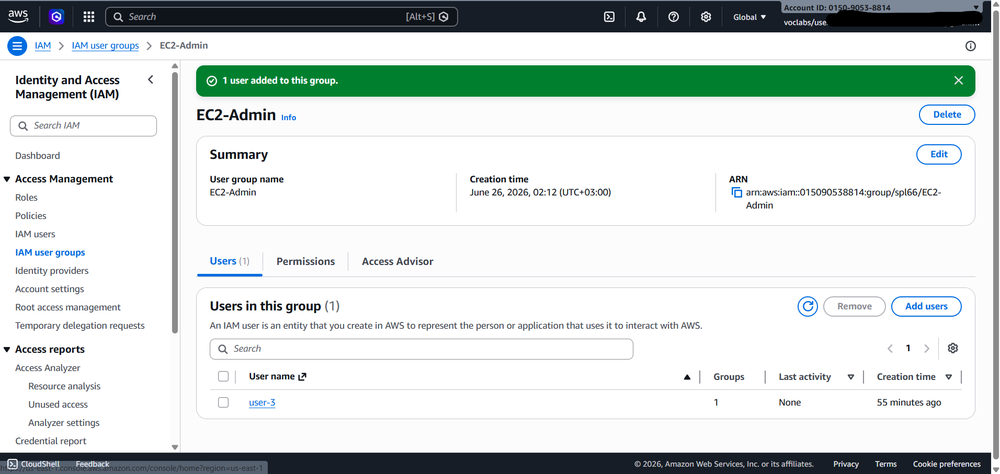
---

## 🔍 Verification Check

To ensure all permissions have been correctly delegated, go back to **User groups** in the left navigation pane. 

   * 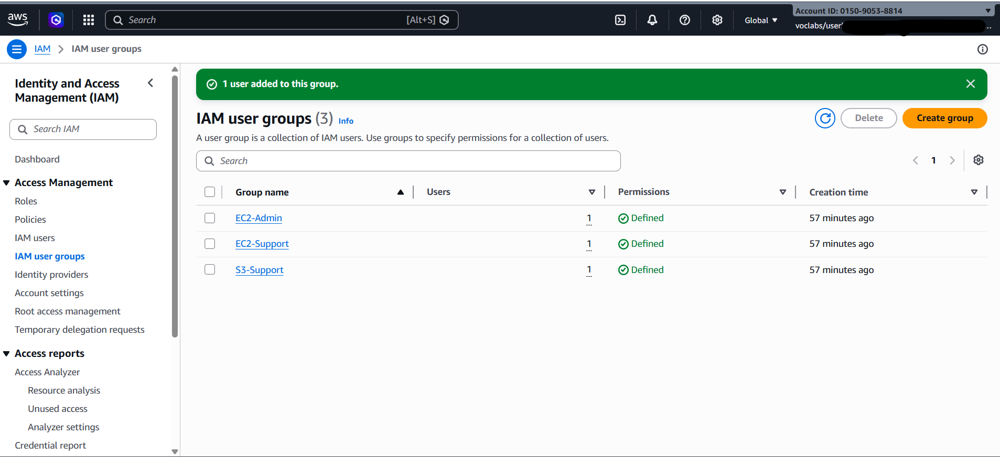

| User Group | Expected Number of Users | Assigned User |
| :--- | :---: | :---: |
| **S3-Support** | 1 | `user-1` |
| **EC2-Support** | 1 | `user-2` |
| **EC2-Admin** | 1 | `user-3` |

## 🧪 Task 3: Sign In and Test User Permissions

In this task, you will retrieve the unique IAM Sign-in URL, log into the AWS Console using an Incognito window as each of the three users, and verify that their effective permissions accurately match the job requirements.

---

### 🔗 Task 3.1: Get the Console Sign-In URL
1. In the left navigation pane of the IAM dashboard, click on **Dashboard**.
2. Locate the **Sign-in URL for IAM users in this account** section at the top of the page. It will look similar to: `https://123456789012.signin.aws.amazon.com/console`.
3. Copy this unique URL to a text editor for easy access.

---

### 🧑‍💻 Task 3.2: Test `user-1` Permissions (S3 Storage Support)
1. Open a **Private / Incognito window** in your browser.
2. Paste your unique Sign-in URL and press **ENTER**.
3. Log in with the following credentials:
   * **IAM user name:** `user-1`
   * **Password:** `Lab-Password1`
4. **Test S3 Access:** Search for and open **S3**. Click on a bucket and browse its contents.
   * *Result:* 🟢 **Success.** Because `user-1` is in the `S3-Support` group, they have full read-only permissions to view buckets.
     * 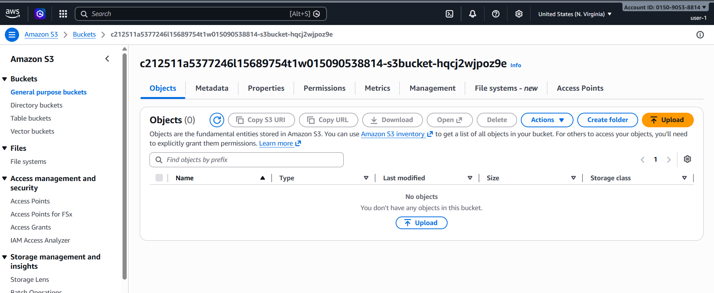

5. **Test EC2 Access:** Search for and open **EC2**, then click **Instances** in the left menu.
   * *Result:* 🛑 **Access Denied.** An error appears saying you are not authorized.
     * 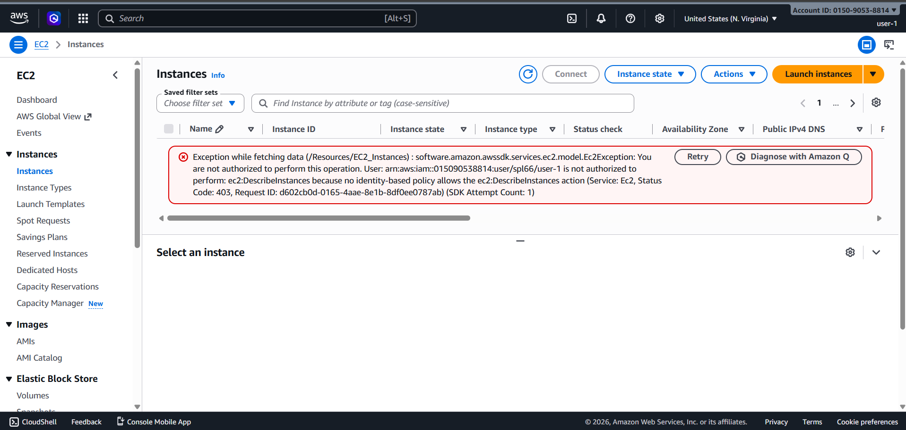

6. **Sign Out:** Click on `user-1` in the upper-right corner and choose **Sign Out**.

---

### 🧑‍💻 Task 3.3: Test `user-2` Permissions (EC2 Support)
1. Return to the sign-in URL in your private window and log in:
   * **IAM user name:** `user-2`
   * **Password:** `Lab-Password2`
2. **Test EC2 Access:** Navigate to the **EC2 console** and click **Instances**. 
   * *Note:* Ensure your region is set correctly (e.g., *N. Virginia*) to view the running instances.
   * *Result:* 🟢 **Success.** You can see the listed EC2 instance.
   * 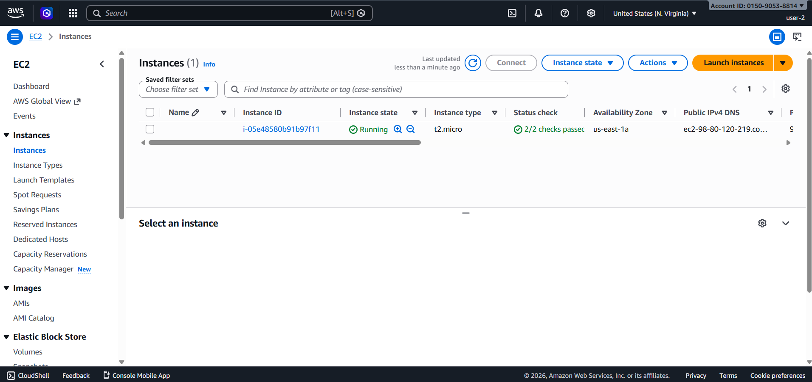

3. **Test Modifying EC2:** Select the EC2 instance, click **Instance state** -> **Stop instance** -> **Stop**.
   * *Result:* 🛑 **Access Denied.** An error confirms you are not authorized to modify resources.
   *    * 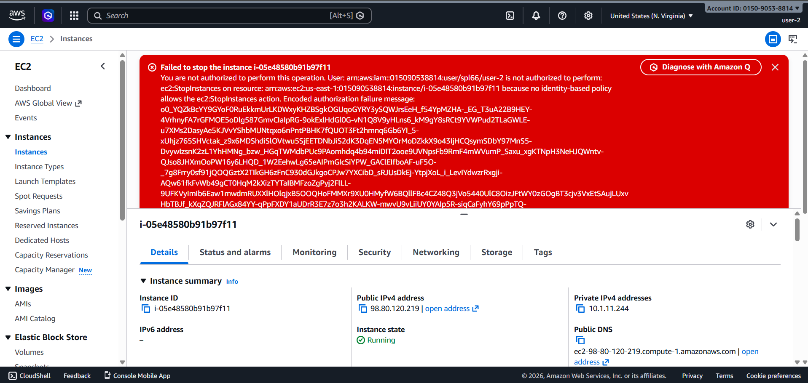

4. **Test S3 Access:** Navigate to the **S3 console**.
   * *Result:* 🛑 **Access Denied.** An error states you don't have permissions to list buckets.
   * 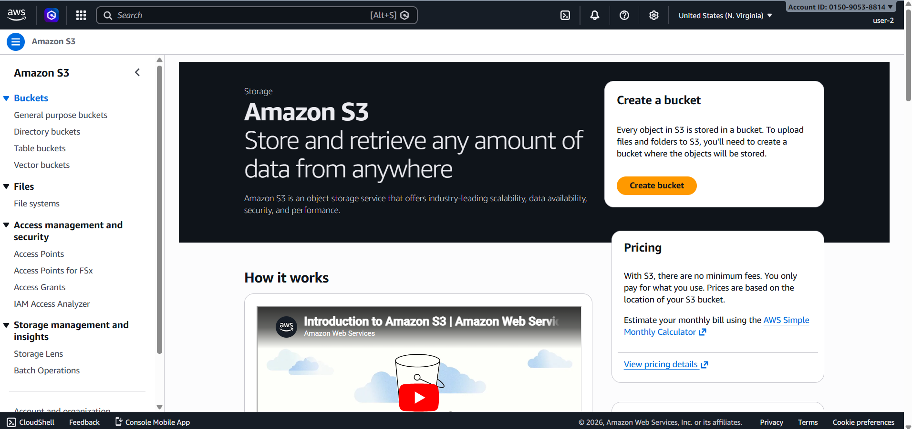

5. **Sign Out:** Click on `user-2` in the upper-right corner and choose **Sign Out**.

---

### 🧑‍💻 Task 3.4: Test `user-3` Permissions (EC2 Administrator)
1. Return to the sign-in URL in your private window and log in:
   * **IAM user name:** `user-3`
   * **Password:** `Lab-Password3`
2. **Test EC2 Admin Access:** Navigate to the **EC2 console** and click **Instances**. 
3. Select the active EC2 instance, click **Instance state**, and choose **Stop instance** -> **Stop**.
   * *Result:* 🟢 **Success!** This time the action is authorized. The instance state changes to `Stopping` and shuts down properly.

   * 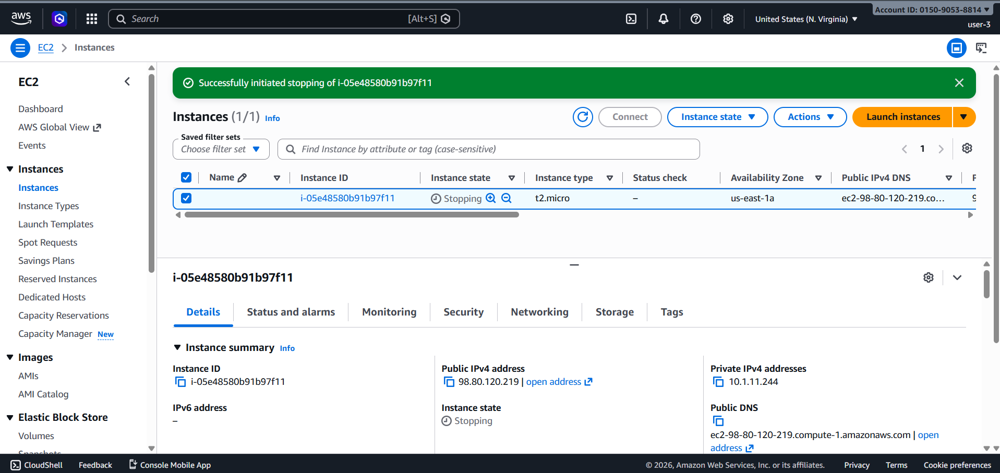

4. Close your private browser window.

---

## 🏁 Conclusion

Congratulations! You have successfully completed the AWS IAM Guided Lab and verified the following cloud security workflows:
* [x] Explored pre-created IAM users and groups.
* [x] Inspected IAM JSON policies applied to administrative and support groups.
* [x] Applied a real-world business scenario by managing group memberships.
* [x] Located and used the unique account-specific IAM sign-in URL.
* [x] Rigorously tested the behavioral effects of managed vs. inline policies on AWS service access.

---

