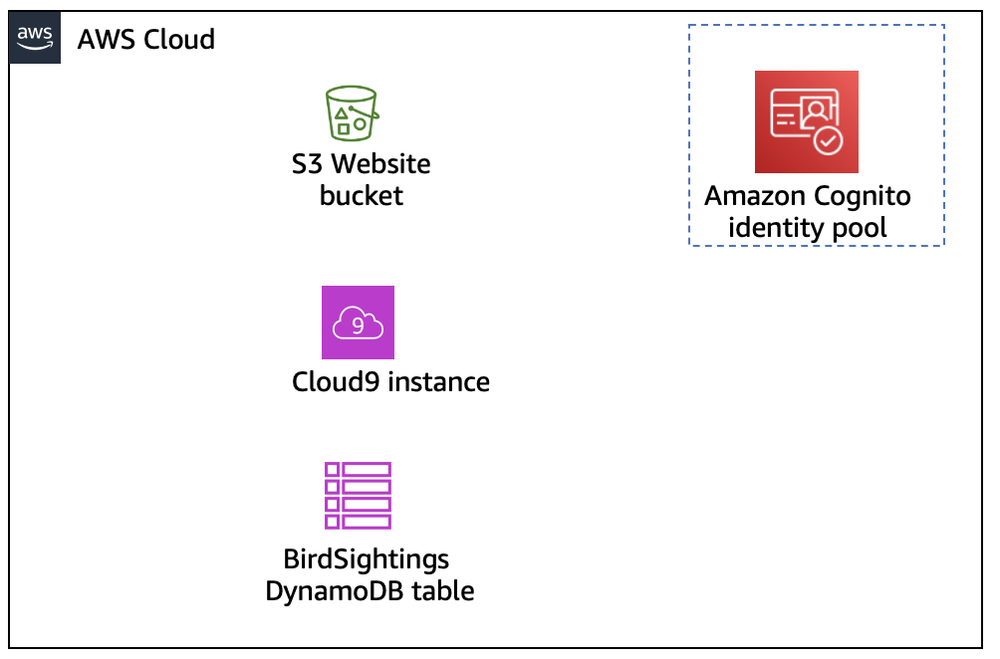
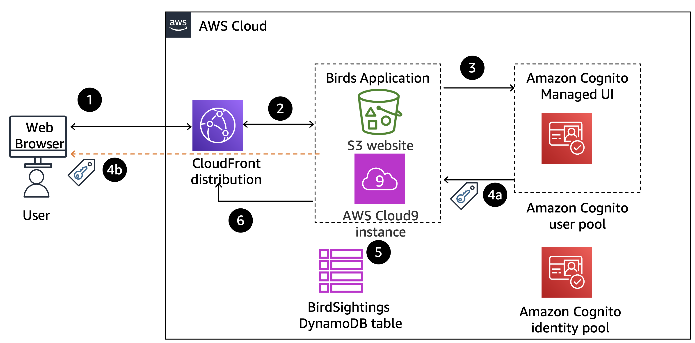

# Guided Lab: Securing Applications by Using Amazon Cognito

## 📌 Lab Overview & Objectives
While building web applications, user authentication and authorization can be challenging. **Amazon Cognito** makes it convenient for developers to add sign-up, sign-in, and enhanced security functionality.

In this lab, you configure an **Amazon Cognito User Pool**, which you use to manage users and their access to an existing web application. You also create an **Amazon Cognito Identity Pool**, which authorizes users when the application makes calls to the **Amazon DynamoDB** service.

After completing this lab, you should be able to do the following:
* [x] **Create an Amazon Cognito user pool.**
* [x] **Add users to the user pool.**
* [x] **Update the example application** to use the user pool for authentication.
* [x] **Configure the Amazon Cognito identity pool.**
* [x] **Update the example application** to use the identity pool for authorization.

---

## ⏱️ Details & Restrictions
* **Estimated Duration:** 60 Minutes
* **Service Restrictions:** Access is restricted strictly to the AWS services and actions required to complete the lab tasks.

---

## 📖 Scenario
You have the **Birds web application**, which was built by using a Node.js server running on an AWS Cloud9 instance and an Amazon Simple Storage Service (Amazon S3) bucket with static website hosting capability. The Birds application tracks students' bird sightings by using the following components:

* **Home page**
* **Educational page** (teaches students about birds)
* **Three protected pages** (accessible only if authenticated):
  * **Sightings page:** View past bird sightings.
  * **Reporting page:** Report new bird sightings.
  * **Administrator page:** Perform additional site administrative operations.

You need to add authentication and authorization to the application for these protected pages.

---

## 🏗️ Architectural Evolution & Workflows

### 1️⃣ Starting Architecture
Initially, you use these base components to install the application and get it running.

---<p align="center">
  
</p>
---

### 2️⃣ Intermediate Architecture: Authentication via User Pool
You add components to implement authentication by using an **Amazon Cognito User Pool** for protected pages.
---<p align="center">
  
</p>

| Step | Explanation |
| :---: | :--- |
| **1** | A user requests access to the protected page from the browser. |
| **2** | The request is routed to the Node.js application server that is hosting the Birds application. |
| **3** | The application redirects the request to the Amazon Cognito managed UI. |
| **4a** | The user is authenticated by the Amazon Cognito user pool, and the access token is returned to the application. |
| **4b** | The Amazon Cognito SDK also stores the access token in browser's local storage for subsequent use, with the default expiration of 3,600 seconds. |
| **5** | The application validates the token and returns the protected page as requested. |
| **6** | The page is returned to the user's browser through the Amazon CloudFront distribution. |

---

### 3️⃣ Final Architecture: Authorization via Identity Pool
Finally, you add additional authentication and authorization by using an **Amazon Cognito Identity Pool** to implement administrator access to the site.

---<p align="center">
  
</p>

| Step | Explanation |
| :---: | :--- |
| **1** | The user requests access to the administrator page from the browser. |
| **2** | The request is routed to the Node.js application server that is hosting the Birds application. |
| **3** | The application redirects the request to the Amazon Cognito managed UI. |
| **4a** | The user is authenticated by the Amazon Cognito user pool, and the access token is returned to the application. |
| **4b** | The Amazon Cognito SDK also stores the access token in browser's local storage for subsequent use, with the default expiration of 3,600 seconds. |
| **5** | The application validates the token and returns the administrator page as requested. |
| **6** | The page is returned to the user's browser through the CloudFront distribution. |
| **7** | The user initiates a query to a DynamoDB table. |
| **8** | The application sends the token to the Amazon Cognito identity pool and receives temporary AWS credentials upon validation. |
| **9** | The application uses the received credentials to query the DynamoDB table and return data to the protected page. The page is returned to the user's browser through the CloudFront distribution. |

### Task 1: Preparing the Lab Environment

In this task, you will set up your AWS Cloud9 development workspace, retrieve the Birds application codebase, configure client-side endpoints, sync static assets to Amazon S3, and launch the Node.js application server.

---

#### Step 1: Initialize Workspace & Download Source Code
1. Open the **AWS Cloud9 IDE** using the `Cloud9url` link provided in your lab details.
2. In a local text editor on your machine, create a scratchpad to track runtime variables needed throughout the lab:

```text
S3 bucket: 
CloudFront distribution domain: 
User pool ID: 
App client ID: 
Amazon Cognito domain prefix: 
Identity pool ID: 

```

3. In the Cloud9 terminal pane (`voclabs:~/environment $`), execute the following commands to download and execute the setup script:

```bash
wget [https://aws-tc-largeobjects.s3.us-west-2.amazonaws.com/CUR-TF-200-ACACAD-3-113230/10-lab-mod9-guided-Cognito/code.zip](https://aws-tc-largeobjects.s3.us-west-2.amazonaws.com/CUR-TF-200-ACACAD-3-113230/10-lab-mod9-guided-Cognito/code.zip)
unzip code.zip
cd resources
. ./setup.sh

```

4. Once `setup.sh` finishes, copy the printed values from the output and record them into your local scratchpad:
* **S3 Bucket Name:** *(e.g., `c42885a571457l1365962t1w991727102856-s3bucket-1s4xxypc1ttq8`)*
* **CloudFront Distribution Domain:** *(e.g., `drhx6krwefmhd.cloudfront.net`)*


---

#### Step 2: Update Web Application Endpoint Configuration

1. In the Cloud9 file explorer on the left, expand `website/scripts/` and open `config.js`.
2. Replace `<cloudfront-domain>` with your recorded CloudFront distribution domain:

```javascript
CONFIG.BASE_NODE_SERVER_STR = "https://<your-cloudfront-domain>.cloudfront.net";

```

3. Save (`File > Save`) and close the file.

---

#### Step 3: Deploy Website Assets to Amazon S3

Sync the updated application files to your S3 static hosting bucket by running the following command in the Cloud9 terminal (replace `<s3-bucket>` with your actual bucket name):

```bash
cd /home/ec2-user/environment
aws s3 cp website s3://<s3-bucket>/ --recursive --cache-control "max-age=0"

```

---

#### Step 4: Launch the Node.js Application Server

Navigate to the backend server directory and initialize the server process:

```bash
cd /home/ec2-user/environment/node_server
npm start

```
---<p align="center">
  
</p>


> 📌 **Important Note:** Leave this terminal tab open and running! The Node.js application server must remain active (`Live on port: 8080`) to process API calls during testing.

---

#### Step 5: Verify CloudFront Distribution Deployment

1. Open the **Amazon CloudFront Console**.
2. Locate your distribution in the **Distributions** table.
3. Check the **Status** column:
* If **Enabled**, proceed to Task 2.
* If **Deploying**, wait a couple of minutes until the distribution deployment completes and changes to **Enabled**.


### Task 2: Reviewing the Birds Website

In this task, you will inspect the initial baseline behavior of the Birds web application prior to enforcing user authentication.

1. Open a new browser tab and navigate to your CloudFront URL: `https://<your-cloudfront-domain>.cloudfront.net`.
---<p align="center">
  
</p>

2. Explore the unauthenticated pages:
   * **HOME Page:** View the welcome overview message.
   * **BIRDS Page:** Browse through educational bird profiles (Public access).
3. Attempt to access protected areas:
   * Click **SIGHTINGS** from the top menu.
   * Click **LOGIN** when prompted.
4. Observe the warning popup: *"Access Denied"* / *"You do not have access"*. This confirms that access controls are unfulfilled until Amazon Cognito is configured.
5. Click **Dismiss** and close the application tab (keep your AWS Cloud9 terminal tab open).

---

### Task 3: Configuring the Amazon Cognito User Pool

In this task, you will establish a Cognito User Pool directory to handle user registration, password management, and JWT token issuance.

#### Task 3.1: Creating & Configuring the User Pool
1. Open the **Amazon Cognito Console** and select **User pools** from the left navigation pane.
2. Click **Create user pool** and set the initial creation options:
   * **Application type:** Select `Traditional web application`.
   * **Name your application:** `bird_app_client`
   * **Configure options:** Select `Username`.
   * **Required attributes for sign-up:** Select `email` from the dropdown.
   * **Add a return URL:** `https://<your-cloudfront-domain>.cloudfront.net/callback.html`
3. Click **Create user directory**.
---<p align="center">
  
</p>

4. *(Optional)* On the confirmation screen, under **Check out your sign-in page**, click **View login page** to inspect the hosted UI endpoint, then close that preview tab.
5. In the User pools list, click your newly generated pool (e.g., `User pool - zzzzzz`).
6. On the **Overview** page, click **Rename**, change the User pool name to `bird_app`, and click **Save changes**.
7. Copy the **User pool ID** (e.g., `us-east-1_AAAA1111`) to your text scratchpad.

##### **Configuring App Client Settings:**
1. From the bottom Recommendations pane (or App clients tab), click **bird_app_client**.
2. Navigate to the **Login pages** tab and click **Edit** under **Managed login pages configuration**:
   * **OAuth 2.0 grant types:** Ensure `Authorization code grant` is checked, and enable `Implicit grant`.
   * **OpenID Connect scopes:** Ensure `Email` and `OpenID` are checked, and **uncheck `Phone`**.
   * Click **Save changes**.
3. Copy the **Client ID** (App client ID) value from the page header to your scratchpad.
4. On the same `bird_app_client` page, click **Edit** (under Authentication flows / General settings):
   * **Authentication flows:** Select `ALLOW_USER_PASSWORD_AUTH` and **uncheck all other boxes**.
   * Click **Save changes**.

   ---<p align="center">
  
</p>

5. From the left navigation pane, select **Domain**.
6. Copy the domain prefix string residing between `https://` and `.auth.us-east-1.amazoncognito.com` (e.g., `us-east-1ozkgdmcoh`) and paste it into your scratchpad under **Amazon Cognito domain prefix**.

us-east-13acr8bro0

   ---<p align="center">
  
</p>
---

#### Task 3.2: Adding Users & Role Groups
1. From the left navigation pane, go to **Overview** > **User management** > **Users**.
2. Click **Create user** and populate the standard user credentials:
   * **User name:** `testuser`
   * **Password:** `Lab-password1$`
   * Click **Create user**.

      ---<p align="center">
  
</p>

3. Click **Create user** again to generate the administrative persona:
   * **User name:** `admin`
   * **Password:** `Admin123$`
   * Click **Create user**.
4. In the left navigation pane under **User management**, select **Groups**.
5. Click **Create group**:
   * **Group name:** `Administrators`
   * Click **Create group**.
6. Select the newly created **`Administrators`** group, click **Add user to group**, select **`admin`**, and click **Add**.
   ---<p align="center">
  
</p>

---

### Task 4: Updating the Application for Cognito User Pool Authentication

In this task, you will connect the web frontend and backend Node.js server to Amazon Cognito by updating configuration parameters and dependencies.

#### Step 1: Update Frontend Config (`config.js`)
1. Return to your **AWS Cloud9 IDE** tab.
2. In the bottom terminal tab, press **`Ctrl + C`** to stop the running Node.js server.
3. In the left file explorer, open `website/scripts/config.js`.
4. Uncomment the following lines by removing the leading double slashes (`//`):

```javascript
CONFIG.COGNITO_DOMAIN_STR = "<cognito-domain>";
CONFIG.COGNITO_USER_POOL_ID_STR = "<cognito-user-pool-id>";
CONFIG.COGNITO_USER_POOL_CLIENT_ID_STR = "<cognito-app-client-id>";
CONFIG.CLOUDFRONT_DISTRO_STR = "<cloudfront-distribution>";

```

5. Replace the placeholders with your scratchpad values:
* `<cognito-domain>`: Your **Amazon Cognito domain prefix** (e.g., `us-east-1ozkgdmcoh`).
* `<cognito-user-pool-id>`: Your **User pool ID** (e.g., `us-east-1_AAAA1111`).
* `<cognito-app-client-id>`: Your **App client ID** (e.g., `1a1a1a12b2b2b2b3c3c3c3c`).
* `<cloudfront-distribution>`: Only the prefix portion of your CloudFront domain preceding `.cloudfront.net` (e.g., `d123456acbdef`).


6. Save the file (`File > Save`).

---

#### Step 2: Deploy Updated Website Assets to Amazon S3

In the Cloud9 terminal, run the S3 sync command (replace `<s3-bucket>` with your bucket name):

```bash
cd /home/ec2-user/environment
aws s3 cp website s3://<s3-bucket>/ --recursive --cache-control "max-age=0"

```

---

#### Step 3: Update Backend Server Dependencies & Configuration

1. Execute the following environment configuration commands in your Cloud9 terminal:

```bash
cd /home/ec2-user/environment/node_server
cp package2.json package.json
cp libs/mw2.js libs/mw.js

```

2. In the Cloud9 file explorer, expand `node_server/` and open `package.json`.
3. Locate the `"start"` script line and replace `<cognito_user_pool_id>` with your actual **User pool ID**:

```json
"start": "REGION_STR=us-east-1 USER_POOL_ID_STR=us-east-1_AAAA1111 node index.js"

```

4. Save the file (`File > Save`).

   ---<p align="center">
  
</p>

### Task 5: Testing User Pool Integration with the Application

In this task, you will test authentication and role-based access control (RBAC) by restarting the application server and accessing protected routes.

#### Step 1: Restart Node.js Application Server
1. In the Cloud9 terminal, navigate to the server directory and start the application:

```bash
cd /home/ec2-user/environment/node_server
npm start

```

2. Return to the Birds web application browser tab and refresh the page (`Ctrl + R` or `Cmd + R`).

---

#### Step 2: Test Standard User Authentication

1. Click **SIGHTINGS** from the top navigation bar.
> 💡 **Note:** The sightings list will no longer display automatically because authentication is now strictly enforced by Amazon Cognito. If a JWT error appears, open a fresh browser window/tab.


2. Click **LOGIN**.
3. Enter the credentials for `testuser`:
* **Username:** `testuser`
* **Password:** `Lab-password1$` *(Set a new password if prompted)*


4. Upon successful login, navigate back to **SIGHTINGS** to verify that the protected sightings list is now visible.

---

#### Step 3: Test Role-Based Access Control (RBAC)

1. Click **SITEADMIN** from the top menu.
2. Verify that the message *"You need Admin credentials to see Admin page"* is displayed. Click **Dismiss**.
3. On the SITEADMIN page, click **ADMIN LOGIN**.
4. When prompted, choose **Sign in as a different user?** and enter the administrator credentials:
* **Username:** `admin`
* **Password:** `Admin123$` *(Set a new password if prompted)*


5. After logging in, return to **SITEADMIN**.
6. Verify that the page displays: *"Admin page under construction"*.

> **Validation Outcome:** This confirms that the Cognito User Pool effectively enforces role-based access restrictions based on user group membership.

---

### Task 6: Configuring the Amazon Cognito Identity Pool

In this task, you will link your Cognito User Pool to the pre-created Cognito Identity Pool to enable temporary AWS credential generation (STS tokens).

1. Open the **Amazon Cognito Console** and select **Identity pools** from the left navigation pane.
2. Select **bird_app_id_pool**.
3. Copy the **Identity pool ID** (e.g., `us-east-1:xxxx-xxxx-xxxx`) and paste it into your text scratchpad.
4. Go to the **User access** tab in the lower pane and click **Add identity provider**.
5. Select **Amazon Cognito user pool**.
6. Configure the identity provider parameters:
* **User pool ID:** Select `bird_app`.
* **App client ID:** Select `bird_app_client`.
* **Role settings:** Leave **Default authenticated role** as selected.


7. Click **Save changes**.

---

### Task 7: Updating the Application for Identity Pool Authorization

In this task, you will update the client codebase to request temporary IAM credentials using the Identity Pool ID and User Pool authentication tokens.

#### Step 1: Stop Node.js Server & Update Frontend Code

1. Return to the Cloud9 IDE tab and press **`Ctrl + C`** in the terminal to stop the Node.js process.
2. Open `website/scripts/config.js` in the file explorer.
3. Uncomment the last line and replace `<cognito-identity-pool-id>` with your actual Identity Pool ID:

```javascript
CONFIG.COGNITO_IDENTITY_POOL_ID_STR = "<your-cognito-identity-pool-id>";

```

4. Save the file (`File > Save`).
5. Open `website/scripts/auth.js`.
6. Locate line ~91 and replace `<cognito-user-pool-id>` with your **User Pool ID**:

```javascript
AWS.config.credentials = new AWS.CognitoIdentityCredentials({
  IdentityPoolId : CONFIG.COGNITO_IDENTITY_POOL_ID_STR,
  Logins : {
    "[cognito-idp.us-east-1.amazonaws.com/us-east-1_AAAA1111](https://cognito-idp.us-east-1.amazonaws.com/us-east-1_AAAA1111)": token_str_or_null
  }
});

```

7. Save the file (`File > Save`).

---

#### Step 2: Push Updated Code to S3 & Restart Node.js Server

1. Sync updated static assets to your S3 bucket (replace `<s3-bucket>` with your bucket name):

```bash
cd /home/ec2-user/environment
aws s3 cp website s3://<s3-bucket>/ --recursive --cache-control "max-age=0"

```

2. Restart the Node.js application server:

```bash
cd /home/ec2-user/environment/node_server
npm start

```

---

### Task 8: Testing Identity Pool Integration & AWS Service Authorization

In this task, you will verify that authenticated users receive temporary IAM credentials to communicate directly with Amazon DynamoDB.

1. Switch back to your Birds web application browser tab.
2. Click **HOME** and refresh the page (`Ctrl + R`) to pull the updated JavaScript code.
3. Click **REPORT**.
4. Click **LOGIN** and authenticate using the `admin` account credentials (if not already authenticated).
5. Click **REPORT** again.
6. Click **VALIDATE MY TEMPORARY AWS CREDENTIALS**.
7. Confirm that the application successfully calls DynamoDB and displays the following message:

> `Your temporary AWS credentials have been configured.. Connecting to DynamoDB Table..BirdSightings Your Dynamodb Table has 0 rows..`

---

## Lab Conclusion

You have successfully implemented identity management, authentication, and temporary authorization for a full-stack web application on AWS:

* **Amazon Cognito User Pool:** Built a secure user directory, configured OAuth 2.0 grant flows, and created role-based user accounts/groups.
* **Application Authentication:** Configured client and server applications to authenticate users using JWTs.
* **Amazon Cognito Identity Pool:** Federated User Pool authentication with AWS STS to issue short-lived IAM credentials.
* **Fine-Grained AWS Authorization:** Validated direct, secure backend access to Amazon DynamoDB tables based on authenticated identity roles.


### Lab complete 
